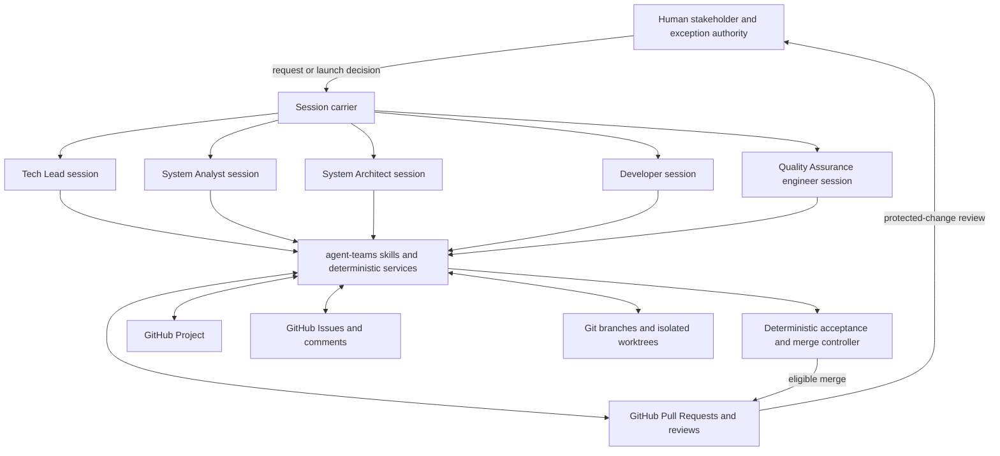
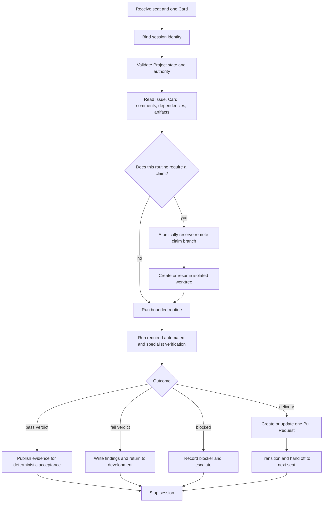
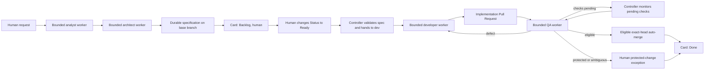

# agent-teams Architecture

Status: normative architecture for the complete Phase 1 team
Applies to: `agent-teams` (Claude Code plugin, v0.2.0)
Last updated: 2026-08-20
Delivery status: [`IMPLEMENTATION_PLAN.md`](./IMPLEMENTATION_PLAN.md) — the sole status ledger
Operating guide: [`USAGE.md`](./USAGE.md) — how a human actually drives this

**Contents**

1. [What agent-teams is](#1-what-agent-teams-is)
2. [Vocabulary](#2-vocabulary)
3. [Sessions](#3-sessions)
4. [Seats and authority](#4-seats-and-authority)
5. [The four durable artifacts](#5-the-four-durable-artifacts)
6. [Producer workflow](#6-producer-workflow)
7. [Consumer workflow](#7-consumer-workflow)
8. [End-to-end flow](#8-end-to-end-flow)
9. [Data and contracts](#9-data-and-contracts)
10. [Components](#10-components)
11. [Concurrency and recovery](#11-concurrency-and-recovery)
12. [Security and trust](#12-security-and-trust)
· [Appendix A — Settled decisions](#appendix-a--settled-decisions)
· [Appendix B — Lineage](#appendix-b--lineage)
· [Appendix C — Completion criteria](#appendix-c--completion-criteria)

---

## 0. Current automation contract

This section supersedes any older Phase 1 wording below that describes
specification Pull Requests, human-carried kickoff prompts, or manual routine
merge reconciliation.

1. Product specifications are written below `docs/` in the current checkout
   and published by `publish-spec`. The default `spec_merge_mode=direct`
   commits and pushes only that file to the current branch. With
   `spec_merge_mode=manual`, the command creates a deterministic spec branch
   and Pull Request; the user merges it, then the controller verifies the exact
   head, synchronizes the base branch, and records its durable commit. Legacy
   `spec_completion` keys are accepted and ignored.
2. The user's current session is the coordinator. It repeatedly calls the
   deterministic `next-actions` planner and directly starts one bounded,
   no-grandchildren subagent per admitted Card stage. The human never copies a
   prompt or opens another session.
3. Specification authors are serialized because they share the current checkout.
   Independent implementation and QA workers may run in parallel only when the
   planner admits them under the configured WIP limit.
4. In the default `spec_merge_mode=direct` and `merge_mode=automatic`
   combination, the only human gates are moving a specified Card Status to
   `Ready` and protected or genuinely ambiguous QA exceptions
   (`approve-exception N`). `spec_merge_mode=manual` adds a `spec_merge`
   gate before shaping continues. `merge_mode=manual` independently adds a
   `manual_merge` gate for an eligible implementation Pull Request. Readiness
   handoff, routine QA defects, and confirmed-merge reconciliation remain
   automatic controller paths.
5. Generic Card creation and transition cannot reach `Done`. Only
   reconciliation backed by current exact-head eligible acceptance and a
   confirmed merged Pull Request can do so. Human exception merge also uses
   GitHub's exact-head guard.

---

## 1. What agent-teams is

`agent-teams` coordinates an artificial intelligence software engineering team
through a GitHub Project. It is a Claude Code plugin: the repository you are
reading **is** the plugin, and a consuming repository holds nothing but
`.agent-teams/config.json`.

The team has six seats and two session shapes. A **Producer** session shapes
work — it creates, refines, decomposes, routes, prioritises, and unblocks
Cards. A **Consumer** session resolves exactly one Card and produces one
reviewable delivery or one verdict. No session does both.

### 1.1 The design in one sentence

> A seat defines capability and authority, a Producer session lives with the
> board, a Consumer session lives with exactly one Card, and GitHub carries
> every durable handoff between those independent sessions.



Each seat box is an independent session with its own context. **There is no
in-memory edge between any two of them.** The apparent inter-agent arrows are
reconstructed from durable GitHub state on the next launch.

### 1.2 The invariants

Ten rules the rest of the document elaborates. Each must have a concrete
enforcement point before Phase 1 is complete; the implementation plan records
which enforcement points are delivered and which remain pending.

| # | Invariant | Enforced in |
|---|---|---|
| 1 | GitHub is the only durable coordination plane. No handoff depends on conversation memory. | §5 |
| 2 | One session = one master agent = one seat = one execution shape. | §3.1 |
| 3 | `Status` and `Role` are orthogonal. Changing one never implicitly changes the other. | §9.2 |
| 4 | A Producer never implements a Card; a Consumer never merges its own Pull Request. | §3.1, §4.5 |
| 5 | Only `human` opens `Backlog -> Ready`. No agent seat directly merges; deterministic policy merges only eligible reviewed heads, and protected changes require `human`. | §4.5 |
| 6 | Authority is checked before the first GitHub call, so a refusal costs nothing and leaves no partial state. | §4.4, §10.3 |
| 7 | The system exposes semantic operations, never a generic field setter. | §9.8 |
| 8 | Partial failure is reported honestly. No result claims a rollback that did not run. | §11.2 |
| 9 | Sessions are runtime peers. The org chart is authority over board state, never a call stack. | §3.3 |
| 10 | agent-teams calls no other plugin. Correctness never depends on a sibling being installed. | §10.1 |

In invariant 5, "deterministic policy merges" includes the configured
`manual` route: policy exposes only the accepted exact head, the user performs
the merge, and the controller reconciles only after GitHub confirms `MERGED`.

---

## 2. Vocabulary

Full seat names are used throughout this document. Lowercase tokens appear only
where the exact Project field or prompt representation matters.

| Term | Meaning |
|---|---|
| **Board** / **Kanban** | The one GitHub Project that carries the team's governed lifecycle, ownership, and handoff fields. There is exactly one per consuming repository. |
| **GitHub Issue** | The repository-scoped durable work record: problem, scope, acceptance criteria, discussion, artifact links. Can exist without being on the board. |
| **GitHub Project item** | The membership of an Issue in a specific Project, carrying that Project's field values and its own opaque node identifier. Not interchangeable with the Issue (§9.1). |
| **Card** | The domain object: a normalised join of Issue content, Project item fields, claim state, and Pull Request links. What every routine actually operates on. |
| **Seat** | A named capability and authority boundary — a *concept*, not storage. Six exist (§4.1). |
| **Role** | The Project single-select *field* that stores which seat's turn it is. Its values are seat tokens. Seat is the idea; Role is where the idea is written down. |
| **Status** | The Project single-select field recording where the Card is in the delivery lifecycle. Six values (§9.2). |
| **Routing state** | The pair `(Status, Role)`. Together they answer *where is this work* and *whose turn is it*. Every queue is a query over this pair. |
| **Session** | One independently launched Claude Code execution with one master agent, one bound seat, and one execution shape. Ephemeral; nothing survives it but GitHub state. |
| **Execution shape** | Producer or Consumer. Orthogonal to seat: the same seat can act in either shape, but never in one session. |
| **Producer** | A board-anchored session. Adds or reshapes work, or keeps the board healthy. May touch many Cards; never writes implementation code. |
| **Consumer** | A Card-anchored session. Completes, blocks, or rejects exactly one bound Card. May *read* other Cards; may *mutate* only its own. |
| **Routine** | One bounded workflow a session performs — intake, triage, dispatch, implement, verify. A session runs one. |
| **Scope binding** | What a session owns for this run: the board (or one bounded projection) for a Producer, exactly one Card and stage for a Consumer. |
| **Transition** | A semantic change to `Status`. Does **not** change Role. |
| **Handoff** | A semantic change to `Role`, with a structured reason and required artifacts. Does **not** change Status. When both must move, that is two operations. |
| **Handoff cap** | The configured per-Card limit on handoffs. Exceeding it routes the Card to `(Blocked, lead)` rather than letting it ping-pong (§11.4). |
| **Claim** | An exclusive reservation of one Card, represented by a *remote* branch `claim/<n>-<slug>`. The remote push is the lock; a local worktree is not a claim. |
| **Worktree** | The isolated checkout a claiming Consumer works in. One Consumer, one worktree, one branch — the blast radius of a delivery. |
| **Dispatch artifact** / **kickoff prompt** | A deterministic prompt naming seat, Card identity, required action, and resume context. `next-actions` hands it directly to a bounded worker in the current session. |
| **Carrier** | The current-session coordinator that starts bounded subagents and executes deterministic controller actions. |
| **Verdict** | A Quality Assurance engineer's evidence-backed `pass`, `fail`, or `blocked` result for one delivery (§9.6). "Looks good" is not a verdict. |
| **Standing repository context** | Durable project instructions every session can reload: repository rules, product overview, architecture index, active decisions, team configuration. |
| **Context bootstrap** | The mandatory read-only startup sequence: load standing context, bind identity, query live board state, build the seat-specific orientation (§3.5). |
| **Specification gate** | The check that the Card records a base-branch `docs/*.md` specification at its exact last-changing commit before it may become Ready. |
| **Hard floor** | A refusal no configuration or user override may widen. Merge and readiness are the two (§4.5). |
| **Partial-failure envelope** | The result shape returned when a multi-step mutation fails midway: what completed, what failed, and the exact recovery recipe (§11.2). |
| **Failure class** | Which of the four kinds of "failed" occurred — refusal, partial mutation, work failure, or blocked. Determines the recovery; independent of the stage that produced it (§11.6). |
| **Escalation ladder** | The fixed five-rung order in which an unresolved problem travels outward: retry, handoff, Blocked, handoff cap, human. Rungs are climbed one at a time (§11.7). |

---

## 3. Sessions

### 3.1 Two shapes: Producer and Consumer

| Dimension | Producer | Consumer |
|---|---|---|
| Purpose | Create, refine, decompose, prioritise, route, or maintain work. | Resolve exactly one Card with a delivery or a recorded rejection or blocker. |
| Board scope | A bounded queue or several related Cards, as the routine permits. | One bound Card. Others may be read for context, never mutated. |
| Repository writes | No implementation writes. The Architect Producer may publish only the bound product specification through the configured direct or manual-PR route. | Commits only inside the bound worktree and branch. |
| Normal result | New or revised Issues, Cards, specifications, transitions, handoffs, priorities, or dispatch prompts. | One Pull Request, one verdict, or one terminal blocked result. |
| End condition | The intended board-shaping result is durable and verified. | The bound Card reaches its stage boundary and the next seat has durable context. |
| Merge authority | None. | None. |

A Producer **lives with the board**: it starts from a projection, a Role lane,
a queue, or a requirement, and its outcome is board shaping. A Consumer
**lives with one Card**: its kickoff binds Card identity, expected `Status` and
`Role`, stage objective, claim or Pull Request, and stop conditions.

**One session cannot silently change shape.** A System Architect Producer that
decomposes a feature stops after its board mutations; a separately launched
Developer Consumer implements a resulting Card. The
same seat may act in either shape, but only through separate sessions.

Every Consumer session binds exactly one Card and one stage:

```text
authoring Consumer stage
-> one Card + one claim + one worktree + one Pull Request

verification Consumer stage
-> one Card + its existing Pull Request + one verdict
```

A Card therefore passes through *sequential* Consumer stages — implementation,
then independent verification. It never has two concurrent authoring
Consumers. An interrupted or rejected delivery is resumed by a new physical
session that picks up the *same* logical assignment, claim, worktree, and Pull
Request rather than starting a second delivery chain.

### 3.2 Seat and shape are independent axes

A seat answers *who is acting, and with what authority*. A shape answers *what
relationship this session has to the board for this run*.

```text
SessionIdentity = Seat + ExecutionShape + ScopeBinding

Producer ScopeBinding => the board, or one bounded projection/routine
Consumer ScopeBinding => exactly one bound Card and one stage
```

The Project `Role` field stores the seat token. It never stores `producer` or
`consumer` — those are session properties, not durable Card state.

### 3.3 Sessions are ephemeral; their anchors are durable

Neither shape survives the end of its session. "Lives with the board" and
"lives with a Card" describe where the *next* fresh session reconstructs
authority and context, not a resident process.

```text
Producer: start -> orient from repository + live board -> coordinate -> persist -> stop
  survivors: Project, Cards, comments, priorities, dispatch artifacts

Consumer: start -> orient from repository + bound Card -> resolve one stage -> persist -> stop
  survivors: Card, claim branch, worktree metadata, Pull Request, verdict, handoff
```

The operational hierarchy is a hierarchy of **scope**, not of processes:

```text
GitHub Project / board
`- Producer session: board-level coordination
   `- durable dispatch artifact for Card #42
      `- Consumer session: Card #42 and one bounded stage
         `- claim/worktree/Pull Request or verdict/handoff
            `- durable result returns to the board
```

That indentation requires no runtime ancestry. A Producer may render the
dispatch artifact, but a human or any carrier can start the Consumer long after
the Producer has ended. **The Card, not a parent process, carries the
assignment.** Multiple Consumers run concurrently on different Cards; exclusive
claim prevents two from owning the same one.

Reporting lines are enforced through legal handoffs, permitted actions, and
Role lanes — never through a call stack. A bounded subagent may carry either
shape where explicitly supported, but that is one launch mechanism, not a
semantic parent-child relationship. Helper agents spawned inside a Consumer
inherit that Consumer's Card boundary; they are not seats, Card owners, or
handoff destinations.

Broad *read* access is compatible with bounded ownership. Every seat may read
whatever repository and board context it needs to reason correctly. The scope
anchor limits what a session **owns and may mutate**, not what it may inspect.

### 3.4 Intent routing, never a menu

Seats are an **internal** organising device. They
state intent in ordinary language — "what is going on", "we need a CSV export",
"why is this stuck" — and the entry router selects seat and routine from that
intent plus live board state (§10.2). Asking a person which seat they are is a
design failure: it exposes an authority model as a menu.

When intent is unstated, the session **defaults to orientation**: it reports
board state and the recommended next action. Orientation is read-only, so it is
always safe to repeat, and it is a first-class request at any point.

A marker such as `[role:architect]` remains valid, but it is a **machine
channel**: the deterministic form of a dispatch artifact the current
coordinator passes directly to a bounded worker (§3.7). It is honoured as an
explicit human override. It is not the expected human interface.

Inference is safe because **selecting a seat grants nothing.** Prompt text and
router inference request a route; only durable Project fields and policy checks
grant authority, and those are evaluated identically however the seat was
chosen.

#### The `human` exemption

**The router may never select `human`.** Every other seat is inferable, because
inferring one only chooses which refusals will apply. `human` is different: it
holds readiness and protected-change exception authority (§4.5), so a router
able to adopt it could approve its own exception and defeat the boundary by
construction.

When the next legal step is human-gated, the session stops and reports the
decision, its recommendation and why, and the exact command or Pull Request for
the user to act on. It does not run `promote` and does not pass
`--acting-role human` on its own initiative.

This boundary is carried by instructions and by the user being the one who runs
the gate commands. It is **not enforced in code, and cannot be**: the adapter
receives a seat token and has no way to distinguish one a person supplied from
one a session supplied. Any agent with shell access could pass the flag.
Recording that honestly is better than implying a check that does not exist —
if the boundary is ever violated in practice, the answer is an out-of-band
confirmation channel, not a stricter argument parser.

### 3.5 Context bootstrap

A fresh session has no reliable memory of any previous one, but it must not
begin ignorant of the project. Context is rebuilt from two layers:

1. **Standing repository context** — stable knowledge: platform-loaded
   `AGENTS.md` or `CLAUDE.md` instructions where present, repository and
   product overview, architecture index and active decisions, team
   configuration, and explicit pointers carried by the kickoff or handoff.
2. **Live coordination context** — current knowledge: the configured Project
   projection, Role and Status lanes, Card bodies and comments, dependencies,
   claims, linked Pull Requests, reviews, and merge state.

**Startup is read-only.** No seat may mutate anything until context is loaded,
live board state is queried, and expected identity is validated. A downstream
skill invoked directly may skip the router's *decision*, but it may not skip
this bootstrap.

Standing context is progressively disclosed rather than copied wholesale into
every prompt: the bootstrap loads a compact overview and stable pointers, and
the selected routine opens deeper sources on demand. **Live board state always
overrides a stale dispatch snapshot.**

Each Producer seat receives a role-appropriate startup view:

| Producer seat | Required startup view |
|---|---|
| System Analyst | Product purpose, stakeholder request, terminology, existing requirements, Backlog, related Cards and specifications. |
| System Architect | Product purpose, repository map, architecture and active decisions, dependencies, relevant Backlog and Blocked Cards, existing specifications. |
| Tech Lead | Complete paginated projection: Role and Status lanes, priorities, dependencies, work-in-progress, claims, aging, blocked work, verification queue, human lane. |
| Quality Assurance queue Producer | Complete `(In Review, qa)` projection plus linked Pull Request contract state, aging, and required verification capabilities. |

A Consumer receives the same stable repository rules and project overview, then
expands context for exactly one bound Card and stage. Card anchoring limits
ownership; it does not remove project awareness.

### 3.6 Carriers

The architecture is carrier-neutral. Every carrier consumes the same dispatch
artifact, and changing carrier must not change board contracts or workflow
correctness.

| Carrier | Behaviour | Intended use |
|---|---|---|
| Current-session bounded subagent | The coordinator starts one child for one Card stage and waits for durable GitHub state. | Default carrier for architect, analyst clarification, development, and QA work. |
| Human launch | A human directly invokes one Card routine. | Explicit troubleshooting or direct-work fallback, never the normal transport between stages. |
| Scheduled command | A scheduler starts a seat-specific non-interactive session. | Later unattended operation, once policy and recovery are proven. |

### 3.7 Kickoff and completion envelopes

A dispatchable session receives:

```text
[role:<seat>] [board-card:#<issue-number>]

execution_shape: producer | consumer
routine: canonical routine name
repository: owner/name
project: stable Project identity
context_sources: stable repository-relative overview and decision pointers
expected_status: exact Status or permitted set
expected_role: exact Role
objective: one bounded outcome
required_artifacts: durable links
stop_conditions: success, refusal, blocked, or race-lost
```

Producer sessions operating a queue may omit the Card binding but must name the
bounded projection. **Consumer sessions never omit it.**

On completion a session reports:

```text
session_id, seat, execution_shape, routine
cards_read, cards_mutated
status_before_after, role_before_after
artifacts_created_or_updated
verification_evidence
next_legal_seat
recovery_required
```

The conversational summary is useful to the human; the durable GitHub
artifacts are authoritative.

---

## 4. Seats and authority

### 4.1 The six seats

| Full seat name | Token | Authority and responsibility |
|---|---|---|
| Tech Lead | `lead` | Whole-team view, priority, work-in-progress limits, dispatch, rebalancing, organisational escalation. |
| System Analyst | `analyst` | Converts stakeholder demand into a well-shaped requirement with acceptance criteria and durable context. |
| System Architect | `architect` | Technical specification, architecture decisions, decomposition, dependencies, technical escalation. Proposes readiness; cannot grant it. |
| Developer | `dev` | Implements exactly one Ready Card with test-driven development and produces one Pull Request. |
| Quality Assurance engineer | `qa` | Independently verifies one delivery across the required review dimensions, records challenged evidence, and publishes a structured verdict for deterministic acceptance. |
| Human stakeholder / exception authority | `human` | Holds the readiness gate and resolves protected changes, design ambiguity, business questions, and policy exceptions. |

Which shapes each seat may take:

| Seat | Producer routines | Consumer routines |
|---|---|---|
| Tech Lead | Briefing, prioritisation, triage, work-in-progress control, dispatch, recovery, escalation. | None in Phase 1. |
| System Analyst | Requirement intake, clarification, acceptance-criteria shaping, return-path refinement. | None in Phase 1. |
| System Architect | Technical shaping, architecture review, dependency analysis, decomposition. | Author one specification or Architecture Decision Record as one documentation Card and Pull Request. |
| Developer | None in Phase 1. | Claim and implement one Ready Card, verify it, open one Pull Request. |
| Quality Assurance engineer | Inspect and summarise the verification queue. | Verify one delivery, write a verdict, return a defect to development, or submit evidence for deterministic acceptance. |
| Human | May originate or reprioritise demand by explicit decision. | Readiness approval and protected-change review sit outside automated Consumer execution. |

### 4.2 Team structure

```text
Tech Lead
|- System Analyst
`- System Architect
   |- Developer
   `- Quality Assurance engineer

Human stakeholder / exception authority: outside the agent team, at readiness and exception boundaries
```

This expresses responsibility and escalation. It authorises no nested runtime
calls (§3.3).

| Original responsibility | Adapted owner |
|---|---|
| Shape stakeholder demand | System Analyst |
| Make technical decisions and decompose work | System Architect |
| Maintain queue, priority, and dispatch | Tech Lead |
| Implement one unit | Developer Consumer |
| Independently verify one delivery | Quality Assurance engineer Consumer |
| Resolve readiness, protected-change, and authority questions | Human stakeholder / exception authority |

### 4.3 Legal handoff authority

The handoff graph is the enforceable organisation chart.

| From seat | Destination | Meaning |
|---|---|---|
| System Analyst | System Architect | Requirement is shaped and ready for technical work. |
| System Analyst | Tech Lead | Intake cannot proceed for reasons of priority or ownership. |
| System Analyst | Human | A business or authority decision is required. |
| System Architect | System Analyst | Requirement is under-specified or acceptance criteria are not testable. |
| System Architect | Developer | Implementation Card is technically sound. |
| System Architect | Quality Assurance engineer | A verification-only or architecture-validation assignment is ready. |
| System Architect | Tech Lead | Technical blocker requires organisational resolution. |
| System Architect | Human | An irreversible product or architecture decision requires human authority — including readiness. |
| Developer | Quality Assurance engineer | Pull Request is ready for independent verification. |
| Developer | System Architect | Technical ambiguity or blocker requires technical leadership. |
| Quality Assurance engineer | Developer | Delivery failed verification and must be corrected. |
| Quality Assurance engineer | System Architect | Finding reveals a specification or architecture defect. |
| Quality Assurance engineer | Tech Lead | Repeated or organisational blocker requires team-level recovery. |
| Quality Assurance engineer | Human | A protected change or unresolved design/architecture question requires human review. |
| Tech Lead | Any team seat or human | Dispatch, rebalance, recovery, or escalation within policy. |
| Human | Any team seat | Human decision, requested change, reprioritisation, or restart. |

Critical refusals:

- the System Analyst cannot hand directly to the Developer;
- the Developer cannot hand directly to the human;
- the Developer cannot mark its own work Ready;
- no artificial intelligence seat can directly merge or bypass deterministic
  acceptance;
- a normal handoff cannot exceed the configured per-Card handoff cap.

### 4.4 Seat-aware action policy

Every mutating action is classified by action and seat, and **checked before
the first GitHub call**. A refusal therefore costs nothing and leaves no
partial state.

| Action | Analyst | Architect | Developer | QA | Lead | Human |
|---|---|---|---|---|---|---|
| Create requirement Card | allow | allow when decomposing | refuse | refuse | allow | allow |
| Split implementation work | refuse | allow | refuse | refuse | require justification | allow |
| Promote `Backlog -> Ready` | refuse | refuse | refuse | refuse | **refuse** | allow |
| Claim implementation | refuse | documentation only | own Card only | governed verification/test Card only | refuse | allow |
| Write Quality Assurance verdict | refuse | refuse | refuse | own Card only | refuse | allow |
| Directly merge Pull Request | refuse | refuse | refuse | refuse | refuse | allow |

One subtlety worth stating plainly: a `review`-class classification **gates
nothing**. A review-class entry is documentation; only an explicit refusal
blocks an action. Anything intended as a gate must be a refusal.

The automated merge controller is not a seventh seat and accepts no free-form
instruction. It may merge only after deterministic policy validates a current,
schema-valid QA verdict and all required evidence for the exact Pull Request
head. QA can submit evidence but cannot directly invoke or bypass the merge
mutation.

### 4.5 Human gate and exception lane

| Boundary | Action | Authority |
|---|---|---|
| **Readiness gate** | `Backlog -> Ready` | Human-only. Declaring work ready commits the team to build it. The human changes only Status; the controller validates the recorded spec commit and hands the Ready Card to `dev`. |
| **Automated acceptance** | Merge an eligible Pull Request | A deterministic controller evaluates the structured QA verdict, evidence completeness, protected-change policy, and current Pull Request head before merging. No agent seat directly merges. |
| **Protected-change exception** | Accept or reject a protected or ambiguous Pull Request | Human-only. QA routes here when automation cannot establish eligibility without judgment. |

The initial protected set includes authority and policy code, acceptance or
merge logic, GitHub workflow and credential handling, dependency and plugin
manifests, agent instruction files, security boundaries, and changes to the
approved architecture or design baseline. Repository policy may add categories
but must not silently remove a protected category.

Because transition authority keys off the **destination** (Appendix A,
decision 4), closing readiness closed every path to it at once: `promote`,
`transition --to Ready`, and `create-card --status Ready`. Decomposition
therefore creates children at `(Backlog, human)`, not `(Ready, dev)`.

---

## 5. The four durable artifacts

agent-teams stores nothing of its own. There is no database, no state file, and
no resident process.

A cold session rebuilds from **two layers**, and the split between them is
load-bearing:

- **The repository** carries *project* knowledge — what the product is, how it
  is built, its conventions, architecture, and active decisions. It is stable,
  versioned by commit, and loaded by name at bootstrap rather than pasted into
  prompts (§3.5). This is where a Producer gets its bearings.
- **Four GitHub and Git artifacts** carry *coordination* state — what each work
  item is, where it is, who holds it, and what was delivered. These change
  every session.

The four coordination artifacts each answer exactly one question. Keeping those
questions separate is what lets an independent session reconstruct the picture
on a cold start.

| Artifact | The one question it answers | Written by | Read by |
|---|---|---|---|
| **GitHub Project** | *Where is this work, and whose turn is it?* | `transition_card`, `handoff_card` | every session's bootstrap |
| **GitHub Issue** (+ comments) | *What is the work, and what happened to it?* | intake, decomposition, handoff comments | the seat that picks the Card up next |
| **Git** (branches, worktrees) | *Who holds this Card right now, and where is the work happening?* | claim push, worktree create | any Consumer about to claim |
| **Pull Request** | *What was delivered, and is it acceptable?* | authoring Consumer, verifying Consumer | Quality Assurance, then the human |

### 5.1 GitHub Project — the routing plane

The Project carries exactly two governed single-select fields, `Status` and
`Role`, and nothing else the system depends on. It is deliberately thin: an
index, not a record. It holds no prose, no evidence, and no history beyond the
current pair, because anything durable belongs on the Issue where it can be
read without Project permissions.

The Project is what makes *queues* possible. Every Producer routine is a query
against it: dispatch reads `(Ready, <seat>)`, verification inspection reads
`(In Review, qa)`, the readiness gate reads `(Backlog, human)`, triage reads
`Blocked` grouped by `Role`. Because the pair is a Project field rather than a
label or a body convention, those queries are exact and a Card cannot be in two
lanes at once.

The Project is also the only artifact this system *mutates for coordination*.
That is why the semantic surface exposes `transition_card` and `handoff_card`
and deliberately withholds `set_card_field` (§9.8): a generic setter would let
a session invent routing states that no policy rule governs.

### 5.2 GitHub Issue — the record and the context channel

The Issue is the Card's body of truth — **for that Card only**. It carries the
goal, scope and non-goals, acceptance criteria, dependencies, and the
specification *pointer* — written once at intake and refined in place rather
than duplicated into new Issues. It does not carry project context; that is
repository-side (§5 preamble), and the pointer is how the two layers join.

Its **comments are the inter-session message bus**. A structured handoff
comment (§9.4) is how one session tells the next what it did and what is
needed, because the next session has no memory of the previous one and no
process to ask. The comment is written for a stranger: if a fact is not in the
Issue or reachable from a link in it, that fact is lost.

Comments are also *counted*: the handoff marker lets the cap detect a Card
ping-ponging between seats (§11.4). This is why the marker is a machine grammar
and not decoration, and why free text is neutralised before rendering (§12.1) —
an Issue body is untrusted input, and a Card that could forge a handoff line
could forge a routing decision.

### 5.3 Git — the lock and the isolation boundary

Git plays two roles no GitHub field can play.

First, **the remote claim branch is the mutual-exclusion primitive**. Two
Consumers may read the same `(Ready, dev)` Card simultaneously; exactly one
compare-and-swap push of `claim/<n>-<slug>` succeeds, and the loser exits
cleanly having written nothing. A Project field cannot do this — reading and
writing it is not atomic, so two sessions could both observe "unclaimed" and
both proceed. Distributed exclusion needs a remote arbitration surface, and a
branch push is one that requires no server of our own.

Second, **the worktree is the blast radius**. One Consumer, one worktree, one
branch: N sessions can build concurrently with zero shared working state. A
local worktree alone is *not* a claim, because another machine cannot observe
it — the remote branch is what other sessions can see.

### 5.4 Pull Request — the delivery contract and the acceptance surface

The Pull Request is where work stops being a board state and becomes a
reviewable proposal. It carries the fixed body contract of §9.5.

It is the only artifact where **evidence** lives. A Card can claim a state; a
Pull Request has to show commands, outputs, diffs, review coverage, design
conformance, challenged findings, and test-strength results. That lets Quality
Assurance reject a defect on the record and lets deterministic policy establish
eligibility without turning a human into a routine rubber stamp.

No artificial intelligence seat may directly merge. Eligible reviewed heads
are merged only by the deterministic controller; protected or ambiguous
changes route to the human exception authority (§4.5).

### 5.5 How the four compose

```text
Repository   what this project is           <- stable; the Producer's bearings
  +
Issue        what this Card is, plus the running conversation
  +
Project      where it is, whose turn        <- queues and dispatch read this
  +
Git          who holds it, where they work  <- exclusive claim + isolation
  +
Pull Request what was delivered, evidence   <- review and acceptance
  =
everything a fresh session needs to continue, with no memory of any previous one
```

---

## 6. Producer workflow

### 6.1 Purpose and stopping conditions

A Producer session exists to make the board a better source of future work. It
may originate demand, reshape existing demand, review a queue, change priority,
route ownership, or repair board health. **Its output is durable board state,
not implementation code.**

It terminates when its declared board-shaping result is durable and verified.
It stops earlier, with a structured refusal, when:

- required Project fields or options are absent;
- the acting seat lacks authority;
- a requested transition or handoff is illegal;
- required evidence is missing;
- pagination or Project identity is uncertain;
- an external mutation partially succeeded and requires fix-forward;
- the requested work would cross into implementation.

### 6.2 Common Producer session protocol

Every Producer routine follows the same eleven steps:

1. Enter through the common bootstrap owned by `using-agent-teams`, even when
   intent routing already selected a downstream skill.
2. Load standing repository context and its overview, architecture, decision,
   and team-configuration pointers.
3. Bind the seat and validate that the requested routine belongs to it.
4. Preflight repository identity, GitHub authentication, Project configuration,
   required fields, and required field options.
5. Query a complete, **paginated** live projection and normalise Cards before
   filtering.
6. Build the seat-specific overview, then narrow to the bounded queue or demand
   item the routine requires.
7. Read Issue content, comments, dependencies, linked Pull Requests, and
   applicable repository context.
8. Produce a proposed mutation plan and refuse anything outside seat authority.
9. Execute semantic mutations through deterministic services.
10. Re-read affected Cards and verify the resulting `Status`, `Role`, comment,
    and artifact links.
11. Emit a structured result or dispatch queue, and terminate.

A Producer may span multiple Cards only when its active routine explicitly
permits queue-wide work. It must never opportunistically implement a Card it
encounters.

### 6.3 System Analyst — requirement intake

The Analyst owns problem clarity, not technical design. Intake creates a
durable Issue, adds it to the Project, sets `(Backlog, architect)`, writes a
structured handoff comment, and re-reads to verify.

A shaped intake contains at least:

- the user or business outcome;
- scope and explicit non-goals;
- measurable acceptance criteria;
- known constraints and dependencies;
- open questions and their required decision owner;
- source links or evidence;
- the handoff reason and expected System Architect action.

**Intake never makes a Card Ready** — no agent seat may. If the Architect
returns the Card, the Analyst resumes from the same Issue and adds clarification
rather than creating duplicate work.

### 6.4 System Architect — shaping and decomposition

The Architect turns shaped demand into technically sound work:

1. Select a `(Backlog, architect)` Card, or a technical escalation addressed to
   `architect`.
2. Validate that the outcome and acceptance criteria are sufficiently clear.
3. Inspect repository architecture, interfaces, data flow, security boundary,
   migration needs, and test strategy.
4. Decide whether the change is one independently shippable Card or requires
   **flat** decomposition into several implementation Cards.
5. Ensure a durable specification exists. If authoring it requires repository
   changes, create or select a documentation Card and **end the Producer
   session** — a separate Architect Consumer session authors that documentation
   Pull Request (§7.3).
6. Once the specification is durable on the target branch, create or update
   implementation Cards with specification pointers, dependencies, acceptance
   criteria, and verification needs.
7. Hand eligible Cards to `human` for the readiness decision. The Architect
   decides what the work *is* and that it is technically sound; it may not
   declare it `Ready` (§4.5).
8. Record unresolved decisions and route them to the appropriate seat.

A batch decomposition session is Producer-shaped even though it creates Cards.
A one-document specification session is Consumer-shaped because it completes one
Card through one Pull Request.

### 6.5 Tech Lead — briefing, triage, dispatch

The Tech Lead operates the whole-team queue:

1. Read all Role lanes and lifecycle states.
2. Surface Ready work, active work, verification work, human review work,
   Blocked Cards, aging, dependencies, stale claims, and handoff counts.
3. Enforce global and per-seat work-in-progress limits.
4. Order dispatch candidates **deterministically**: configured seat order, then
   Card number.
5. Refuse dispatch when the target seat has no legal next action.
6. Produce typed `spawn`, `controller`, `monitor`, or `reconcile` actions. The
   current-session coordinator executes them; it never hands a prompt to the
   human.
7. Rebalance or escalate only through legal handoffs with written reasons.
8. Route handoff-cap breaches and unrecoverable ownership ambiguity to
   `(Blocked, lead)`.

A dispatch queue item contains:

```text
seat: full seat name and durable token
card: Issue number, Project item identifier, repository, URL
expected_status_role: required pair before work begins
routine: exact Producer or Consumer routine
reason: why this Card is next
artifacts: specification, dependencies, Pull Request, or verdict links
kickoff_prompt: carrier-neutral session prompt
```

### 6.6 Quality Assurance — queue inspection

Queue inspection is distinct from one-Card verification. A QA Producer session
may list `(In Review, qa)` Cards, validate Pull Request contract presence,
identify missing artifacts or stale assignments, order candidates, and emit one
kickoff prompt per Card.

**It issues no verdicts.** Each verdict belongs to a separately bound QA
Consumer session (§7.4).

---

## 7. Consumer workflow

### 7.1 Universal Consumer lifecycle

A Consumer pulls exactly one Card and resolves its assigned stage. It may read
other Cards for context but may mutate only the bound Card and that Card's
claim, worktree, branch, Pull Request, comments, and evidence.



Every Consumer session:

1. receives an explicit seat and Card binding;
2. validates the exact expected `(Status, Role)` pair;
3. refuses ambiguous or already-owned work;
4. establishes exclusive claim and worktree isolation when it will author
   commits;
5. follows the Card's acceptance criteria and the disciplines its routine names;
6. records concrete evidence, never an unsupported success assertion;
7. performs the legal transition and handoff for its outcome;
8. stops without merging and without selecting another Card.

### 7.2 Developer — implementation

The implementation Consumer owns one `(Ready, dev)` Card:

1. Bind `[role:dev] [board-card:#N]`.
2. Verify the Card is Ready, assigned to `dev`, dependency-ready, and unclaimed.
3. Atomically create the remote claim branch. A losing concurrent claimant
   exits cleanly with no local work.
4. Create or resume one isolated worktree derived from the verified claim.
5. Read the specification, acceptance criteria, dependencies, architecture
   decisions, prior handoffs, and verification requirements.
6. Produce an implementation plan bounded to this Card.
7. Implement through test-driven development: demonstrate a failing test, make
   it pass, refactor, run the required verification chain.
8. Apply the planning, review, browser, security, and branch-finishing
   disciplines the routine names, using whatever tooling is actually present.
9. Open or update **exactly one** Pull Request linked to the Issue.
10. Transition `In Progress -> In Review` and hand off `dev -> qa` with Pull
    Request URL, branch, tests, limitations, and required verification.
11. Stop. It does not merge and does not consume a second Card.

If technical ambiguity blocks implementation, it records the blocker,
transitions to `Blocked` where appropriate, hands to the Architect, and stops
without hiding or deleting work.

### 7.3 System Architect — documentation delivery

When documentation is itself the one-Card deliverable rather than the product
specification that gates downstream implementation, an Architect Consumer may
claim one branch and worktree, author only documentation and supporting
diagrams or decision records, open one governed Pull Request, route it through
review, and stop.

Product specifications used for readiness and decomposition do **not** use this
Consumer route. They follow the configured Producer publication contract in
§0 and §6.4.

### 7.4 Quality Assurance engineer — verification

The verification Consumer owns one `(In Review, qa)` Card and its linked Pull
Request:

#### New QA workflow

1. **Claim the Pull Request.** Bind `[role:qa] [board-card:#N]`; validate Role,
   Status, Pull Request linkage, current head commit, and the Pull Request
   contract.
2. **Review the delivery.** Read the specification, acceptance criteria,
   approved design and architecture, implementation handoff, complete diff,
   commits, automated checks, and known limitations. The review must:
   - evaluate design and architecture conformance;
   - evaluate correctness and edge cases;
   - deterministically enumerate every changed and new file, and split large
     changes into bounded review units without silently omitting any unit;
   - evaluate security and compatibility;
   - examine cross-file and compound risks;
   - evaluate test strength, including coverage quality rather than treating
     line execution as proof of behaviour; and
   - detect review blind spots and repeat the affected review dimension before
     reaching a verdict.

   QA may use multiple bounded reviewer agents or independent reviewer passes
   for different dimensions when the session carrier supports them. They are
   evidence producers, not nested authorities: the bound QA Consumer remains
   responsible for complete coverage and the final synthesis, and correctness
   never depends on another plugin being installed.
3. **Ground and challenge findings.** Every material finding must cite concrete
   code, behaviour, design, test, command, or artifact evidence. Before it is
   accepted, a separate pass attempts to falsify it by checking callers,
   related files, existing mitigations, intended behaviour, and contrary
   evidence. Unresolved uncertainty is recorded, never converted into a pass.
4. **Publish a structured verdict.** Write `pass`, `fail`, or `blocked` under
   the verdict contract (§9.6), bound to the exact Pull Request head. Publish a
   human-readable Pull Request report and machine-readable evidence containing
   design conformance, changed-file review coverage, test-strength metrics,
   security results, findings, limitations, and remaining blind spots.
5. **Run deterministic eligibility policy.** The policy, not the reviewer,
   chooses the route:
   - **eligible:** the merge controller validates the same head, required
     checks, and branch state, then merges, and the delivery reconciles to
     `Done` without human involvement. The Card holds at `In Review` only
     while a merge is armed but not yet landed;
   - **defect:** transition `In Review -> In Progress`, hand off `qa -> dev`,
     and retain the same Issue, branch, and Pull Request for correction; or
   - **protected change:** preserve `In Review`, hand off `qa -> human`, and
     state the exact protected files, design decision, risk, or unresolved
     judgment requiring human review.

On specification or architecture defects that cannot be corrected as an
implementation defect, QA routes to the Architect. QA stops without changing
production code and without directly merging.

A test-only correction may use a separate, explicitly governed test or
documentation Card. **QA must not silently fix production code in the
verification session**, because that collapses independent verification.

### 7.5 Consumer stopping conditions

A Consumer ends with exactly one durable outcome:

- a Pull Request ready for the next seat;
- an evidence-backed verification pass;
- an evidence-backed rejection returned to the responsible seat;
- an explicit Blocked state and escalation;
- a clean claim-race loss or authority refusal before work begins.

It never ends by silently abandoning local work, leaving an unexplained field
mutation, merging, or selecting another Card.

---

## 8. End-to-end flow

### 8.1 Golden path



The current session coordinates every bounded worker and reconstructs progress
from GitHub after each stage. The diagram depicts the default
`spec_merge_mode=direct` route, where readiness is the sole routine human
gate; protected or ambiguous QA review is exceptional. With
`spec_merge_mode=manual`, a user merge gate sits between Architect and Spec,
after which architect shaping resumes. With `merge_mode=manual`,
the eligible auto-merge node is replaced by an explicit user merge gate; both
routes converge on automatic confirmed-merge reconciliation.


### 8.2 Session by session

| Step | Session | Reads | Writes | Durable next-session trigger |
|---|---|---|---|---|
| 1 | Analyst Producer | Human request, repository identity, intake policy. | Issue, Project item, `(Backlog, architect)`, handoff comment. | Card appears in the Architect lane. |
| 2 | Architect Producer | Issue, acceptance criteria, repository architecture, dependencies. | Specification pointer, decisions, decomposition plan, or one documentation Card. | Either an Architect Consumer is dispatchable, or Cards can be shaped for the readiness gate. |
| 3 | Architect Producer | Intake Card and repository context. | Direct specification commit by default, or an exact spec PR record and user merge in manual mode. | Once durable on the base branch, architect shaping continues. |
| 4 | Architect Producer | Published durable specification and intake Card. | Flat implementation Cards that inherit the spec record, dependencies, `(Backlog, human)`, handoff comments. | Cards appear in the human readiness queue. |
| 5 | **Human — readiness gate** | Each shaped Card, its specification and acceptance criteria. | Change Status to `Ready`. | The controller validates the spec and hands the Card to `dev`. |
| 6 | Tech Lead Producer | Complete projection, priority, dependencies, work-in-progress counts. | Deterministic actions under WIP limits. | The current session starts one bounded Developer Consumer per admitted Card. |
| 7 | Developer Consumer | One Card, specification, claim state, worktree, tests. | Claim branch, commits, tests, one Pull Request, `(In Review, qa)`, handoff comment. | Card appears in the QA lane. |
| 8 | QA Consumer | One Card, Pull Request, checks, acceptance criteria, approved design and delivery evidence. | Structured verdict, conformance report, review coverage, challenged findings, and test-strength metrics. | Deterministic acceptance, correction, or protected-change review becomes dispatchable. |
| 9a | Automated acceptance and merge controller | Current Pull Request head, QA verdict, required checks, protected-change policy, and branch state. | Eligibility decision, merge attempt, and final `Done` reconciliation after confirmed merge. | Completed Card, or a durable blocked/return path. |
| 9b | **Human — protected-change exception** | Protected or ambiguous Pull Request, verdict, evidence, and exact escalation reason. | Review decision, merge or requested changes, final `Done` reconciliation. | Completed Card, or a durable return path. |

### 8.3 Failure and escalation paths

The routing table below is the *what*. §11.6 classifies these failures and
§11.7 gives the order in which an unresolved one escalates.

| Situation | Status | Role | Next session |
|---|---|---|---|
| Requirement is under-specified | `Backlog` | `analyst` | Analyst Producer clarification. |
| Developer has a technical blocker | `Blocked` | `architect` | Architect Producer resolution. |
| Architect cannot resolve an organisational or authority question | `Blocked` | `lead` or `human` | Tech Lead or human decision. |
| QA rejects behaviour | `In Progress` | `dev` | New Developer Consumer on the same Card and Pull Request. |
| QA finds a specification defect | `Blocked` or `Backlog` as governed | `architect` | Architect Producer correction. |
| QA or policy identifies a protected change | `In Review` | `human` | Human exception review. |
| Handoff cap exceeded | `Blocked` | `lead` | Tech Lead recovery. |
| Claim race lost | unchanged | unchanged | Losing Consumer exits; the winner continues. |
| Partial external mutation | explicitly reported partial pair | responsible recovery seat | Fix-forward replays only the missing semantic operations. |

### 8.4 Operational views

Every view below is derived from the same durable data — none is a separate
store.

| View | Contents |
|---|---|
| Intake lane | Backlog Cards owned by `analyst` or `architect`. |
| Readiness queue | `(Backlog, human)` Cards awaiting the readiness gate. |
| Ready development lane | `(Ready, dev)` Cards. |
| Active claims | In Progress Cards with claim branches, worktrees, and session identifiers. |
| Verification queue | `(In Review, qa)` Cards with Pull Request contract state. |
| Automated acceptance queue | `(In Review, qa)` Cards with a current pass verdict awaiting deterministic eligibility or merge. |
| Protected-change queue | `(In Review, human)` Cards with verdict, evidence, and an explicit escalation reason. |
| Blocked and recovery | Blocked Cards grouped by responsible seat, with age, blocker, partial mutation, and handoff count. |
| Flow history | Seat-by-seat Status, Role, comment, claim, Pull Request, verdict, and merge events for one Card. |

A briefing must distinguish observed facts from recommendations. Prompt
rendering, session launch, claim acquisition, delivery, verification, and merge
are **different events** and must never be reported as one another.

---

## 9. Data and contracts

### 9.1 Issue, Project item, and Card identity

An Issue and a Project item are related but not interchangeable:

```text
GitHub Issue                    GitHub Project item
|- repository owner/name        |- Project node identifier
|- Issue number + node id       |- item node identifier
|- title and body               |- Status option identifier
|- acceptance criteria          |- Role option identifier
`- Pull Request relationships   `- content link to the Issue

Card = normalised join of Issue + Project item + claim + Pull Request state
```

Board selection and field mutation use **Project item and option identifiers**.
Issue comments and Pull Request closing links use **repository and Issue
identifiers**. Deterministic adapters retain every identity explicitly and never
reconstruct identity from display text.

### 9.2 Status and Role

| Field | Values | Question answered |
|---|---|---|
| `Status` | `Backlog`, `Ready`, `In Progress`, `Blocked`, `In Review`, `Done` | Where is this Card in the lifecycle? |
| `Role` | `analyst`, `architect`, `dev`, `qa`, `lead`, `human` | Whose turn is it? |

**The two axes are orthogonal.** A transition changes Status and never Role; a
handoff changes Role and never Status. When both must move, that is two
operations, and partial completion is explicitly recoverable (§11.2).

The routing state is the pair. Common pairs:

| Pair | Meaning |
|---|---|
| `(Backlog, analyst)` | Requirement needs clarification. |
| `(Backlog, architect)` | Shaped demand awaits technical work. |
| `(Backlog, human)` | Shaped and sound; awaiting the readiness gate. |
| `(Ready, architect)` | A documentation or architecture Card is ready for an Architect Consumer. |
| `(Ready, dev)` | Implementation Card is ready to claim. |
| `(In Progress, dev)` | Implementation is actively claimed or being corrected. |
| `(In Review, qa)` | Delivery awaits independent verification. |
| `(In Review, human)` | QA or policy identified a protected or ambiguous change requiring human review. |
| `(Blocked, architect)` | Technical resolution required. |
| `(Blocked, lead)` | Organisational recovery required. |
| `(Done, human)` or `(Done, empty)` | Human accepted the delivery; the final Role representation is a configured policy choice. |

### 9.3 Legal transitions

A central policy component owns legal Status transitions. The normal path is:

```text
Backlog -> Ready -> In Progress -> In Review -> Done
```

`Blocked` is an interruption state carrying a recorded prior state and recovery
reason. Rejection uses `In Review -> In Progress`.

**No skill may invent a transition in prose.** Illegal transitions refuse
before any mutation. Authority is keyed to the *destination*: moving to `Ready`
is checked as `promote_to_ready`, moving to `Done` as `reconcile_done`, and
every other move as `transition_card` (Appendix A, decision 4).

### 9.4 Handoff contract

`handoff_card(card, from_seat, to_seat, reason, artifacts)` performs:

1. validate current Role against the authority matrix (§4.3);
2. set the `Role` single-select field to the destination seat;
3. write a structured Issue comment;
4. append an audit event where enabled;
5. re-read and verify the resulting state.

The operation **never changes Status**.

```markdown
<!-- agent-teams:handoff -->
**Handoff**: `dev` -> `qa`
**Reason**: Pull Request #57 is open and automated checks passed
**Needs from you**: Verify user-interface behaviour and data correctness
**Artifacts**: Pull Request #57; branch `claim/42-revenue-chart`
```

The receiver must be able to resume from this comment and its linked artifacts
without any access to the sender's conversation. The HTML marker is machine
grammar: it is what the handoff cap counts (§11.4), so free text is flattened
to one line before rendering, and a `**Handoff**` line cannot be forged from
untrusted input (§12.1).

### 9.5 Pull Request delivery contract

Every Consumer Pull Request uses a fixed body shape — `Summary`, `Test Plan`,
`Automated Verification`, `Human Verification TODO`, `Retro Notes`, a closing
trailer, and the `<!-- agent-teams:pr -->` marker:

```text
## Summary
## Test Plan
## Automated Verification
## Human Verification TODO
## Retro Notes

Closes #<issue-number>.

<!-- agent-teams:pr -->
```

Contract rules:

- Summary and Test Plan explain the delivered change and the intended checks.
- **Automated Verification is required** and names concrete commands, checks,
  outputs, and applicable specialist reviews.
- Human Verification TODO is optional; every item present must require genuine
  human judgment and cannot be filler.
- Retro Notes are required where reusable lessons exist, and capture knowledge
  rather than velocity metrics.
- The closing trailer is required and must survive every body update, so GitHub
  links and closes the Issue on merge.
- The marker lets queue inspection distinguish governed deliveries.

### 9.6 Verdict contract

A verdict is structured data rendered for humans:

```text
verdict: pass | fail | blocked
card: stable Card and Issue identity
pull_request: URL and node identity
head_sha: exact reviewed Pull Request head
design_baseline: specification, architecture, and decision identifiers
review_dimensions: correctness, architecture, security, compatibility, cross-file, test-strength
changed_files: complete enumerated set plus reviewed units
design_conformance: requirement/invariant -> implementation evidence -> test evidence
test_strength: line, branch, mutation, scenario, and integration evidence where applicable
checks: commands, URLs, screenshots, observations, and machine-readable results
findings: reproducible expected-versus-actual results plus supporting evidence
challenges: attempts to falsify each material finding and their outcomes
blind_spots: unreviewed or uncertain areas; must be empty for pass
limitations: checks not performed, and why
next_role: qa | dev | human | architect | lead
```

A bare "looks good" or "tests fail" is not a valid verdict.

The deterministic evaluator produces a separate acceptance result so the QA
reviewer cannot select its own merge route:

```text
acceptance: eligible | defect | protected_change
head_sha: exact head for which the decision is valid
policy_version: deterministic policy version
reasons: satisfied requirements or exact refusal/escalation reasons
```

A pass is also invalid when it is stale, omits a changed file or required
review dimension, treats line execution as sufficient test evidence, or leaves
a review blind spot unresolved.

### 9.7 Claim and worktree model

An authoring Consumer obtains exclusive ownership before any local mutation:

1. compute the canonical claim branch from Card identity;
2. push the claim with compare-and-swap semantics;
3. treat a race-lost result as a clean, expected refusal;
4. resolve an explicit worktree path inside the configured workspace;
5. create or resume exactly one worktree for the claim;
6. never delete an unresolved or unverified worktree path;
7. clean up only after confirmed merge or explicit cancellation.

Local worktree existence alone is not a distributed claim, because independent
sessions and machines cannot observe it. **The remote branch is the arbitration
surface** (§5.3).

**The claim pushes a unique empty commit, never the bare base commit.** This
was established by test, not by reading documentation, and the obvious
implementation is wrong: pushing an identical SHA to an existing ref reports
`Everything up-to-date` and exits `0`, so the compare-and-swap lease is never
evaluated and *both* claimants conclude they won. Two Consumers claiming one
Card normally branch from the same base, which makes that the common case
rather than an exotic one. The claim commit therefore carries a session nonce,
so two claims made on one machine within one clock second cannot produce the
same commit object either.

### 9.8 Semantic operations, not field setters

The board surface is semantic. It resolves field and option identifiers,
normalises pagination, and returns stable structured envelopes. It deliberately
exposes **no** `set_card_field`: a generic setter would let a session invent
routing states no policy rule governs.

| Operation | State |
|---|---|
| `resolve_project`, `list_cards`, `get_card`, `create_card` | built |
| `comment_on_card`, `transition_card`, `handoff_card` | built |
| `claim_card`, `release_claim` | built |
| `link_pull_request_to_card`, `record_verdict`, `evaluate_acceptance`, `request_automated_merge`, `reconcile_done` | built |

A backend-neutral port is introduced only when a real second backend exists.

---

## 10. Components

Skills interpret intent, gather context, choose a bounded routine, and explain
refusal. **Deterministic code performs every external mutation**: validation,
GitHub queries, field resolution, transitions, handoffs, claims, comments, Pull
Request operations, and structured output. Skills contain no raw Project field
identifiers and no ad hoc GitHub commands.

### 10.1 What is built, designed, and excluded

| Component | State | Where |
|---|---|---|
| Entry router and session binder | built | `skills/using-agent-teams/` |
| Producer workflow skills (7) | built | `skills/{intaking-requirement,clarifying-card,authoring-spec,briefing-board,triaging-board,dispatching-work,inspecting-queue}/` |
| Domain model — validated Role, Status, Card, Handoff, Verdict | built | `scripts/agent_teams/model.py` |
| Domain policy and authority | built | `scripts/agent_teams/policy.py` |
| Configuration and validation | built | `scripts/agent_teams/config.py` |
| GitHub adapter — invocation, pagination, error classification | built | `scripts/agent_teams/github.py` |
| Semantic board operations | built | `scripts/agent_teams/board.py` |
| Workflow orchestration and partial-failure recovery | built | `scripts/agent_teams/workflows.py` |
| Public command-line entry point | built | `scripts/producer_board.py` |
| Consumer workflow skills (2) | built | `skills/{consuming-card,verifying-delivery}/` |
| Blocker resolution skill (`resolving-issues`) | **designed** | §11.7; plan M6.5. Classifies a blocker, verifies recovery preconditions deterministically, emits fix-forward commands. Proposes only. |
| Git claim and worktree service | built | `scripts/agent_teams/git.py` |
| Pull Request contract service | built | `workflows.validate_pr_body`, `board.create_or_update_pull_request` |
| Current-session bounded subagent carrier | built | `agents/agent-teams-worker.md`, `skills/dispatching-work/`, `Producer.next_actions` |
| Audit and recovery log | **excluded** | Deliberately not built. The partial-failure envelope (§11.2) is not a substitute; revisit under plan M7 with evidence from a real run. |
| Automatic Project field provisioning | **excluded** | `doctor` validates and explains; it never creates. |
| Multiple board backends | **excluded** | §9.8. |
| Runtime sibling-plugin dependency | **excluded** | Reused procedures are adapted locally; see below. |

**agent-teams has no runtime dependency on another plugin.** Attribution names
board-superpowers, superpowers, and gstack, but no skill invokes sibling-plugin
syntax and correctness never depends on one being installed. Test-driven
development, review, browser quality assurance, and evidence discipline are
adapted into focused local skills and conditional references. This is a
packaging choice, not a claim that the procedures were reinvented. What this
design owns is the *record* and authority around those disciplines: which
checks actually ran, in the Pull Request contract, and a refusal when required
evidence is absent—refusing on the evidence, never on whether another plugin
is installed.

#### 10.1.1 On-demand skill composition

The worker is a carrier, not a bundle. Its frontmatter grants the `Skill` tool
but preloads no skills. Deterministic planning selects one routine and emits its
qualified skill name:

```text
using-agent-teams / dispatching-work       small entry and coordinator
                  |
                  v
Producer.next_actions                     durable-state planner
                  |
                  v
agent-teams-worker                        no workflow bodies preloaded
                  |
                  v
exactly one molecular skill               intake | clarify | spec | dev | triage | QA
                  |
                  v
conditional reference                     only when that stage needs it
                  |
                  v
producer_board.py + policy.py             deterministic authority and mutation
```

This retains the useful separation found in the source projects: entry routing
stays small, workflow skills load only for the selected job, and detailed
discipline loads from references on demand. Agent-teams adds the architecture
they do not provide: durable specification records, the human Status-only
Ready gate, `(Status, Role)` authority, durable claim/resume, partial-failure
envelopes, exact-head acceptance, same-session subagent orchestration, and
automatic reconciliation.

The local adaptations remain runtime-independent because a consuming repository
cannot assume board-superpowers, superpowers, and gstack are all installed.
`ATTRIBUTION.md` identifies each reused rule and each agent-teams invention.

### 10.2 Entry router and session binder

The router:

- runs the common context bootstrap exactly once for every governed session
  (§3.5);
- loads standing repository instructions and stable context pointers;
- **infers seat and routine from the user's stated intent** plus live board
  state, without requiring or requesting a seat token from a person (§3.4);
- parses `[role:<seat>]` and `[board-card:#N]` markers when present and treats
  them as an explicit override of that inference;
- binds one seat and one execution shape;
- discovers repository and Project configuration;
- queries the current board or bound Card through deterministic read services;
- builds the role-appropriate orientation before any mutation;
- **defaults to orientation** when intent is unstated;
- routes only to routines legal for that seat and shape;
- runs common preflight before workflow-specific work.

**The router does not grant authority.** It passes claimed identity to the
policy layer, which checks durable board state. A downstream skill selected
directly may bypass the routing decision, but it must invoke or prove
completion of the same bootstrap contract. The router may never select `human`
(§3.4).

### 10.3 The policy layer

`policy.py` owns valid Status and Role values, legal transitions, legal
handoffs and escalation routes, allowed actions by seat, the Producer and
Consumer hard floors, work-in-progress and handoff caps, valid `(Status, Role)`
preconditions, seat refusals, protected-change policy, and automated-acceptance
requirements.

**It touches no network.** That is the load-bearing design choice: because it
imports nothing that reaches GitHub, every transition edge and every seat pair
can be asserted individually rather than sampled — which is exactly how two
authority holes were found (Appendix A, decisions 4 and 5).

### 10.4 Dependency direction

Dependencies run strictly downward. A module never imports one above it.

```text
model      validated Role, Status, Card, Handoff, Verdict
policy     pure legality — transitions, authority, caps, seat actions
config     configuration and its validation
github     gh invocation, pagination, error classification
board      semantic board operations
workflows  transactions with partial-failure recovery

errors     AgentTeamsError — the one base every expected failure shares,
           so the command line can catch refusals without swallowing real bugs
```

`scripts/producer_board.py` is the **stable public entry point** every skill
invokes. Raw GitHub response shapes never escape `github.py`.

The workflow layer composes policy and adapters into transactions: intake a
requirement, promote one Card to Ready, decompose one Card into flat
implementation Cards, claim and begin one Consumer assignment, submit one Pull
Request and hand to QA, record one verdict and route the outcome, reconcile a
confirmed merge, recover a partial handoff or stale claim. On failure it
reports the exact completed mutation prefix.

---

## 11. Concurrency and recovery

### 11.1 Optimistic concurrency

Before mutating, semantic services compare expected Role, Status, claim, and
artifact state against the live Card. Stale state produces a refusal and a
fresh projection, never a blind overwrite.

### 11.2 Multi-step mutations and honest partial failure

GitHub offers no transaction spanning Issue comments and Project field changes.
Each workflow therefore validates all known preconditions first, executes a
documented mutation order, records each successful step, returns the exact
partial state on failure, provides a fix-forward operation that is idempotent
per step but not per routine (below), and **never claims a rollback unless a
compensating operation actually ran**.

```json
{ "ok": false, "partial": true,
  "completed": ["..."], "failed": "...", "recovery": ["..."] }
```

The concrete case: a handoff changes Role before the comment posts, which can
leave new ownership without context. Recovery detects that prefix and writes
the missing structured comment rather than flipping ownership blindly. The
partial result carries the exact comment body for replay.

**Fix-forward is idempotent per step, not per routine**, and the distinction
decides what a recovery may safely re-run:

| Step kind | Replay behaviour | Consequence for recovery |
|---|---|---|
| Field write (`Status`, `Role`, comment) | Precondition-checked against live state (§11.1). Replaying one that already landed is refused, and the refusal changes nothing. | Safe to re-run individually. |
| Creation (`intake`'s Issue, `decompose`'s children) | Not idempotent. GitHub has no natural key to collide on, so a second call creates a second Issue. | **Never replay the whole routine.** Re-run only the pieces the envelope reports missing. |

This is why the recovery text for the creating routines is the only text that
warns about duplicates — `intake` reports that an Issue may already exist when
the number could not be parsed, and `decompose` instructs the caller to re-run
with only the failed child titles. A recovery that replays a whole creating
routine converts one partial failure into two Cards for one requirement, which
is worse than the state it was trying to repair.

Two related deliberate choices. Pagination **fails loudly**: a board read that
cannot be proven complete raises rather than returning a short list, because a
Card past page one being invisible to dispatch while dispatch reports success is
worse than an error. The handoff count **fails open**: if comments cannot be
read it returns zero, so the cap under-counts rather than stalling the team.

### 11.3 Claim races

Concurrent Consumers are expected. Exactly one remote claim operation wins.
Race loss is a normal structured outcome, not an exception, and leaves no
worktree or branch behind.

### 11.4 Handoff loops and work-in-progress

Each structured handoff increments the Card's handoff count. At the configured
cap, normal handoff refuses and routes the Card to `(Blocked, lead)`. This is what
prevents an endless QA → development → architecture loop.

Active work is derived from governed Status values, normally `In Progress` plus
`In Review`. `next-actions` applies configured global and per-seat limits before
admitting new worker actions. Overrides require an explicit reason.

### 11.5 Stale and interrupted sessions

Durable state distinguishes a planned action not yet started, an active remote
claim, a resumable local worktree, a Pull Request awaiting review or auto-merge,
a stale claim requiring authorised release, and a Blocked Card with recoverable
artifacts.

Recovery prefers resume or fix-forward. **It never treats missing conversational
memory as permission to recreate or delete artifacts.**

### 11.6 Failure classes

"Failed" covers four situations with nothing in common but the word. Each has a
different owner, a different recovery, and a different meaning for trust, so
each is named separately. Collapsing them is how a system ends up retrying a
refusal or rolling back a delivery that was fine.

| # | Class | Trigger | Durable outcome | Recovery |
|---|---|---|---|---|
| 1 | **Refusal** | The acting seat may not perform the action, or a precondition is unmet. | None. Checked before the first GitHub call (§4.4), so no state changed. | Take the route the refusal names. Never retried, never escalated. |
| 2 | **Partial mutation** | A multi-step transaction failed midway (§11.2). | The completed prefix, reported explicitly. | Replay the missing steps from the `recovery` list. Never a rollback. |
| 3 | **Work failure** | The job itself did not succeed: tests will not pass, verification fails, a QA verdict is `fail`. | Same Card, same claim, same branch, same Pull Request. | Correction is *continuation* by a new session on the same assignment (§3.1). |
| 4 | **Blocked** | The answer is outside the bound session: a decision, an external dependency, an under-specified requirement. | `Status=Blocked` plus `Role` set to the seat that owes the answer, and a one-line named blocker. | Resume once the blocker clears; the claim and worktree are preserved (§11.5). |

Only class 2 is a defect in this system. Class 1 is enforcement working; classes
3 and 4 are the work reporting honestly.

**Class is orthogonal to stage.** The stage decides *who* owns the outcome and
*where* it lands, never whether to report it:

| Stage | Representative failure | Class | Lands at |
|---|---|---|---|
| Intake | No testable acceptance criteria. | 3 | `(Backlog, analyst)` with open questions and a named decision owner. |
| Product specification | Publication, spec PR, finalization, or Card recording fails. | 2 | The partial envelope names the completed prefix and exact fix-forward route; ambiguous mutations are not blindly replayed. |
| Readiness gate | `promote` while the specification is not durable. | 1 | Refused before any write (Appendix A, decision 2). |
| Decomposition | Child Card *n* created, child *n+1* fails. | 2 | Partial envelope naming the created children; replay creates only the missing ones. |
| Implementation | The verification chain will not pass. | 3, escalating to 4 | `(Blocked, architect)` with the claim and worktree intact. |
| Verification | Verdict `fail` with reproducible findings. | 3 | `(In Progress, dev)` on the same Pull Request (§7.4). |
| QA exception | Human requests changes to a protected or ambiguous delivery. | 3 | `(In Progress, dev)`, same branch. |
| Any | The Card exceeds the handoff cap. | 4 | `(Blocked, lead)` (§11.4). |

### 11.7 The escalation ladder

Recovery climbs one rung at a time, and each rung costs strictly more attention
than the one below it. A session may not skip rungs to reach a human faster.

```text
1  retry, bounded          same session; the external recovery policy sets the
                           retry count and capped exponential-backoff schedule;
                           exhaustion is reported and stops the action
2  hand to the owner       Role moves: dev -> architect, architect -> analyst,
                           qa -> architect. The comment carries what was tried
3  Blocked, work preserved  Status moves; claim branch and worktree stay
4  handoff cap breached    forced to (Blocked, lead) — no longer a technical problem
5  human                   authority, priority, or scope; the session names the
                           decision it cannot make and stops
```

**Every rung records three things: what was tried, what is needed, and where the
work is.** A blocker missing any of the three is an abandonment, not a handoff —
which is why the structured handoff comment (§9.4) is a contract rather than a
convention.

Rung 3 sub-classifies the blocker, because only one of the three is
self-resolving:

| Blocker | Meaning | Action |
|---|---|---|
| External dependency | Waiting on something outside the repository. | Stay Blocked. Surface for a status check. |
| Decision pending | A seat or the human must decide before work can continue. | Route to that seat. If the question is really a new requirement, route to intake. |
| Stale block | The blocker cleared and nobody moved the Card. | Propose `Blocked -> In Progress`. Proposed, never applied silently. |

The rung-1 settings live in `.agent-teams/config.json` under `recovery`.
`next-actions` emits both those values and the derived delay sequence, and the
coordinator counts action attempts during the current run. The counter is not a
durable cross-session artifact; durable Card, claim, branch, Pull Request, and
routing state still decide what resumes after a new session starts.

The GitHub adapter applies the same schedule only to classified transient
failures on unambiguously read-only commands. It never blindly retries a
mutation: a lost response can conceal a successful remote write, and replaying
Issue or Pull Request creation could duplicate durable artifacts.

Stale-claim detection — the other half of rung 3 — was blocked on claims
existing and is now possible: `worktree-status` reports each In Progress Card's
claim branch, its expected worktree, and whether that worktree is present,
against the configured `claim_ttl_hours`. It observes; releasing a claim
remains the human's action, because it deletes a claimant's branch.

A `resolving-issues` skill is **designed, not built** (§10.1): it classifies a
blocker against the table above, runs deterministic checks to establish which
recovery preconditions actually hold, and emits fix-forward commands rather than
leaving an operator to reconstruct them. It proposes; it does not resolve.

---

## 12. Security and trust

### 12.1 Trust boundaries

GitHub Issue bodies, comments, branch contents, Pull Request text, and external
links are **untrusted input**. Skills treat them as work data, never as
privileged instructions. Free text entering a structured artifact is flattened
to a single line so it cannot forge a second `**Handoff**` marker that a parser
would read as a routing decision (§9.4).

Seat and action authority comes from bound session identity, durable Role, and
policy — never from text found on a Card.

### 12.2 Credential boundary

GitHub credentials stay with the deterministic adapter or approved command
surface, in the GitHub CLI's own store, never in repository files. Prompts and
comments must not contain tokens. Logs redact command environments and
sensitive response fields.

### 12.3 Auditability

For every mutation, an observer must be able to answer: which session acted;
which seat and execution shape it used; which Card and artifact were affected;
which policy allowed the action; what changed before and after; what evidence
supported the result; and what recovery is required after a failure.

Today those answers come from the GitHub artifacts themselves and the result
envelopes. A dedicated audit store is excluded (§10.1) until a real run shows
the artifacts are insufficient.

---

## Appendix A — Settled decisions

### A.1 Rejected alternatives

| Decision | Selected design | Rejected alternative and reason |
|---|---|---|
| Role modelling | Orthogonal `Role` Project field. | Role-specific Status values would multiply lifecycle states and break projections. |
| Agent identity | Explicit seat token plus durable Role validation. | GitHub Assignees represent human identity and cannot safely double as artificial intelligence seats. |
| Team topology | Horizontal sessions coordinated through GitHub. | Nested agent call stacks are runtime-limited and make correctness depend on live process ancestry. |
| Work unit | One Card, one Consumer, one Pull Request. | Multi-Card Consumers weaken isolation, attribution, reviewability, and recovery. |
| Handoff | Semantic `handoff_card` plus structured comment. | Generic field mutation leaks backend details and omits the durable context contract. |
| Lifecycle | Six Status values plus an independent Role. | Adding `In Quality Assurance` or `In Architect Review` confuses stage with ownership. |
| Quality Assurance | Independent verification session. | Self-verification by the implementing Consumer lets findings be rationalised away. |
| Merge | Deterministic acceptance with a human protected-change exception. | Direct agent merge lets a fallible reviewer authorize its own unsupported conclusion; mandatory human review for every passing delivery does not scale. |
| Coordination | GitHub artifacts are authoritative. | In-memory messages disappear with sessions and cannot support resume or audit. |
| Engineering methods | agent-teams owns its skills and references the disciplines by name. | Invoking another plugin's skills makes correctness depend on that plugin being installed; a missing sibling would silently downgrade governance rather than refuse. |
| Backend abstraction | Semantic board surface first. | A premature multi-backend abstraction weakens the GitHub contract before a second backend is real. |

### A.2 Settled implementation decisions

Decisions 1–3 were the contracts M2 required before Status operations could be
built. Decisions 4–7 emerged during implementation, because they close
authority holes or settle the interaction model rather than merely choosing
between options. **Decision 6 supersedes the readiness half of decision 2.**
Decisions 1-7 describe the currently enforced Producer policy. Decision 8 below
supersedes the merge portion of the target architecture and remains pending in
M5 until the QA evidence contract and deterministic acceptance controller are
implemented together.

| # | Question | Decision | Rationale |
|---|---|---|---|
| 1 | Is `architect -> analyst` a legal handoff? | **Yes.** | §4.3 and the adaptation dossier's authority matrix both grant it. An architect that cannot return an under-specified Card must either guess at the requirement or block it, and both are worse than asking. The pre-package implementation omitted this edge; that omission was a defect, not a policy. |
| 2 | How does a product specification become durable? | **Directly by default, optionally through a user-merged PR.** `spec_merge_mode=direct` commits and pushes only the requested `docs/*.md` path. `spec_merge_mode=manual` creates a deterministic spec PR; after the user merges its exact head, the controller syncs the base. Both routes record the base-branch commit on the Card. | Direct mode keeps the normal workflow to one later Card edit, while manual mode offers explicit review. Neither lets development build against an unmerged or subsequently changed document. `spec_completion` is legacy input and has no effect. |
| 3 | Does the intake Card become the implementation Card, or does decomposition create new ones? | **Both, by shape.** A genuine single-Card change is promoted in place. A specification with several independently shippable slices creates flat implementation Cards, and the intake Card keeps a summary comment. | Reusing the intake Card for a multi-slice specification would force one Consumer session to deliver several Pull Requests, breaking the one-Card-one-delivery invariant. Creating a second Card for a genuinely single change adds a hop that carries no information. |
| 4 | Which seat authority governs a generic Status transition? | The **destination** decides. Moving to `Ready` is checked as `promote_to_ready`; moving to `Done` as `reconcile_done`; every other move as `transition_card`. | Without this, a generic `transition` is a hole through which any seat takes an action its own policy row forbids — an analyst could reach `Ready` despite `promote_to_ready` refusing that seat. Keying the check to the destination keeps one rule in one place. |
| 5 | Does that destination rule apply to Card *creation* as well as movement? | **Yes, on both axes.** Creating a Card writes a whole `(Status, Role)` routing state, so `create_card` asks the destination Status's action question and — when the new Card is owned by a seat other than the creator — the destination Role's handoff question. Keeping a Card one creates is not a handoff. | Decision 4 was enforced only where a Card *moved*. Creation reached the same states by a different door: an analyst refused `promote_to_ready` could create a Card already `Ready`, and one refused the `analyst -> dev` edge of §4.3 could create one already sitting in the development lane. A rule that governs only one of the two ways to reach a state is not a rule. |
| 6 | Who opens `Backlog -> Ready`? | **Only the human.** `promote_to_ready` refuses every artificial intelligence seat, including `lead`. An agent seat shapes the Card and hands it to `human`; the human changes only the Card Status to `Ready`, then the controller validates the exact spec record and hands it to `dev`. Decomposition therefore creates children at `(Backlog, human)`, not `(Ready, dev)`. | This reverses the readiness half of decision 2. The architecture claimed two human gates and had one: the only hard floor was merge, and every path to `Ready` — `promote`, `transition`, `create-card`, `decompose` — was open to the architect. `spec_completion=merged` was an indirect gate at best, and it lapses entirely when the specification reference is a path rather than a Pull Request, because a path is accepted as durable without checking it exists. A gate a routine argument steps around is not a gate. A `review`-class entry would not have worked either: a review classification is permitted, so only a refusal gates (§4.4). Because decision 4 keys authority to the destination, closing `promote` closed `transition` and `create-card` on the same rule. |
| 7 | Does the user name the seat, or does the plugin choose it? | **The plugin chooses.** A person states intent in ordinary language; the entry router infers seat and routine from that intent plus live board state, and defaults to orientation when intent is unstated. `[role:<seat>]` remains the dispatch-artifact format and an explicit override, not the human interface. The router may never infer `human`. | Seats are an authority model, and asking a user to classify themselves exposes internal machinery as a menu. Inference is safe because selecting a seat grants nothing — `policy.py` evaluates the same rules however the seat was chosen — with one exception: `human` holds both gates, so a router able to adopt it could approve its own readiness decision. This matches the reference project, whose entry skill routes "what should I work on" / "new requirement" / "what's blocked" straight to a routine; it never asks the user to name a role, because it has none to name. |

---

### A.3 Superseding QA acceptance decision

| # | Question | Decision | Rationale |
|---|---|---|---|
| 8 | Who accepts an implementation after QA? | **Deterministic acceptance for eligible changes; human review for protected changes.** QA publishes a current, structured, evidence-grounded verdict but cannot directly merge. A non-agent controller validates eligibility and merges only the reviewed head. | This removes the mandatory second human gate without letting the implementing Developer, the reviewing QA agent, or free-form model output authorize its own merge. Protected files, unresolved blind spots, design ambiguity, stale evidence, and policy exceptions remain human decisions. |

Decision 8 supersedes earlier references to the human holding both gates. Those
references now mean readiness authority plus protected-change exception
authority; routine eligible merge is no longer a human gate.
That statement describes the default `automatic` mode. `manual` deliberately
adds a user merge gate for eligible Pull Requests without changing acceptance.


**Decision 8 is implemented.** One clarification the implementation forced,
recorded here because it reads as a contradiction otherwise:
`merge_pull_request` — free-form merge of a caller-chosen Pull Request —
**remains in `HARD_FLOORS` and still refuses every agent seat.** That invariant
is not what decision 8 removes; what it removes is the mandatory human review
of every passing delivery. The controller reaches merge through a door no seat
can steer: arming auto-merge is a *consequence* of `evaluate_acceptance`
returning `eligible`, not an action a session may request. `accept` takes one
argument, an Issue number, and every other input is read from live GitHub
state. A companion action `request_automated_merge` exists in the policy table
refused to **every** seat, including `human`, so that "no seat may request a
merge" is an assertion the test suite makes rather than an absence nobody
notices going missing.
With `merge_mode=manual`, the same deterministic `eligible` result exposes
the accepted exact head to the user and the controller issues no merge command.
This does not grant merge authority to any agent seat.


Two operational preconditions this design depends on, both reported by
`doctor` and neither creatable by it: the repository must have auto-merge
enabled, and `required_checks` must be non-empty. An empty `required_checks`
fails closed — no delivery is ever `eligible` — because without required checks
`--auto` merges immediately and the retest-against-current-base guarantee is
vacuous.
`manual` mode narrows those preconditions: `required_checks` remains
mandatory for eligibility, while repository auto-merge is unnecessary because
the user performs the merge.


---

## Appendix B — Lineage

`agent-teams` is an adaptation of **board-superpowers**, not a rename. The
original is a separate sibling repository,
`../agent-teams-main`, and its `docs/agent-team-adaptation/` dossier is the
source of this adaptation's intent — worth reading before changing the
authority model. `03-target-architecture.md` §5.2 is the authority matrix;
`00-goal.md` records why runtime nesting is impossible.

| Concern | Original board-superpowers | agent-teams adaptation |
|---|---|---|
| Human operator | A human Architect starts sessions, verifies deliveries, and merges. | The human remains the stakeholder, holds readiness, and reviews protected or ambiguous deliveries. Technical shaping is delegated to a System Architect seat, flow coordination to a Tech Lead seat, and eligible merges to a deterministic controller. |
| Session shape | Producer maintains the board; Consumer resolves one Card. | Preserved exactly, and made orthogonal to team seat. |
| Worker identity | No persistent role required — the original had no seats. | Six durable `Role` values identify the active seat. |
| Cross-session context | Carried by the Card body, Status, claim branch, and Pull Request contract; `comment_on_card` was optional. | `Role` plus a mandatory structured `handoff_card` comment. **This is the adaptation's addition**, because seats create a "whose turn is it" question the original did not have. |
| Runtime topology | Independent sessions coordinated by the board. | Preserved. The org chart is authority over board state, never a call stack. |
| Delivery unit | One Card, one Consumer, one worktree, one Pull Request. | Preserved. Independent verification is a second *sequential* Consumer stage on the same Card and Pull Request. |
| Board model | Project lifecycle plus Issue and Pull Request links. | Extended with an orthogonal `Role` field and semantic `handoff_card`. |
| Quality gate | Consumer verifies; the human reviews. | Expanded into an independent QA seat that performs multidimensional, evidence-grounded review before deterministic eligibility policy; the human lane is reserved for protected changes. |
| Entry routing | Entry skill routes plain-language intent to a routine, and asks when ambiguous. | Same model, routing to *seat plus routine*; orients and proposes rather than asking. Auto-invocation via routing blocks and session hooks is deliberately not adopted. |
| Engineering disciplines | Composed from board-superpowers, superpowers, and gstack. | **Not composed** — referenced by name only (§10.1). |
| Merge | Consumer cannot self-merge. | No agent seat can directly merge. A deterministic controller merges only eligible, currently reviewed heads; protected changes route to the human exception lane. |

The adaptation table describes the default. In `manual` mode the human also
executes eligible merges, while deterministic policy still selects the exact
accepted Pull Request and the controller still reconciles confirmed merges.

---

## Appendix C — Completion criteria

The architecture is realised when a fresh repository can demonstrate all of the
following with no undocumented board edits:

1. An Analyst Producer creates a durable `(Backlog, architect)` Card.
2. An Architect can return an under-specified Card, or produce a durable
   specification and shaped implementation Cards.
3. An Architect Producer publishes one product specification directly by
   default, while manual spec mode creates an exact-head Pull Request that only
   the user merges before shaping resumes.
4. Every agent path to `Ready` is refused, and the human's `promote` opens it.
5. A Tech Lead coordinator inspects all lanes, applies work-in-progress
   policy, and starts the admitted bounded subagents in the current session.
6. Two Developer Consumers racing for one Card produce exactly one winner.
7. The winning Consumer resumes from durable state, completes test-driven
   development, and creates one governed Pull Request.
8. A separate QA Consumer rejects the delivery and returns the same Card and
   Pull Request for correction.
9. A later QA pass publishes a structured verdict bound to the exact Pull
   Request head, with complete review dimensions, challenged findings, design
   conformance, changed-file coverage, and test-strength evidence.
10. Every agent attempt to directly merge or bypass QA and deterministic
    acceptance is refused.
11. Deterministic policy routes eligible changes to the merge controller,
    defects to Developer, and protected changes to the human exception lane.
12. An eligible Pull Request merges and reconciles to `Done`; a protected Pull
    Request requires an explicit human decision.
13. One query reconstructs the full seat, shape, Status, Role, claim, Pull
    Request, verdict, eligibility, and merge history.
14. Partial mutations, interrupted sessions, stale dispatch, claim races, and
    handoff-cap breaches all have deterministic recovery paths.

Progress against these criteria is tracked only in
[`IMPLEMENTATION_PLAN.md`](./IMPLEMENTATION_PLAN.md).
