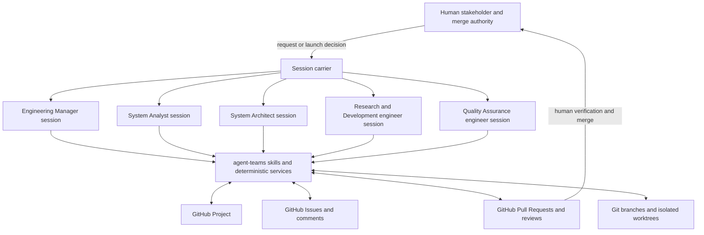
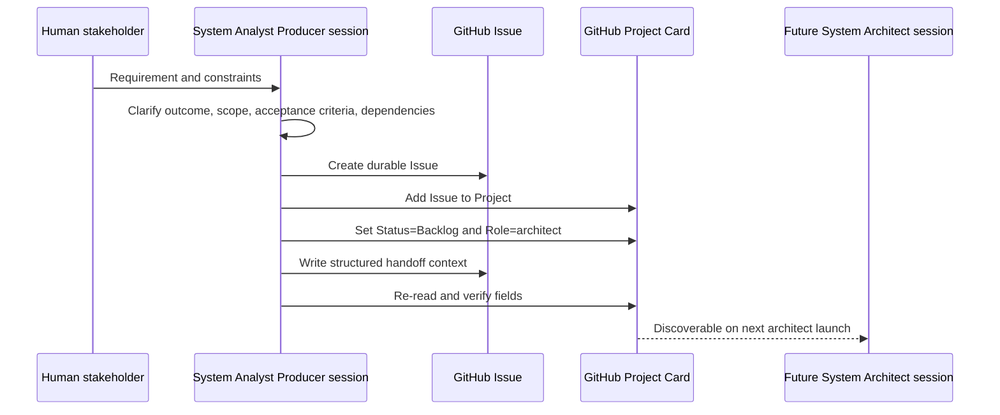
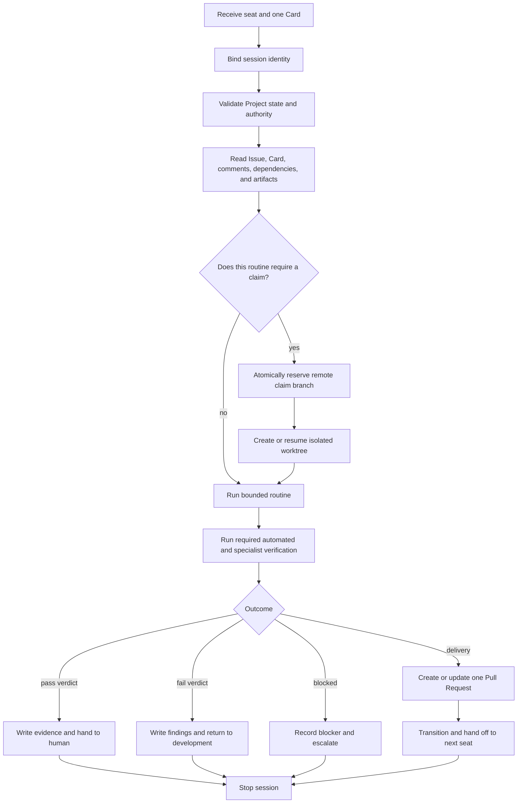
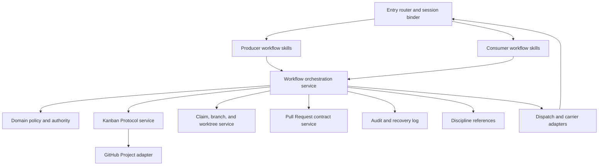

# agent-teams Producer and Consumer Architecture

Status: normative architecture for the complete Phase 1 team
Applies to: `agent-teams`
Last updated: 2026-07-30
Implementation progress: [`IMPLEMENTATION_PLAN.md`](./IMPLEMENTATION_PLAN.md)
Operating guide: [`USAGE.md`](./USAGE.md) — how a human actually drives this

## 1. Purpose and scope

`agent-teams` coordinates an artificial intelligence software engineering team
through a GitHub Project. The architecture has two equally important execution
shapes:

- Producer sessions create, refine, decompose, route, prioritize, and maintain
  work on the kanban;
- Consumer sessions complete or reject exactly one Card and produce one
  reviewable delivery or verdict.

This document defines the overall design: roles, session shapes, GitHub data,
component boundaries, lifecycle, authority, handoffs, concurrency, delivery,
verification, and human acceptance. It intentionally does not inventory the
currently delivered subset. Implemented, partial, pending, blocked, and
deferred work is maintained in the implementation plan.

The design in one sentence is:

> A team seat defines capability and authority, a Producer session lives with
> the board, a Consumer session lives with exactly one Card, and GitHub carries
> every durable handoff between those independent sessions.

## 2. Design lineage

### 2.1 Agent-team adaptation dossier

This architecture directly adopts and reconciles the complete proposed design
in `agent-teams-main/docs/agent-team-adaptation`:

| Source | Architectural contribution |
|---|---|
| [`00-goal.md`](../../agent-teams-main/docs/agent-team-adaptation/00-goal.md) | Phase 1 team boundary, five artificial intelligence seats, human merge authority, sibling-skill composition, and horizontal sessions. |
| [`01-codebase-guide.md`](../../agent-teams-main/docs/agent-team-adaptation/01-codebase-guide.md) | Original board-superpowers skill layers, Card model, claims, worktrees, hooks, scripts, and session assumptions. |
| [`02-agent-team-evaluation.md`](../../agent-teams-main/docs/agent-team-adaptation/02-agent-team-evaluation.md) | Runtime constraints: no correctness dependency on in-memory inter-session messages, persistent identity, or nested teams. |
| [`03-target-architecture.md`](../../agent-teams-main/docs/agent-team-adaptation/03-target-architecture.md) | Orthogonal `Status` and `Role`, authority as legal handoffs, seat-aware policy, complete team lifecycle, horizontal topology, and human merge lane. |
| [`04-implementation-plan.md`](../../agent-teams-main/docs/agent-team-adaptation/04-implementation-plan.md) | Dependency order for building the role layer, handoff protocol, dispatch, specification, development, and verification. |
| [`05-file-change-map.md`](../../agent-teams-main/docs/agent-team-adaptation/05-file-change-map.md) | Expected responsibility boundaries and coupled contracts. |
| [`06-operating-runbook.md`](../../agent-teams-main/docs/agent-team-adaptation/06-operating-runbook.md) | Day-to-day session launch, board-mediated handoff, rejection, escalation, and merge flow. |
| [`README.md`](../../agent-teams-main/docs/agent-team-adaptation/README.md) | Dossier reading order and proposal status. |

### 2.2 Original board-superpowers contracts

The adaptation preserves these load-bearing contracts from the original
board-superpowers architecture:

| Original reference | Contract retained by agent-teams |
|---|---|
| [`0001-positioning.md`](../../agent-teams-main/docs/architecture/0001-positioning.md) | Human attention is concentrated at review and merge; work is decomposed into small reviewable units. |
| [`02-roles.md`](../../agent-teams-main/docs/architecture/0002-product-features-and-flows/02-roles.md) | Producer and Consumer are session purposes relative to the kanban, not worker identities. |
| [`03-producer-surface-redesign.md`](../../agent-teams-main/docs/architecture/0002-product-features-and-flows/03-producer-surface-redesign.md) | Producer routines shape demand and keep the board healthy without implementing Cards. |
| [`04-consumer-surface-redesign.md`](../../agent-teams-main/docs/architecture/0002-product-features-and-flows/04-consumer-surface-redesign.md) | A Consumer binds to one Card, claims it, works in isolation, verifies it, and opens one Pull Request. |
| [`07-cross-cutting-invariants.md`](../../agent-teams-main/docs/architecture/0002-product-features-and-flows/07-cross-cutting-invariants.md) | One authoring assignment maps one Card to one Pull Request; Producers do not implement and Consumers do not merge. Independent verification adds a later one-Card Consumer stage without adding a second implementation Pull Request. |
| [`08-pr-contract.md`](../../agent-teams-main/docs/architecture/0002-product-features-and-flows/08-pr-contract.md) | Pull Request content is the durable delivery contract and contains concrete automated and human verification evidence. |
| [`0004-component-architecture.md`](../../agent-teams-main/docs/architecture/0004-component-architecture.md) | Skills carry intent and policy; deterministic adapters carry external mutations; durable artifacts connect sessions. |
| [`00-kanban-protocol.md`](../../agent-teams-main/docs/architecture/0005-contracts/00-kanban-protocol.md) | Board behavior is exposed as semantic operations rather than a generic field-setting software development kit. |
| [`09-session-agent-protocol.md`](../../agent-teams-main/docs/architecture/0005-contracts/09-session-agent-protocol.md) | Session identity, bounded work, and durable termination behavior form a protocol rather than an informal prompt convention. |
| [`SKILLS.md`](../../agent-teams-main/SKILLS.md) | Layered skill catalog and composition boundaries. |

### 2.3 What is inherited and what is adapted

`agent-teams` is an adaptation of board-superpowers, not a literal rename.
The relationship is:

| Concern | Original board-superpowers | agent-teams adaptation |
|---|---|---|
| Human operator | A human Architect starts Producer and Consumer sessions, verifies deliveries, and merges. | The human remains the stakeholder and only merge authority. Technical shaping is delegated to a System Architect seat and flow coordination to an Engineering Manager / Team Lead seat. |
| Session shape | Producer maintains the kanban; Consumer resolves one Card. | Preserved exactly and made orthogonal to team seat. |
| Worker identity | No persistent artificial intelligence team role is required. | Six durable Role values identify the active seat: `analyst`, `architect`, `rd`, `qa`, `em`, and `human`. |
| Runtime topology | Independent sessions coordinated by the board. | Preserved. The org chart is authority over board state, never a nested call stack. |
| Delivery unit | One Card, one authoring Consumer, one worktree, one Pull Request. | Preserved for implementation and documentation authoring. Independent verification is a second sequential Consumer stage bound to the same Card and existing Pull Request. |
| Board model | GitHub Project lifecycle plus Issue and Pull Request links. | Extended with an orthogonal `Role` field and semantic `handoff_card`. |
| Quality gate | Consumer verifies and the human reviews. | Expanded into an independent Quality Assurance engineer seat that can reject delivery before the human lane. |
| Engineering disciplines | Composed from board-superpowers, superpowers, and gstack. | **Not composed.** agent-teams carries its own skills and only *references* those disciplines; correctness never depends on another plugin being installed. See section 4.10. |
| Merge | Consumer cannot self-merge. | No artificial intelligence seat can merge; the human gate remains a hard floor. |

## 3. Ubiquitous language

### 3.1 Core terms

| Term | Meaning |
|---|---|
| Kanban | The GitHub Project and its governed lifecycle, ownership, prioritization, and handoff fields. |
| GitHub Issue | The repository-scoped durable work record containing problem, scope, acceptance criteria, discussion, and artifact links. |
| GitHub Project item | The membership of an Issue in a specific GitHub Project, including Project field values and its own opaque node identifier. |
| Card | The domain representation of a GitHub Project item backed by a GitHub Issue. A Card joins Issue content, Project fields, claim state, and Pull Request links. |
| Seat | A named team capability and authority boundary. |
| Role | The GitHub Project single-select field that records whose turn it is. Its values are seat tokens. |
| Status | The GitHub Project single-select field that records where the Card is in the delivery lifecycle. |
| Session | One independently launched Claude Code execution with one master agent, one bound seat, and one execution shape. |
| Producer | A board-anchored session whose purpose is to add or reshape work or keep the kanban healthy and ready for more work. |
| Consumer | A Card-anchored session whose purpose is to complete, block, or reject exactly one bound Card. |
| Routine | A bounded workflow performed by a Producer or Consumer session. |
| Claim | An exclusive reservation of one Card, represented by a remote claim branch and an isolated worktree. |
| Transition | A semantic change to `Status`; it does not imply a Role handoff. |
| Handoff | A semantic change to `Role` with a structured reason and required artifacts; it does not imply a Status transition. |
| Dispatch artifact | A deterministic kickoff prompt containing seat, Card identity, required action, and resume context. |
| Verdict | The Quality Assurance engineer's evidence-backed `pass`, `fail`, or `blocked` result for one delivery. |
| Carrier | The mechanism that starts a session, such as a human-opened terminal, a bounded subagent, or a scheduled command. |
| Standing repository context | Durable project instructions and overview pointers that every session can reload, such as repository rules, product overview, architecture index, active decisions, and team configuration. |
| Context bootstrap | The mandatory, read-only startup sequence that loads standing repository context, binds session identity, queries current board state, and builds the seat-specific orientation used by the selected routine. |

### 3.2 Team seats and durable tokens

Full names are used throughout this document. Lowercase tokens are used only
where the exact Project field or prompt representation matters.

| Full seat name | Durable token | Authority and responsibility |
|---|---|---|
| Engineering Manager / Team Lead | `em` | Maintains the whole-team view, priority, work-in-progress limits, dispatch, rebalancing, and organizational escalation. |
| System Analyst | `analyst` | Converts stakeholder demand into a well-shaped requirement with acceptance criteria and durable context. |
| System Architect | `architect` | Owns technical specification, architecture decisions, decomposition, dependencies, readiness, and technical escalation. |
| Research and Development engineer | `rd` | Implements exactly one Ready Card with test-driven development and produces one Pull Request. |
| Quality Assurance engineer | `qa` | Independently verifies one delivery, records evidence, rejects defects, or opens the human review lane. |
| Human stakeholder / merge authority | `human` | Resolves business or authority questions, performs remaining human verification, and holds both lifecycle gates: the only actor allowed to declare work `Ready`, and the only actor allowed to merge. |

### 3.3 Seat and execution shape are independent axes

A seat answers:

```text
Who is acting, and what authority does this session have?
```

An execution shape answers:

```text
What relationship does this session have to the kanban for this run?
```

The session identity model is:

```text
SessionIdentity = Seat + ExecutionShape + ScopeBinding

Producer ScopeBinding => the board or one bounded board projection/routine
Consumer ScopeBinding => exactly one bound Card and one stage
```

The Project `Role` field stores the seat token. It never stores `producer` or
`consumer`.

Seats are an **internal** organising device. A human user never names one. They
state an intent in ordinary language — "what is going on", "we need a CSV
export", "why is this stuck" — and the entry router selects the seat and
routine from that intent plus live board state (section 11.1). Asking a person
which seat they are is a design failure: it exposes an authority model as a
menu.

A prompt marker such as `[role:architect]` remains valid, but it is a
**machine channel**: the deterministic form of a dispatch artifact, which a
carrier pastes verbatim into a fresh session (section 12.1). It is honoured as
an explicit override when a human writes one, and it is how a Producer hands
work to a Consumer, but it is not the expected human interface.

Selecting a seat grants nothing. Prompt text and router inference can request a
route; only durable Project fields and policy checks grant authority, and they
are evaluated identically however the seat was chosen.

One seat is exempt from inference. **The router may never select `human`**
(section 11.1).

### 3.4 Producer and Consumer comparison

| Dimension | Producer | Consumer |
|---|---|---|
| Purpose | Create, refine, decompose, prioritize, route, or maintain work. | Resolve exactly one selected Card with delivery or a recorded rejection/blocker. |
| Board scope | A bounded queue or multiple related Cards, as permitted by the routine. | One bound Card; other Cards may be read for context but not mutated. |
| Repository writes | Does not author implementation commits or push claim branches. | Authors commits only inside the bound worktree and branch. |
| Normal result | New or revised Issues, Cards, specifications, transitions, handoffs, priorities, or dispatch prompts. | One Pull Request, one verdict, or one terminal blocked result. |
| End condition | The intended board-shaping result is durable and its effects are validated. | The bound Card reaches its session boundary and the next seat has durable context. |
| Merge authority | None. | None. |

One session cannot silently change shape. A System Architect Producer session
that decomposes a feature must stop after its board mutations. A separately
launched Research and Development engineer Consumer session implements a
resulting Card.

### 3.5 Board-anchored Producer, Card-anchored Consumer

- a Producer lives with the board. It starts from a board projection, Role
  lane, queue, requirement, or board-health routine and may read or mutate the
  set of Cards permitted by that routine. Even when it focuses on one intake
  Card, its outcome is board shaping rather than implementation delivery;
- a Consumer lives with exactly one Card. Its kickoff binds the Card identity,
  expected `Status` and `Role`, stage objective, claim or Pull Request, and
  stop conditions. It may read other Cards for context but may mutate only the
  bound Card and that Card's artifacts.

The operational hierarchy is therefore a hierarchy of scope and work flow:

```text
GitHub Project / board
`- Producer session: board-level coordination
   `- durable dispatch artifact for Card #42
      `- Consumer session: Card #42 and one bounded stage
         `- claim/worktree/Pull Request or verdict/handoff
            `- durable result returns to the board
```

The indentation does not require runtime process ancestry. A Producer may
render the dispatch artifact, but a human or any supported carrier can start
the Consumer after the Producer session has ended. The Card, not the parent
process, carries the assignment. Multiple Consumers may run concurrently on
different Cards, while exclusive claim prevents two authoring Consumers from
owning the same Card.

The normal flow is:

1. a Producer reads the board and creates, reshapes, prioritizes, routes, or
   selects a Card;
2. the Producer writes the required board state and a carrier-neutral dispatch
   artifact;
3. a carrier launches a new Consumer session bound to that Card;
4. the Consumer resolves exactly one stage and writes a Pull Request, verdict,
   blocker, transition, or handoff;
5. the result is visible on the board, where a later Producer, Consumer, or
   human session continues the flow.

A seat may operate at either level only through separate sessions. For example,
the System Architect is Producer-shaped while decomposing and routing work, but
Consumer-shaped while delivering one specification Card and one documentation
Pull Request. It must stop before changing back to board-level Producer work.

## 4. Architectural principles and invariants

### 4.1 GitHub is the durable coordination plane

No handoff depends on prior conversation memory. GitHub Issues, GitHub Project
fields, comments, branches, worktrees, Pull Requests, reviews, and merge state
must contain enough information for the next session to resume independently.

### 4.2 One session has one master agent and one shape

For the lifetime of a session:

```text
one session = one master agent = one seat = one execution shape
```

Every Consumer session is bound to exactly one Card and one stage:

```text
one Consumer session -> one Card + one bounded stage outcome

authoring Consumer stage
-> one Card + one claim + one worktree + one Pull Request

verification Consumer stage
-> one Card + its existing Pull Request + one verdict
```

A Card may therefore pass through sequential Consumer stages: implementation
first and independent verification second. It never has two concurrent
authoring Consumers. An interrupted or rejected delivery may be resumed by a
new physical session, but that session resumes the same logical assignment,
claim, worktree, and Pull Request instead of creating a second delivery chain.

### 4.3 Producer and Consumer have symmetric hard floors

- A Producer never implements the production change represented by a Card.
- A Consumer never merges its own Pull Request.
- No artificial intelligence seat bypasses independent Quality Assurance by
  handing implementation directly to the human merge lane.

### 4.4 Role and Status are orthogonal

`Status` answers where work is in its lifecycle. `Role` answers whose turn it
is. Changing one never implicitly changes the other. When both must change,
two semantic operations run and partial completion is explicitly recoverable.

### 4.5 Scope hierarchy and authority do not require runtime nesting

Producer and Consumer form an operational scope hierarchy from board-level
coordination to Card-level delivery and back to the board. All seat sessions
remain runtime peers. Reporting lines are enforced through legal handoffs,
permitted actions, escalation routes, and Project Role lanes. The design does
not require a Producer or other parent session to remain alive while a Consumer
works.

### 4.6 Sessions are ephemeral; their scope anchors are durable

Neither a Producer nor a Consumer process survives the end of its session.
"Lives with the board" and "lives with a Card" describe where the next fresh
session reconstructs authority and context; they do not describe a resident
agent process.

```text
Producer process: start -> orient from repository + live board -> coordinate -> persist -> stop
Durable survivor: GitHub Project, Cards, comments, priorities, and dispatch artifacts

Consumer process: start -> orient from repository + bound Card -> resolve one stage -> persist -> stop
Durable survivor: Card, claim branch, worktree metadata, Pull Request, verdict, and handoff
```

A bounded subagent may carry either shape when explicitly supported, but that
is only one launch mechanism. It does not make every Consumer an agent team or
a semantic child of a Producer. A normal Consumer can be launched after the
Producer has stopped. Helper agents spawned inside a Consumer inherit the
same Card boundary and remain implementation details of that one Consumer;
they are not additional seats, Card owners, or handoff destinations.

Broad read access is compatible with bounded ownership. Every seat may read
the repository and related Cards needed to reason correctly. The scope anchor
limits what the session owns and may mutate, not what relevant context it may
inspect.

### 4.7 Skills orchestrate; deterministic components mutate

Skills interpret intent, gather context, choose a bounded routine, and explain
refusal. Deterministic code performs validation, GitHub queries, field
resolution, transitions, handoffs, claims, comments, Pull Request operations,
and structured output.

### 4.8 Semantic operations precede backend abstractions

The system exposes operations such as `transition_card`, `handoff_card`, and
`claim_card`, not unrestricted Project field mutation. A backend-neutral port
is introduced only when a real second backend exists.

### 4.9 Human merge is a hard boundary

Every artificial intelligence seat may prepare evidence and recommend an
outcome. Only the human merge authority can accept the repository change by
merging. This is enforced policy, not merely a prompt instruction.

### 4.10 agent-teams owns its own skills and references the disciplines

Every skill and script in this plugin is its own. agent-teams does not invoke
`superpowers`, `gstack`, or any other plugin's skills, and correctness must
never depend on one being installed.

Test-driven development, planning, review, browser quality assurance, security
review, and branch-finishing remain the disciplines this design expects a
Consumer to follow, and a skill may **reference** them — naming the practice,
citing the sibling that implements it well, or telling the operator to run it.
That is a documentation relationship, not a call. agent-teams owns coordination
contracts, and it carries them in its own instructions rather than delegating
to a plugin that may be absent.

## 5. System context and runtime topology



Each seat box represents an independent session with its own context. There
is no in-memory edge from one seat to another. The apparent inter-agent edges
are reconstructed from durable artifacts on the next launch.

### 5.1 Session carriers

The architecture is carrier-neutral:

| Carrier | Behavior | Intended use |
|---|---|---|
| Human launch | Engineering Manager dispatch renders a kickoff prompt; a human opens a session. | Default Phase 1 carrier and safest way to observe early operation. |
| Bounded subagent | A session starts one short-lived child for a bounded pass and waits for its result. | Optional short verification or triage work; correctness still lands on GitHub. |
| Scheduled command | A scheduler starts a seat-specific non-interactive session. | Later unattended operation after policies and recovery are proven. |

Every carrier consumes the same dispatch artifact. Changing carrier must not
change board contracts or workflow correctness.

### 5.2 Fresh-session context reconstruction

A fresh session has no reliable conversational memory from a previous
session, but it must not begin ignorant of the project. Context is rebuilt
from two durable layers:

1. **Standing repository context** supplies stable knowledge: platform-loaded
   `AGENTS.md` or `CLAUDE.md` instructions when present, repository and product
   overview, architecture index and active decisions, team configuration, and
   explicit context pointers carried by the kickoff or handoff.
2. **Live coordination context** supplies current knowledge: the configured
   Project projection, Role and Status lanes, Card bodies and comments,
   dependencies, claims, linked Pull Requests, reviews, and merge state.

The entry skill owns this bootstrap contract. A direct downstream-skill match
may skip the entry skill's routing decision, but it must not skip the common
bootstrap. Startup is read-only: no seat may mutate state until context has
been loaded, live board state has been queried, and expected identity has been
validated.

Standing context is progressively disclosed rather than copied wholesale into
every prompt. The bootstrap loads a compact overview and stable pointers; the
selected routine then opens the relevant source documents and repository
areas on demand. Live board state always overrides a stale dispatch snapshot.

Producer seats receive role-appropriate broad context:

| Producer seat | Required startup view |
|---|---|
| System Analyst | Product purpose, stakeholder request, terminology, existing requirements, Backlog, and related Cards or specifications. |
| System Architect | Product purpose, repository map, architecture and active decisions, dependencies, relevant Backlog/Blocked Cards, and existing specifications. |
| Engineering Manager / Team Lead | Complete paginated board projection, Role and Status lanes, priorities, dependencies, work-in-progress, claims, aging, blocked work, verification queue, and human lane. |
| Quality Assurance queue Producer | Complete `(In Review, qa)` projection plus linked Pull Request contract state, aging, and required verification capabilities. |

A Consumer receives the same stable repository rules and project overview,
then expands the context for exactly one bound Card and stage. Card anchoring
therefore limits ownership; it does not remove project awareness.

## 6. Organization and authority model

### 6.1 Team structure

```text
Engineering Manager / Team Lead
|- System Analyst
`- System Architect
   |- Research and Development engineer
   `- Quality Assurance engineer

Human stakeholder / merge authority: outside the agent team at the merge gate
```

The diagram expresses responsibility and escalation. It does not authorize
nested runtime calls.

### 6.2 Original human Architect and adapted System Architect

The original board-superpowers term "human Architect" refers to the operator
who starts sessions, understands the system, verifies output, and merges. The
adapted System Architect is an artificial intelligence seat with token
`architect`. It owns technical shaping but cannot exercise the human's merge
authority.

The original human operating responsibility is distributed as follows:

| Original responsibility | Adapted owner |
|---|---|
| Shape stakeholder demand | System Analyst |
| Make technical decisions and decompose work | System Architect |
| Maintain queue, priority, and dispatch | Engineering Manager / Team Lead |
| Implement one unit | Research and Development engineer Consumer |
| Independently verify one delivery | Quality Assurance engineer Consumer |
| Resolve authority questions and merge | Human stakeholder / merge authority |

### 6.3 Seat-to-shape mapping

| Seat | Producer routines | Consumer routines |
|---|---|---|
| Engineering Manager / Team Lead | Briefing, prioritization, triage, work-in-progress control, dispatch, recovery, and escalation. | None in Phase 1. |
| System Analyst | Requirement intake, clarification, acceptance-criteria shaping, and return-path refinement. | None in Phase 1. |
| System Architect | Technical shaping, architecture review, dependency analysis, and decomposition. Proposes readiness; cannot grant it. | Author one specification or Architecture Decision Record as one documentation Card and one documentation Pull Request. |
| Research and Development engineer | None in Phase 1. | Claim and implement exactly one Ready Card, verify it, and open one Pull Request. |
| Quality Assurance engineer | Inspect and summarize the verification queue. | Verify exactly one delivery, write a verdict, reject to development, or hand to the human lane. |
| Human stakeholder / merge authority | May originate or reprioritize demand through an explicit decision. | Manual review and merge are outside automated Consumer execution. |

### 6.4 Legal handoff authority

The handoff graph is the enforceable organization chart:

| From seat | Legal destination | Meaning |
|---|---|---|
| System Analyst | System Architect | Requirement is shaped and ready for technical work. |
| System Analyst | Engineering Manager / Team Lead | Intake cannot proceed because of organizational priority or ownership. |
| System Analyst | Human stakeholder / merge authority | A business or authority decision is required. |
| System Architect | System Analyst | Requirement is under-specified or acceptance criteria are not testable. |
| System Architect | Research and Development engineer | Implementation Card is technically Ready. |
| System Architect | Quality Assurance engineer | A verification-only or architecture-validation assignment is Ready. |
| System Architect | Engineering Manager / Team Lead | Technical blocker requires organizational resolution. |
| System Architect | Human stakeholder / merge authority | An irreversible product or architecture decision requires human authority. |
| Research and Development engineer | Quality Assurance engineer | Pull Request is ready for independent verification. |
| Research and Development engineer | System Architect | Technical ambiguity or blocker requires technical leadership. |
| Quality Assurance engineer | Research and Development engineer | Delivery failed verification and must be corrected. |
| Quality Assurance engineer | System Architect | Finding reveals a specification or architecture defect. |
| Quality Assurance engineer | Engineering Manager / Team Lead | Repeated or organizational blocker requires team-level recovery. |
| Quality Assurance engineer | Human stakeholder / merge authority | Verification passed and the Pull Request is ready for human review. |
| Engineering Manager / Team Lead | Any team seat or human | Dispatch, rebalance, recovery, or escalation within policy. |
| Human stakeholder / merge authority | Any team seat | Human decision, requested change, reprioritization, or restart. |

Critical refusals include:

- the System Analyst cannot hand directly to the Research and Development
  engineer;
- the Research and Development engineer cannot hand directly to the human;
- the Research and Development engineer cannot mark its own work Ready;
- no artificial intelligence seat can merge;
- a normal handoff cannot exceed the configured per-Card handoff cap.

## 7. Producer architecture

### 7.1 Producer purpose

A Producer session exists to make the kanban a better source of future work.
It may originate demand, reshape existing demand, review a queue, change
priority, route ownership, or repair board health. Its output is durable board
state, not implementation code.

### 7.2 Common Producer session protocol

Every Producer routine follows the same protocol:

1. Enter through the common bootstrap owned by `using-agent-teams`, even when
   intent routing already selected a downstream Producer skill.
2. Load standing repository context and its explicit overview, architecture,
   decision, and team-configuration pointers.
3. Bind the seat from the kickoff prompt and validate that the requested
   routine belongs to that seat.
4. Run preflight for repository identity, GitHub authentication, Project
   configuration, required fields, and required field options.
5. Query a complete, paginated live board projection and normalize Cards before
   filtering.
6. Build the seat-specific overview, then select only the bounded queue or
   demand item required by the routine.
7. Read Issue content, comments, dependencies, linked Pull Requests, and
   applicable repository context.
8. Produce a proposed board mutation plan and refuse actions outside the seat's
   authority.
9. Execute semantic mutations through deterministic services.
10. Re-read affected Cards and verify the resulting `Status`, `Role`, comment,
   and artifact links.
11. Emit a structured result or dispatch queue and terminate.

A Producer may span multiple Cards only when its active routine explicitly
permits queue-wide work. It must not opportunistically implement a Card it
encounters.

### 7.3 System Analyst Producer flow



The System Analyst owns problem clarity, not technical implementation design.
A shaped intake contains at least:

- user or business outcome;
- scope and explicit non-goals;
- measurable acceptance criteria;
- known constraints and dependencies;
- open questions and their required decision owner;
- source links or evidence;
- handoff reason and expected System Architect action.

If the System Architect returns the Card, the System Analyst resumes from the
same Issue and adds clarification instead of creating duplicate work.

### 7.4 System Architect Producer flow

The System Architect turns shaped demand into technically Ready work:

1. Select a `(Backlog, architect)` Card or a technical escalation addressed to
   `architect`.
2. Validate that the outcome and acceptance criteria are sufficiently clear.
3. Inspect repository architecture, interfaces, data flow, security boundary,
   migration needs, and test strategy.
4. Decide whether the change is one independently shippable Card or requires
   flat decomposition into multiple implementation Cards.
5. Ensure a durable specification exists. If authoring the specification
   requires repository changes, create or select a documentation Card and end
   the Producer session; a separate System Architect Consumer session authors
   that documentation Pull Request.
6. After the specification is durable on the target branch, create or update
   implementation Cards with specification pointers, dependencies, acceptance
   criteria, and verification needs.
7. Hand eligible Cards to the human stakeholder for the readiness decision.
   The System Architect decides what the work *is* and that it is technically
   sound; it may not declare it `Ready`. The human opens that gate.
8. Record unresolved decisions and route them to the appropriate seat.

A batch decomposition session is Producer-shaped even though it creates Cards.
A one-document specification session is Consumer-shaped because it completes
one documentation Card through one Pull Request.

### 7.5 Engineering Manager Producer flow

The Engineering Manager operates the whole-team queue:

1. Read all Role lanes and lifecycle states.
2. Surface Ready work, active work, verification work, human review work,
   Blocked Cards, aging, dependencies, stale claims, and handoff counts.
3. Enforce global and configured per-seat work-in-progress limits.
4. Order dispatch candidates deterministically by explicit priority, dependency
   readiness, age, and stable Card identity.
5. Refuse dispatch when the target seat has no legal next action.
6. Produce carrier-neutral kickoff prompts; never claim that prompt rendering
   started a session.
7. Rebalance or escalate only through legal handoffs with written reasons.
8. Route handoff-cap breaches and unrecoverable ownership ambiguity to a
   Blocked Engineering Manager lane.

A dispatch queue item contains:

```text
seat: full seat name and durable token
card: Issue number, Project item identifier, repository, and URL
expected_status_role: required pair before work begins
routine: exact Producer or Consumer routine
reason: why this Card is next
artifacts: specification, dependencies, Pull Request, or verdict links
kickoff_prompt: carrier-neutral session prompt
```

### 7.6 Quality Assurance queue Producer flow

Queue inspection is distinct from one-Card verification. A Quality Assurance
engineer Producer session may:

- list Cards in `(In Review, qa)`;
- validate Pull Request contract presence;
- identify missing artifacts or stale verification assignments;
- order candidates for separate verification sessions;
- emit one kickoff prompt per Card.

It does not issue a pass or failure verdict for multiple Cards. Each verdict
belongs to a separately bound Quality Assurance engineer Consumer session.

### 7.7 Producer stopping conditions

A Producer terminates when its declared board-shaping result is durable and
verified. It stops earlier with a structured refusal when:

- required Project fields or options are absent;
- the acting seat lacks authority;
- a requested transition or handoff is illegal;
- required evidence is missing;
- pagination or Project identity is uncertain;
- an external mutation partially succeeded and requires fix-forward;
- the requested work would cross into implementation.
## 8. Consumer architecture

### 8.1 Consumer purpose

A Consumer session pulls exactly one Card and resolves its assigned stage. It
may read other Cards for context but may mutate only the bound Card and its
associated claim, worktree, branch, Pull Request, comments, and evidence.

### 8.2 Universal Consumer lifecycle



Every Consumer session:

1. receives an explicit seat and Card binding;
2. validates the exact expected `Status` and `Role` pair;
3. refuses ambiguous or already-owned work;
4. establishes exclusive claim and worktree isolation when it will author
   commits;
5. follows the Card's acceptance criteria and the disciplines its routine names;
6. records concrete evidence, not an unsupported success assertion;
7. performs the legal transition and handoff for its outcome;
8. stops without merging or selecting another Card.

### 8.3 Research and Development engineer Consumer flow

The implementation Consumer owns one `(Ready, rd)` Card:

1. Bind `[role:rd] [board-card:#N]`.
2. Verify the Card is Ready, assigned to `rd`, dependency-ready, and not
   already claimed by another session.
3. Atomically create the remote claim branch. A losing concurrent claimant
   exits cleanly without local work.
4. Create or resume one isolated worktree derived from the verified claim.
5. Read the specification, acceptance criteria, dependencies, architecture
   decisions, prior handoffs, and verification requirements.
6. Produce an implementation plan bounded to this Card.
7. Implement through test-driven development: demonstrate a failing test,
   make it pass, refactor, and run the required verification chain.
8. Apply the planning, review, browser, security, and branch-finishing
   disciplines the routine names, using whatever tooling is actually present.
9. Open or update exactly one Pull Request linked to the Issue.
10. Transition `In Progress -> In Review` and hand off `rd -> qa` with Pull
    Request URL, branch, tests, limitations, and required verification.
11. Stop. The session does not merge and does not consume a second Card.

If technical ambiguity blocks implementation, the Consumer records the
blocker, transitions to `Blocked` when appropriate, hands to the System
Architect, and stops without hiding or deleting work.

### 8.4 System Architect documentation Consumer flow

When a specification or Architecture Decision Record is itself a repository
deliverable, a separate System Architect Consumer session:

1. binds one documentation Card owned by `architect`;
2. claims one documentation branch and worktree;
3. researches the codebase and relevant constraints;
4. authors only documentation and supporting diagrams or decision records;
5. validates links, internal consistency, and documentation checks;
6. opens one documentation Pull Request with the standard contract;
7. routes the documentation through review and human merge;
8. stops.

A later System Architect Producer session observes that durable merged
specification and performs decomposition. Combining documentation delivery and
multi-Card decomposition in one session would blend Consumer and Producer
shapes and is therefore prohibited.

### 8.5 Quality Assurance engineer Consumer flow

The verification Consumer owns one `(In Review, qa)` Card and its linked Pull
Request:

1. Bind `[role:qa] [board-card:#N]` and validate Role, Status, and Pull Request
   linkage.
2. Read the specification, acceptance criteria, implementation handoff, Pull
   Request body, commits, automated checks, and known limitations.
3. Validate the Pull Request contract before evaluating behavior.
4. Run applicable functional, regression, browser, data-correctness, security,
   and review checks through whatever tooling is actually available.
5. Record a structured `pass`, `fail`, or `blocked` verdict with commands,
   URLs, screenshots, observations, and reproducible findings.
6. On pass, preserve `In Review`, hand off `qa -> human`, and surface the exact
   remaining Human Verification TODO.
7. On failure, transition `In Review -> In Progress`, hand off `qa -> rd`, and
   retain the same Issue, branch, and Pull Request when correction can continue
   safely.
8. On specification or architecture failure, route to the System Architect.
9. Stop without changing production code or merging.

A test-only correction may use a separate, explicitly governed documentation
or test Card. Quality Assurance must not silently fix production code in the
verification session because that would collapse independent verification.

### 8.6 Consumer stopping conditions

A Consumer ends with exactly one durable outcome:

- Pull Request ready for the next seat;
- evidence-backed verification pass;
- evidence-backed rejection returned to the responsible seat;
- explicit Blocked state and escalation;
- clean claim-race loss or authority refusal before work begins.

It never ends by silently abandoning local work, leaving an unexplained field
mutation, merging, or selecting another Card.

## 9. Complete end-to-end session flow

### 9.1 Golden path

```mermaid
flowchart LR
    HumanRequest[Human request]
    AnalystProducer[System Analyst Producer]
    BoardBacklog[Issue and Card: Backlog, architect]
    ArchitectProducer[System Architect Producer]
    SpecDecision{Repository specification required?}
    SpecCard[One documentation Card]
    ArchitectConsumer[System Architect Consumer]
    SpecPullRequest[Documentation Pull Request]
    HumanSpec[Human specification merge]
    ReadyCards[Implementation Cards: Ready, rd]
    ManagerProducer[Engineering Manager Producer]
    DevelopmentConsumer[Research and Development engineer Consumer]
    CodePullRequest[Implementation Pull Request]
    QualityConsumer[Quality Assurance engineer Consumer]
    HumanReview[Card: In Review, human]
    HumanMerge[Human verification and merge]
    Done[Card: Done]

    HumanRequest --> AnalystProducer
    AnalystProducer --> BoardBacklog
    BoardBacklog --> ArchitectProducer
    ArchitectProducer --> SpecDecision
    SpecDecision -->|yes| SpecCard
    SpecCard --> ArchitectConsumer
    ArchitectConsumer --> SpecPullRequest
    SpecPullRequest --> HumanSpec
    HumanSpec --> ArchitectProducer
    SpecDecision -->|specification already durable| ReadyCards
    ArchitectProducer --> ReadyCards
    ReadyCards --> ManagerProducer
    ManagerProducer --> DevelopmentConsumer
    DevelopmentConsumer --> CodePullRequest
    CodePullRequest --> QualityConsumer
    QualityConsumer -->|pass| HumanReview
    HumanReview --> HumanMerge
    HumanMerge --> Done
    QualityConsumer -->|fail| DevelopmentConsumer
```



Each Producer or Consumer node is a separate session. Returning to a prior
node means launching a new session that reconstructs context from GitHub.

### 9.2 Session-by-session durable interaction

| Step | Session | Reads | Writes | Durable next-session trigger |
|---|---|---|---|---|
| 1 | System Analyst Producer | Human request, repository identity, intake policy. | GitHub Issue, Project item, `Status=Backlog`, `Role=architect`, handoff comment. | Card appears in the System Architect lane. |
| 2 | System Architect Producer | Issue, acceptance criteria, repository architecture, dependencies. | Specification pointer, decisions, decomposition plan, or one documentation Card. | Either a System Architect documentation Consumer is dispatchable or implementation Cards can be made Ready. |
| 3 | System Architect Consumer when needed | One documentation Card and repository context. | Documentation commits, one Pull Request, verification evidence. | Human reviews and merges the specification. |
| 4 | System Architect Producer | Merged specification and intake Card. | Flat implementation Cards, dependencies, `Status=Backlog`, `Role=human`, handoff comments. | Cards appear in the human readiness queue. |
| 4b | Human stakeholder (readiness gate) | Each shaped Card, its specification, and acceptance criteria. | `Status=Ready`, `Role=rd` via `promote`. | Ready Cards appear in the development lane. |
| 5 | Engineering Manager Producer | Complete board projection, priority, dependencies, work-in-progress counts. | Dispatch queue and optional legal rebalancing handoffs. | A carrier starts one Research and Development engineer Consumer per selected Card. |
| 6 | Research and Development engineer Consumer | One Card, specification, claim state, worktree, tests. | Claim branch, commits, tests, one Pull Request, `Status=In Review`, `Role=qa`, handoff comment. | Card appears in the Quality Assurance lane. |
| 7 | Quality Assurance engineer Consumer | One Card, Pull Request, checks, acceptance criteria, delivery evidence. | Verdict and evidence; either `Role=human` or `Status=In Progress, Role=rd`. | Human review or a new development correction session becomes dispatchable. |
| 8 | Human stakeholder / merge authority | Pull Request, verdict, automated evidence, Human Verification TODO. | Review decision, merge or requested changes, final `Done` reconciliation. | Completed Card or a durable return path. |

### 9.3 Failure and escalation paths

| Situation | Resulting Status | Resulting Role | Next session |
|---|---|---|---|
| Requirement is under-specified | `Backlog` | `analyst` | System Analyst Producer clarification. |
| Research and Development engineer has a technical blocker | `Blocked` | `architect` | System Architect Producer resolution. |
| System Architect cannot resolve an organizational or authority decision | `Blocked` | `em` or `human` | Engineering Manager or human decision. |
| Quality Assurance engineer rejects behavior | `In Progress` | `rd` | New Research and Development engineer Consumer on the same Card and Pull Request. |
| Quality Assurance engineer finds a specification defect | `Blocked` or `Backlog` as governed | `architect` | System Architect Producer correction. |
| Handoff cap is exceeded | `Blocked` | `em` | Engineering Manager recovery. |
| Claim race is lost | unchanged | unchanged | Losing Consumer exits; winner continues. |
| Partial external mutation occurs | explicitly reported partial pair | responsible recovery seat | Fix-forward routine replays only missing semantic operations. |
## 10. GitHub artifact and data architecture

### 10.0 The four durable artifacts and what each one is for

agent-teams stores nothing of its own. There is no database, no state file, and
no resident process. Everything the team knows lives in four GitHub and Git
artifacts, and each answers exactly one question. Keeping those questions
separate is what lets an independent session reconstruct the whole picture on a
cold start.

| Artifact | The one question it answers | Written by | Read by |
|---|---|---|---|
| **GitHub Project** | *Where is this work, and whose turn is it?* | `transition_card`, `handoff_card` | every session's bootstrap |
| **GitHub Issue** (+ comments) | *What is the work, and what happened to it?* | intake, decomposition, handoff comments | the seat that picks the Card up next |
| **Git** (branches, worktrees) | *Who holds this Card right now, and where is the work happening?* | claim push, worktree create | any Consumer about to claim |
| **Pull Request** | *What was delivered, and is it acceptable?* | authoring Consumer, verifying Consumer | Quality Assurance, then the human |

#### GitHub Project — the routing plane

The Project carries exactly two governed single-select fields, `Status` and
`Role`, and nothing else the system depends on. It is deliberately thin: it is
an index, not a record. It holds no prose, no evidence, and no history beyond
the current pair, because anything durable belongs on the Issue where it can be
read without Project permissions.

The Project is what makes *queues* possible. Every Producer routine is a query
against it: dispatch reads `(Ready, <seat>)`, verification inspection reads
`(In Review, qa)`, the readiness gate reads `(Backlog, human)`, triage reads
`Blocked` grouped by `Role`. Because the pair is a Project field rather than a
label or a body convention, those queries are exact and a Card cannot be in two
lanes at once.

The Project is also the only artifact this system *mutates for coordination*.
That is why the semantic surface exposes `transition_card` and `handoff_card`
and deliberately withholds `set_card_field` (section 4.8): a generic setter
would let a session invent routing states that no policy rule governs.

#### GitHub Issue — the record and the context channel

The Issue is the Card's body of truth. It carries the goal, scope and
non-goals, acceptance criteria, dependencies, and the specification pointer —
written once at intake and refined in place rather than duplicated into new
Issues.

Its **comments are the inter-session message bus**. A structured handoff
comment (section 10.4) is how one session tells the next what it did and what
is needed, because the next session has no memory of the previous one and no
process to ask. The comment is written for a stranger: if a fact is not in the
Issue or reachable from a link in it, that fact is lost.

Comments are also *counted*: the handoff marker lets the cap detect a Card
ping-ponging between seats (section 13.4). This is why the marker is a machine
grammar and not decoration, and why free text is neutralised before rendering
(section 14.1) — an Issue body is untrusted input, and a Card that could forge
a handoff line could forge a routing decision.

#### Git — the lock and the isolation boundary

Git plays two roles that no GitHub field can play.

First, **the remote claim branch is the mutual-exclusion primitive**. Two
Consumers may read the same `(Ready, rd)` Card simultaneously; exactly one
compare-and-swap push of `claim/<n>-<slug>` succeeds, and the loser exits
cleanly having written nothing. A Project field cannot do this — reading and
writing it is not atomic, so two sessions could both observe "unclaimed" and
both proceed. Distributed exclusion needs a remote arbitration surface, and a
branch push is one that requires no server of our own.

Second, **the worktree is the blast radius**. One Consumer, one worktree, one
branch: N sessions can build concurrently with zero shared working state. A
local worktree alone is *not* a claim, because another machine cannot observe
it — the remote branch is what other sessions can see.

#### Pull Request — the delivery contract and the acceptance surface

The Pull Request is where work stops being a board state and becomes a
reviewable proposal. It carries the fixed body contract of section 10.5:
Summary, Test Plan, Automated Verification, Human Verification TODO, Retro
Notes, and the closing trailer that links the Issue.

It is the only artifact where **evidence** lives. A Card can claim a state; a
Pull Request has to show commands, outputs, and diffs. That is what lets the
Quality Assurance seat reject something on the record rather than on judgment
alone, and what makes the human's merge decision cheap enough to be a real
gate rather than a rubber stamp.

It is also where the system's hardest floor sits: no artificial intelligence
seat may merge (section 4.9). Every agent seat can prepare, argue for, and
evidence a change. Only the human can accept it.

#### How the four compose

```text
Issue        what & why, plus the running conversation
  +
Project      where it is, whose turn        <- queues and dispatch read this
  +
Git          who holds it, where they work  <- exclusive claim + isolation
  +
Pull Request what was delivered, evidence   <- review and the merge gate
  =
everything a fresh session needs to continue, with no memory of any previous one
```

A useful test of any proposed feature: *which of these four would it write to,
and could a cold session still reconstruct the truth without it?* If a design
needs a fifth store, it is usually a sign that one of these four is being used
for the wrong question.

### 10.1 Issue, Project item, and Card identity

A GitHub Issue and GitHub Project item are related but not interchangeable:

```text
GitHub Issue
|- repository owner/name
|- Issue number and node identifier
|- title and body
|- acceptance criteria and discussion
`- Pull Request relationships

GitHub Project item
|- Project node identifier
|- item node identifier
|- Status option identifier
|- Role option identifier
|- priority and planning fields
`- content link to the GitHub Issue

Card = normalized join of Issue + Project item + claim + Pull Request state
```

Board selection and field mutation use Project item and option identifiers.
Issue comments and Pull Request closing links use repository and Issue
identifiers. Deterministic adapters retain every identity explicitly and never
reconstruct identity from display text.

### 10.2 Canonical Status and Role fields

| Field | Values | Question answered |
|---|---|---|
| `Status` | `Backlog`, `Ready`, `In Progress`, `Blocked`, `In Review`, `Done` | Where is this Card in the lifecycle? |
| `Role` | `analyst`, `architect`, `rd`, `qa`, `em`, `human` | Whose turn is it? |

The Card's routing state is the pair `(Status, Role)`. Common pairs are:

| Pair | Meaning |
|---|---|
| `(Backlog, analyst)` | Requirement needs clarification. |
| `(Backlog, architect)` | Shaped demand awaits technical work. |
| `(Ready, architect)` | One documentation or architecture Card is ready for a System Architect Consumer. |
| `(Ready, rd)` | Implementation Card is ready to claim. |
| `(In Progress, rd)` | Implementation is actively claimed or being corrected. |
| `(In Review, qa)` | Delivery awaits independent verification. |
| `(In Review, human)` | Verification passed; human review and merge remain. |
| `(Blocked, architect)` | Technical resolution is required. |
| `(Blocked, em)` | Organizational recovery is required. |
| `(Done, human)` or `(Done, empty)` | Human accepted the delivery; final Role representation is a configured policy choice. |

### 10.3 Lifecycle transitions

A central policy component owns legal Status transitions. The normal delivery
path is:

```text
Backlog -> Ready -> In Progress -> In Review -> Done
```

`Blocked` is an interruption state with a recorded prior state and recovery
reason. Rejection uses:

```text
In Review -> In Progress
```

No skill may invent a new transition in prose. Illegal transitions refuse
before mutation.

### 10.4 Handoff contract

`handoff_card(card, from_seat, to_seat, reason, artifacts)` performs:

1. validate current Role and the authority matrix;
2. set the `Role` single-select field to the destination seat;
3. write a structured Issue comment;
4. append an audit event;
5. re-read and verify the resulting state.

The operation never changes Status. A separate `transition_card` operation is
required when the lifecycle also moves.

Canonical comment shape:

```markdown
<!-- agent-teams:handoff -->
**Handoff**: `rd` -> `qa`
**Reason**: Pull Request #57 is open and automated checks passed
**Needs from you**: Verify user-interface behavior and data correctness
**Artifacts**: Pull Request #57; branch `claim/42-revenue-chart`
```

The receiver must be able to resume from this comment and its linked artifacts
without access to the sender's conversation.

### 10.5 Pull Request delivery contract

Every Consumer Pull Request uses a fixed body shape:

```markdown
## Summary

## Test Plan

## Automated Verification

## Human Verification TODO

## Retro Notes

Closes #<issue-number>.

<!-- agent-teams:pr -->
```

Contract rules:

- Summary and Test Plan explain the delivered change and intended checks.
- Automated Verification is required and names concrete commands, checks,
  outputs, and applicable specialist reviews.
- Human Verification TODO is optional; if present, every item must require
  genuine human judgment and cannot be filler.
- Retro Notes are required when reusable lessons exist and capture knowledge,
  not velocity metrics.
- The closing trailer is required and must survive every Pull Request body
  update so GitHub can link and close the Issue on merge.
- The marker allows queue inspection to distinguish governed deliveries.

### 10.6 Verdict contract

A Quality Assurance verdict is structured data rendered for humans:

```text
verdict: pass | fail | blocked
card: stable Card and Issue identity
pull_request: URL and node identity
scope: functional | user-interface | data-correctness | security | regression
checks: commands, URLs, screenshots, and observations
findings: reproducible expected-versus-actual results
limitations: checks not performed and why
next_role: human | rd | architect | em
```

A bare "looks good" or "tests fail" is not a valid verdict.

### 10.7 Claim and worktree model

A code- or documentation-authoring Consumer obtains exclusive ownership before
local mutation:

1. compute the canonical claim branch from Card identity;
2. push the claim with compare-and-swap semantics;
3. treat a race-lost result as a clean, expected refusal;
4. resolve an explicit worktree path inside the configured workspace;
5. create or resume exactly one worktree for the claim;
6. never delete an unresolved or unverified worktree path;
7. clean up only after confirmed merge or explicit cancellation.

Local worktree existence alone is not a distributed claim because independent
sessions or machines cannot observe it. The remote branch is the arbitration
surface.

## 11. Component architecture



### 11.1 Entry router and session binder

Responsibilities:

- run the common context bootstrap exactly once for every governed session;
- load standing repository instructions and stable project-context pointers;
- **infer the seat and routine from the user's stated intent** plus live board
  state, without requiring or requesting a seat token from a person;
- parse `[role:<seat>]` and optional `[board-card:#N]` markers when present,
  and treat them as an explicit override of that inference;
- bind one seat and one execution shape;
- discover repository and Project configuration;
- query the current board or bound Card through deterministic read services;
- build the role-appropriate orientation before any mutation;
- **default to orientation** when intent is unstated: report board state and
  the recommended next action rather than asking the user to classify
  themselves;
- route only to routines legal for that seat and shape;
- run common preflight before workflow-specific work.

The router does not grant authority. It passes claimed identity to the policy
layer, which checks durable board state. A downstream skill selected directly
may bypass the routing decision, but it must invoke or prove completion of the
same bootstrap contract.

#### The `human` exemption

**The router may never select `human`.** Every other seat is inferable, because
inferring one only chooses which refusals will apply. `human` is different: it
is the seat that holds both lifecycle gates, so a router that could adopt it
could approve its own readiness decision and defeat the gate by construction.

When the next legal step is human-gated, the session stops and reports:
what the decision is, what it recommends and why, and the exact command or
Pull Request for the user to act on. It does not run `promote` and does not
pass `--acting-role human` on its own initiative.

This boundary is carried by instructions and by the user being the one who runs
the gate commands. It is **not** enforced in code, and cannot be: the adapter
receives a seat token and has no way to distinguish a token a person supplied
from one a session supplied. Any agent with shell access could pass the flag.
Recording that honestly is preferable to implying a check that does not exist —
if this boundary is ever violated in practice, the answer is an out-of-band
confirmation channel, not a stricter argument parser.

### 11.2 Producer workflow skills

Producer skills cover:

- requirement intake;
- technical shaping and decomposition;
- board briefing and triage;
- dispatch and rebalancing;
- verification-queue inspection;
- recovery and board maintenance.

They orchestrate semantic services and must not contain raw Project field
identifiers or ad hoc GitHub mutation commands.

### 11.3 Consumer workflow skills

Consumer skills cover:

- one-Card documentation authoring;
- one-Card implementation;
- one-Card delivery verification;
- blocked escalation and resume;
- Pull Request submission and post-review update.

They enforce Card binding, claim ownership, worktree isolation, verification,
and the one-Pull-Request boundary.

### 11.4 Domain policy and authority

The policy component owns:

- valid Status and Role values;
- legal Status transitions;
- legal handoffs and escalation routes;
- allowed actions by seat;
- Producer and Consumer hard floors;
- work-in-progress and handoff caps;
- valid `(Status, Role)` preconditions;
- final human-only merge refusal.

Policy is pure and exhaustively testable without GitHub.

### 11.5 Workflow orchestration service

The workflow service composes policy and external adapters into higher-level
transactions such as:

- intake requirement;
- promote one Card to Ready;
- decompose one Card into flat implementation Cards;
- claim and begin one Consumer assignment;
- submit one Pull Request and hand to Quality Assurance;
- record one verdict and route pass or failure;
- reconcile confirmed human merge;
- recover a partial handoff or stale claim.

It reports the exact completed mutation prefix if an external step fails.

### 11.6 Kanban Protocol service

The semantic board surface includes:

```text
resolve_project
list_cards
get_card
create_card
comment_on_card
transition_card
handoff_card
claim_card
release_claim
link_pull_request_to_card
record_verdict
reconcile_done
```

The service resolves field and option identifiers, normalizes pagination, and
returns stable structured envelopes. It does not expose an unrestricted
`set_card_field` operation.

### 11.7 GitHub Project adapter

The GitHub adapter owns:

- authenticated GitHub command-line interface or application programming
  interface invocation;
- repository, Project, field, and option discovery;
- pagination and response normalization;
- Project item mutation;
- Issue creation and comments;
- Pull Request lookup and mutation;
- structured error classification.

Raw GitHub shapes do not escape the adapter.

### 11.8 Git and worktree service

This service owns claim branch naming, atomic remote claim, race-lost results,
worktree path validation, create/resume behavior, merge confirmation, and safe
cleanup. It does not decide which seat may claim; policy decides that first.

### 11.9 Pull Request contract service

This service renders, validates, and safely updates the governed Pull Request
body. It preserves the closing trailer and marker, links the correct Issue,
checks required evidence, and refuses direct merge operations from agent
sessions.

### 11.10 Audit and recovery log

Each semantic mutation records separate session shape and seat dimensions:

```text
event_id
occurred_at
session_id
actor_seat
execution_shape
card_identity
action
before_state
after_state
result
reason
artifacts
recovery_path
```

The audit path must not turn a successful primary board mutation into a false
failure. If the primary audit store is unavailable, a durable local outbox may
record the event for later flush. Repeated dead-letter events are the signal to
upgrade the storage backend.

### 11.11 Dispatch and carrier adapters

Dispatch selects legal work and emits a stable artifact. Carrier adapters may
turn that artifact into a human instruction, bounded subagent prompt, or
scheduled invocation. They never own lifecycle truth.

### 11.12 Discipline references

There is no sibling-skill composition layer, and none is planned. agent-teams
skills carry their own instructions (section 4.10). What this layer does own is
the *record* of engineering discipline:

- names the discipline a routine expects — test-first development, review,
  security, browser verification, branch finishing;
- may point to a sibling plugin that implements it well, as a recommendation
  the operator or the session may follow;
- records which checks actually ran, in the Pull Request contract;
- refuses when a required discipline cannot be evidenced, on the evidence
  rather than on whether some other plugin is installed;
- never assumes a skill exists, and never makes correctness depend on one.
## 12. Session protocol

### 12.1 Kickoff envelope

A dispatchable session receives:

```text
[role:<seat>] [board-card:#<issue-number>]

execution_shape: producer | consumer
routine: canonical routine name
repository: owner/name
project: stable Project identity
context_sources: stable repository-relative overview and decision pointers
expected_status: exact Status or permitted set
expected_role: exact Role
objective: one bounded outcome
required_artifacts: durable links
stop_conditions: success, refusal, blocked, or race-lost
```

Producer sessions that operate a queue may omit the Card binding but must name
the bounded projection. Consumer sessions never omit it.

### 12.2 Session start

On every launch:

1. load platform-provided standing repository instructions;
2. enter the common bootstrap owned by the entry skill;
3. parse and bind seat, execution shape, scope binding, and routine;
4. discover repository and Project configuration;
5. load the compact project overview and stable context pointers;
6. verify credentials and required capabilities;
7. query the live paginated board projection and fetch the bound Card or queue;
8. compare expected and actual Role, Status, claim, and artifact state;
9. build the role-specific orientation and open deeper repository context on
   demand;
10. refuse stale dispatch rather than acting on outdated assumptions;
11. write a session-start audit event when governed audit is enabled.

No mutation is legal before steps 1 through 10 complete. Closing the session
ends the process; a later session repeats this protocol against the durable
repository and GitHub state.

### 12.3 Session completion

A session completion envelope contains:

```text
session_id
seat
execution_shape
routine
cards_read
cards_mutated
status_before_after
role_before_after
artifacts_created_or_updated
verification_evidence
next_legal_seat
recovery_required
```

The conversational summary is useful to the human, but the durable GitHub
artifacts are authoritative.

## 13. Consistency, concurrency, and recovery

### 13.1 Optimistic concurrency

Before mutation, semantic services compare expected Role, Status, claim, and
artifact state with the live Card. Stale state produces a refusal and fresh
projection rather than a blind overwrite.

### 13.2 Multi-step external mutations

GitHub does not provide one transaction across Issue comments and Project
field changes. Each workflow therefore:

1. validates all known preconditions first;
2. executes a documented mutation order;
3. records each successful step;
4. returns the exact partial state on failure;
5. provides an idempotent fix-forward operation;
6. never claims rollback unless a compensating operation actually succeeded.

For a handoff, changing Role before writing the comment can leave new ownership
without context. Recovery detects that prefix and writes the missing structured
comment rather than flipping ownership blindly.

### 13.3 Claim races

Concurrent Consumers are expected. Exactly one remote claim operation wins.
Race loss is a normal structured outcome, not an exception that leaves a
worktree or branch behind.

### 13.4 Handoff loops

Each structured handoff increments the Card's handoff count. At the configured
cap, normal handoff refuses and routes the Card to `(Blocked, em)` for recovery.
This prevents endless Quality Assurance-to-development-to-architecture loops.

### 13.5 Work-in-progress control

Active work is derived from governed Status values, normally `In Progress`
plus `In Review`. Engineering Manager dispatch applies configured global and
seat limits before emitting new Consumer prompts. Overrides require an
explicit reason and audit trail.

### 13.6 Stale and interrupted sessions

Durable state distinguishes:

- a dispatch prompt that was rendered but never started;
- an active remote claim;
- a local worktree that can be resumed;
- a Pull Request awaiting review;
- a stale claim that requires authorized release;
- a Blocked Card with recoverable artifacts.

Recovery prefers resume or fix-forward. It never treats missing conversational
memory as permission to recreate or delete artifacts.

## 14. Security, trust, and governance

### 14.1 Trust boundaries

GitHub Issue bodies, comments, branch contents, Pull Request text, and external
links are untrusted input. Skills treat them as work data, not privileged
instructions. Seat and action authority comes from bound session identity,
durable Role, and policy.

### 14.2 Credential boundary

GitHub credentials remain with the deterministic adapter or approved command
surface. Prompts and comments must not contain tokens. Logs redact command
environments and sensitive response fields.

### 14.3 Seat-aware action policy

Every mutating action is classified by action and seat. Representative hard
rules are:

| Action | System Analyst | System Architect | Research and Development engineer | Quality Assurance engineer | Engineering Manager | Human |
|---|---|---|---|---|---|---|
| Create requirement Card | allow | allow when decomposing | refuse | refuse | allow | allow |
| Split implementation work | refuse | allow | refuse | refuse | require justification | allow |
| Promote `Backlog -> Ready` | refuse | refuse | refuse | refuse | refuse | allow |
| Claim implementation | refuse | documentation only | own Card only | governed verification/test Card only | refuse | allow |
| Write Quality Assurance verdict | refuse | refuse | refuse | own Card only | refuse | allow |
| Merge Pull Request | refuse | refuse | refuse | refuse | refuse | allow |

The complete matrix is configuration-backed and testable. Project-level and
user-approved overrides may narrow or widen non-hard-floor actions with
accountability. Human-only merge and Consumer Card binding are not overrideable
by an agent session.

### 14.4 Auditability

For every mutation, observers must be able to answer:

- which session acted;
- which full seat and execution shape it used;
- which Card and artifact were affected;
- which policy allowed the action;
- what changed before and after;
- what evidence supported the result;
- what recovery is required after failure.

## 15. Observability and operational views

The system derives operational views from the same durable data:

| View | Contents |
|---|---|
| Intake lane | Backlog Cards owned by the System Analyst or System Architect. |
| Ready development lane | Ready Cards owned by the Research and Development engineer. |
| Active claims | In Progress Cards, claim branches, worktrees, and session identifiers. |
| Verification queue | In Review Cards owned by the Quality Assurance engineer with Pull Request contract state. |
| Human merge queue | In Review Cards owned by the human with verdict and Human Verification TODO. |
| Blocked and recovery | Blocked Cards grouped by responsible seat, age, blocker, partial mutation, and handoff count. |
| Flow history | Seat-by-seat Status, Role, comment, claim, Pull Request, verdict, and merge events for one Card. |

A briefing must distinguish observed facts from recommendations. Prompt
rendering, session launch, claim acquisition, delivery, verification, and merge
are different events and must not be reported as one another.

## 16. Architecture decisions and rejected alternatives

| Decision | Selected design | Rejected alternative and reason |
|---|---|---|
| Role modeling | Orthogonal `Role` Project field. | Role-specific Status values would multiply lifecycle states and break projections. |
| Agent identity | Explicit seat token plus durable Role validation. | GitHub Assignees represent human identity and cannot safely double as artificial intelligence seats. |
| Team topology | Horizontal sessions coordinated through GitHub. | Nested agent call stacks are runtime-limited and make correctness depend on live process ancestry. |
| Work unit | One Card, one Consumer, one Pull Request. | Multi-Card Consumers weaken isolation, attribution, reviewability, and recovery. |
| Handoff | Semantic `handoff_card` plus structured comment. | Generic field mutation leaks backend details and omits the durable context contract. |
| Lifecycle | Six Status values plus independent Role. | Adding `In Quality Assurance` or `In Architect Review` confuses stage with ownership. |
| Quality Assurance | Independent verification session. | Self-verification by the implementation Consumer allows findings to be rationalized away. |
| Merge | Human-only. | Agent self-merge removes the final independent acceptance boundary. |
| Coordination | GitHub artifacts are authoritative. | In-memory messages disappear with sessions and cannot support resume or audit. |
| Engineering methods | agent-teams owns its skills and references the disciplines by name. | Invoking another plugin's skills makes correctness depend on that plugin being installed, and a missing sibling would silently downgrade governance rather than refuse. |
| Backend abstraction | Semantic Kanban Protocol first. | Premature generic multi-backend abstractions weaken the GitHub contract before a second backend is real. |

### 16.1 Settled implementation decisions

The implementation plan's M2 required three contracts to be settled before
Status operations were built. All three are now decided and enforced in
`scripts/agent_teams/policy.py`.

| # | Question | Decision | Rationale |
|---|---|---|---|
| 1 | Is `architect -> analyst` a legal handoff? | **Yes.** | Section 6.4 and the adaptation dossier's authority matrix both grant it. An architect that cannot return an under-specified Card must either guess at the requirement or block it, and both are worse than asking. The pre-package implementation omitted this edge; that omission was a defect, not a policy. |
| 2 | Does specification completion mean the Pull Request is opened or merged? | **Merged**, configurable per repository via `spec_completion`. | Implementation work becomes Ready only once the specification is durable on the target branch, so development never builds against a document review may still change. The cost is a human merge inside the analyst-to-development path, which is accepted: it is the same merge gate the architecture already requires, arriving earlier. A repository may set `spec_completion=opened` deliberately. |
| 3 | Does the intake Card become the implementation Card, or does decomposition create new ones? | **Both, by shape.** A genuine single-Card change is promoted in place. A specification with several independently shippable slices creates flat implementation Cards, and the intake Card keeps a summary comment. | Reusing the intake Card for a multi-slice specification would force one Consumer session to deliver several Pull Requests, breaking the one-Card-one-delivery invariant. Creating a second Card for a genuinely single change adds a hop that carries no information. |

Four further decisions emerged during implementation and are recorded here
because they close authority holes or settle the interaction model rather than
merely choosing between options. Decision 6 supersedes the readiness half of
decision 2:

| # | Question | Decision | Rationale |
|---|---|---|---|
| 4 | Which seat authority governs a generic Status transition? | The **destination** decides. Moving to `Ready` is checked as `promote_to_ready`; moving to `Done` is checked as `reconcile_done`; every other move is checked as `transition_card`. | Without this, a generic `transition` operation is a hole through which any seat takes an action its own policy row forbids — an analyst could reach `Ready` despite `promote_to_ready` refusing that seat. Keying the check to the destination keeps one rule in one place. |
| 5 | Does that destination rule apply to Card *creation* as well as movement? | **Yes, on both axes.** Creating a Card writes a whole `(Status, Role)` routing state, so `create_card` asks the destination Status's action question, and — when the new Card is owned by a seat other than the creator — the destination Role's handoff question. Keeping a Card one creates is not a handoff. | Decision 4 was enforced only where a Card *moved*. Creation reached the same states by a different door: an analyst refused `promote_to_ready` could create a Card already `Ready`, and refused the `analyst -> rd` edge of section 6.4 could create one already sitting in the development lane. A rule that governs only one of the two ways to reach a state is not a rule. |
| 6 | Who opens `Backlog -> Ready`? | **Only the human.** `promote_to_ready` refuses every artificial intelligence seat, including `em`. An agent seat shapes the Card and hands it to `human`; the human approves it into `Ready`, which also hands it to `rd`. Decomposition therefore creates children at `(Backlog, human)`, not `(Ready, rd)`. | This reverses the readiness half of decision 2. The architecture claimed two human gates and had one: the only hard floor was merge, and every path to `Ready` — `promote`, `transition`, `create-card`, `decompose` — was open to the architect. `spec_completion=merged` was an indirect gate at best, and it lapses entirely when the specification reference is a path rather than a Pull Request, because a path is accepted as durable without checking that it exists. A gate a routine argument steps around is not a gate. A `review`-class entry would not have worked either: `Decision.permitted` is true for `REVIEW`, so only `refuse` gates. Because decision 4 keys authority to the destination, closing `promote` closed `transition` and `create-card` on the same rule. |
| 7 | Does the user name the seat, or does the plugin choose it? | **The plugin chooses.** A person states intent in ordinary language; the entry router infers seat and routine from that intent plus live board state, and defaults to orientation when intent is unstated. `[role:<seat>]` remains the dispatch-artifact format and an explicit override, not the human interface. The router may never infer `human`. | Seats are an authority model, and asking a user to classify themselves exposes internal machinery as a menu. Inference is safe because selecting a seat grants nothing — `policy.py` evaluates the same rules however the seat was chosen — with one exception: `human` holds both gates, so a router able to adopt it could approve its own readiness decision. This matches the reference project, whose entry skill routes "what should I work on" / "new requirement" / "what's blocked" straight to a routine; it never asks the user to name a role, because it has none to name. |

## 17. Architectural completion criteria

The complete architecture is realized when a fresh repository can prove all
of the following without undocumented board edits:

1. A System Analyst Producer creates a durable `(Backlog, architect)` Card.
2. A System Architect can return an under-specified Card or produce a durable
   specification and Ready implementation Cards.
3. A System Architect documentation Consumer can deliver one specification
   Pull Request without mixing in decomposition.
4. An Engineering Manager Producer can inspect all lanes, apply
   work-in-progress policy, and render deterministic dispatch artifacts.
5. Two Research and Development engineer Consumers racing for one Card produce
   exactly one winner.
6. The winning Consumer resumes from durable state, completes test-driven
   development, and creates one governed Pull Request.
7. A separate Quality Assurance engineer Consumer can reject the delivery and
   return the same Card and Pull Request for correction.
8. A later Quality Assurance pass hands the Card to the human lane with
   evidence and any genuine Human Verification TODO.
9. Every agent attempt to merge or bypass Quality Assurance is refused.
10. The human merges and the Card reconciles to Done.
11. One query reconstructs the full seat, shape, Status, Role, claim, Pull
    Request, verdict, and merge history.
12. Partial mutations, interrupted sessions, stale dispatch, claim races, and
    handoff-cap breaches have deterministic recovery paths.

Delivery progress against these criteria is tracked only in
[`IMPLEMENTATION_PLAN.md`](./IMPLEMENTATION_PLAN.md).
