# AI Agent Dev Team

Weekly update — workflow redesign, skill migration, and implemented the Consumer half 
ITRI

<!--
Two sections this week: what we built in the system, then the dashboard demo. The headline is that the Consumer half — dev, architect, and qa — is implemented, so the loop from a shaped Card to a merged Pull Request now exists in code. The honest caveat comes at the end of Part 1.
-->

---
layout: center
---

  
Part 1

  
What We Did This Week

  
1. Redesigned the merge workflow · 2. Updated the skills · 3. Consumer half

<!--
Three things this week, and unlike last week two of them are shipped code rather than documented direction. First, the readiness gate stays while the routine merge gate becomes evidence-based automated acceptance. Second, the skill migration: we derived proven content from board-superpowers, superpowers, and gstack into our own skills, with attribution and zero runtime dependencies — including the analyst clarification loop derived from superpowers brainstorming, after the PM's feedback that the analyst under-clarified.
Third, the Consumer half — dev, architect, and qa — is implemented end to end.
Tests went 130 to 344 across the week. Say the honest caveat out loud on the Consumer slide: none of it has touched a live GitHub board yet.
-->

---
layout: ppt
class: dense
---

# 1 — Redesigned the Merge Workflow

  

    <h3>Before — two human gates</h3>
    
Gate 1 promote: approve work into <code>Ready</code>. 
    Gate 2 merge: read and accept every PR. 
    Every passing delivery still consumed human attention.

  

  

    <h3>Now — one gate + exception lane</h3>
    
Gate 1 stays human-only — committing the team to build something is a judgment call. 
    Routine merge: QA evidence → deterministic acceptance → merge controller. 
    Protected or ambiguous changes still go to a human.

  

 

- No agent seat merges — the merge controller is policy code, not a model
- Protected set: authority/policy code, merge logic, credentials, dependencies, agent instructions, security boundaries, architecture changes

<!--
Why: the human gate should sit where judgment is required, not on every routine passing delivery. Readiness is a commitment decision; a routine merge with complete evidence is not.
The protected set is the honest boundary: anything that could change the rules of the system itself always reaches a human. It names files, not just categories — the seven default categories resolve to concrete path patterns in config.DEFAULT_PROTECTED_PATHS, so classification is a glob match rather than a judgment call.
Last week this slide was a design. It is now implemented: policy.evaluate_acceptance is the evaluator, and merge_pull_request remains a hard floor refused to every seat. The rest of Part 1 is what shipped.
-->

---
layout: ppt
class: dense
---

# Existing Projects Methods

| Project | What replaces the second human gate |
|---|---|
| `OpenCodeReview` | Deterministic file selection and small review bundles; the agent reads full files and repository context, then posts precise line-level findings. |
| `PR-AF` | Focused reviewers cover different risk dimensions; evidence grounding and falsification remove weak findings; coverage gaps trigger another pass. |
| `GitHub Agentic Workflows` | Agents run read-only and emit structured requests; trusted handlers validate and sanitize writes, while unsafe output is blocked. |

Shared pattern: the model produces review evidence or a requested action; deterministic policy controls what can merge or write.

<ul>
<li><b>Sources</b> — <a href="https://github.com/alibaba/open-code-review">OpenCodeReview</a> · <a href="https://github.com/Agent-Field/pr-af">PR-AF</a> · <a href="https://github.com/github/gh-aw">GitHub Agentic Workflows</a></li>
</ul>

<!--
OpenCodeReview contributes completeness and context: deterministic file selection and bundling keep large changes reviewable; the agent can inspect full files and search the repository before producing line-level findings.
PR-AF contributes depth and skepticism: focused reviewer threads inspect separate dimensions, evidence grounding checks callers and context, a falsifiability gate tries to disprove findings, and coverage gaps send the review through another iteration.
GitHub Agentic Workflows contributes the authority boundary: the agent runs with read-only permissions, buffers structured outputs, and trusted jobs validate, sanitize, and externalize writes. The agent never receives direct merge authority.
These are precedents for the design pattern, not dependencies of the current implementation.
-->

---
layout: ppt
class: dense
---

# New QA Workflow

  
1<strong>Claim</strong><code>[role:qa] [board-card:#N]</code>
One PR, exact head commit.

→

  
2<strong>Review</strong><code>every file · all 8 dimensions</code>
Design conformance, correctness, security, cross-file risk, test strength.

→

  
3<strong>Challenge</strong><code>falsify findings</code>
Each finding needs evidence and survives a refutation pass.

→

  
4<strong>Verdict</strong><code>pass · fail · blocked</code>
Structured, bound to the exact PR head.

→

  
5<strong>Route by policy</strong><code>not by QA</code>
Deterministic evaluator picks the route.

- QA reports what it found; policy decides whether to merge, return the PR for fixes, or ask a human
- Line Coverage: every covered line must have its intended behavior verified, not merely be executed; branch and negative paths must also be checked
- If the PR changes after QA approval, QA must review it again

<!--
Step 2's dimension list is the review contract, and it is now enforced rather than described: model.REQUIRED_DIMENSIONS holds all eight, and validate_verdict refuses a pass that omits any of them. Blind-spot detection repeats the affected dimension before a verdict; a pass must have an empty blind_spots list.
The test-strength rule is the one worth naming. Our first version searched the prose for one of six dimension words, which meant "line coverage 98%, NO branch coverage was measured" passed the check — the token was present. That is the same error the rule exists to catch. It is now structured: each entry is an object with a dimension from a closed vocabulary, the evidence, and what it falsified.
Step 3 is the anti-slop mechanism: a separate pass tries to refute each material finding by checking callers, mitigations, and intended behavior. Unresolved uncertainty is recorded, never converted into a pass.
Coverage is execution evidence, not proof of correctness. A test can run through a line without asserting its result; QA treats covered-but-unasserted behavior as incomplete.
Step 5 is the separation that makes automation safe: the reviewer that produced the evidence has no authority over what happens next.
-->

---
layout: ppt
class: dense
---

# After the Verdict — Three Routes

Use <code>policy.evaluate_acceptance</code>, a decision table with no network access

  
1
<strong>Eligible</strong> · <code>In Review → merged → Done</code>
Complete evidence, no protected files, checks green on the same head — the merge controller re-validates and merges. No human in the loop.

  
2
<strong>Defect</strong> · <code>(In Review, qa) → (In Progress, dev)</code>
Fix forward on the same Card, same branch, same PR. The findings travel in the handoff.

  
3
<strong>Protected change</strong> · <code>(In Review, human)</code>
Policy or ambiguity requires judgment — QA states exactly which files, decision, or risk needs the human.

 

- Human attention moves from every merge to only the merges that need judgment
- QA publishes the evidence, policy picks the route

<!--
Route 1 is the new part: the controller validates the exact head SHA, required checks, and branch state itself — it does not trust the verdict blindly, and it is not an agent.
Route 2 is unchanged from the old rework loop; the invariant one Card = one PR holds through corrections.
Route 3 is the escape hatch that keeps the human in control of anything that could change the system's own rules.
-->

---
layout: ppt
class: dense
---

# 2 — We Updated the Skills

| Our skill | Derived from | Plugin |
|---|---|---|
| `intaking-requirement` | `intaking-requirement` · `brainstorming` (clarification loop) | `board-superpowers` · `superpowers` |
| `authoring-spec` | `decomposing-into-milestones` | `board-superpowers` |
| `briefing-board` | `briefing-daily` | `board-superpowers` |
| `triaging-board` | `triaging-board` | `board-superpowers` |
| `inspecting-queue` | `reviewing-pr-queue` | `board-superpowers` |
| `using-agent-teams` | `using-board-superpowers` | `board-superpowers` |
| `dispatching-work` | — no counterpart; hardened from our own live tests | — |

- We adopt from their skills, stripping their dependencies and adding ours

<ul>
<li><b>Sources</b> — <a href="https://github.com/PanQiWei/board-superpowers">board-superpowers</a> · <a href="https://github.com/obra/superpowers">superpowers</a> · <a href="https://github.com/garrytan/gstack">gstack</a></li>
</ul>

<!--
Say verbally, not on the slide:
- This executed this week: all 7 Producer skills upgraded 2026-08-06; migration log in docs/skill_migration.md, licensing in ATTRIBUTION.md (all three sources MIT).
- Ground rules: derive never depend (grep for superpowers:/gstack: in skills/ returns nothing); every adopted board mutation rewired to producer_board.py + our result envelope; our invariants win — every rejection recorded.
- Signature rejections to mention: Ready-at-intake / Ready-at-creation (violates human-only readiness), all sibling-plugin routing, their 5-step prose governance (policy.py enforces in code before any GitHub call).
- One migration touched Python: their stale-claim release collided with our promote gate, so it became a human-only CLI command `release-claim` (branch-first mutation order, all five agent seats refused). Tests 130 → 145.
- intaking-requirement got a second pass (skill_migration.md section 10): the clarification loop comes from superpowers' brainstorming — one question per message, multiple choice preferred, stop when no requirement reads two ways and ACs are third-person checkable (termination criteria replaced the old two-question cap). Trigger was the PM's under-clarification feedback. First superpowers-derived content in a Producer skill.
- authoring-spec also got a live-catch addendum (section 6): spec PR bodies must not use GitHub closing keywords — a real PR said "Closes #12" and would have auto-closed the card on merge; the human gate caught it. That one is our own finding, not derived.
- dispatching-work had no counterpart in any source — hardened from our live-test findings instead: [expected:(Status, Role)] stamp in kickoffs, carrier-handoff rules (the --plugin-dir lesson), the (Ready, qa) inconsistent-pair case.
- superpowers and gstack land in the Consumer skills (next slide): consuming-card takes its TDD/worktree/evidence disciplines from superpowers; verifying-delivery takes its review gate from gstack.
-->

---
layout: ppt
class: dense sources
---

# 3 — Implemented the Consumer

  

    <h3>Dev and Architect — <code>consuming-card</code></h3>
    
Takes one Card, locks it, and opens a private workspace. Writes the tests first, then the code. Ends by opening exactly one Pull Request and handing the Card to QA.

  

  

    <h3>QA — <code>verifying-delivery</code></h3>
    
Reads every changed file and checks eight required areas. Tries to disprove each of its own findings. Publishes the review on the Card — then policy picks the route.

  

| Command | What it does |
|---|---|
| `claim` | Locks one Ready Card and opens a private workspace for it |
| `submit-pr` | Opens the one Pull Request for that Card and hands it to QA |
| `verdict` | Publishes the QA review as a permanent record on the Card |
| `accept` | Runs the decision and sends the Card down one of the three routes |
| `reconcile-done` | Confirms the merge landed, then removes the lock and the workspace |
| `worktree-status` | Read-only: which Cards are locked, and by whom |

<!--
This is the milestone every previous session had deferred: from an approved spec, to a 17-task plan, to execution with a failing test written before each piece of code.
SAY THIS OUT LOUD, do not wait to be asked: none of it has run against a real GitHub board. We are not logged in yet, so all 344 tests talk to a stand-in we wrote from GitHub's documentation. The mechanisms are tested; they have never met the real thing. Logging in, standing up a throwaway repository and board, and running one full cycle through all three routes is the top of next week's list.
The six commands are the whole Consumer surface, and that is the honest measure of what shipped. Note what is NOT there: no command that sets a Card field directly, and no option on accept for choosing an outcome.
Underneath the six commands: a new module for the card locking, the two record formats — QA's review and the resulting decision, kept deliberately separate so a reviewer cannot write its own outcome — and the code that arms GitHub's auto-merge.
One skill serves both the developer and the architect, because writing a document and writing code follow the same claim, implement, submit shape. That is why it is two new skills and not three.

BACKUP — how card locking works, if asked. Claiming a Card pushes a branch to GitHub named after that Card; if the branch is already there the claim fails and the session is told to pick different work. The lock has to live on GitHub rather than the laptop, because another machine cannot see a local folder. If an agent abandons a claim, a human-only release-claim command deletes the branch and returns the Card to Ready.
BACKUP — why the suite takes 30 seconds, if asked. The obvious version of that lock is wrong in the ordinary case: two agents normally start from the same commit, and git treats re-pushing a commit that is already there as success with nothing to do, so neither push gets rejected and both sessions think they won. Each claim now pushes a commit unique to the session. A coverage report would have called the broken version fully covered, and a stand-in git would have agreed with it, so those tests race two real clones — 23 tests, most of the wall clock.
-->

---
layout: ppt
class: dense
---

# 4 — Where the Consumer Skills Come From

| Our skill | Derived from | Plugin |
|---|---|---|
| `consuming-card` | `consuming-card` · `enforcing-pr-contract` | <code style="white-space:nowrap">board-superpowers</code> |
| | `test-driven-development` · `using-git-worktrees` · `verification-before-completion` | `superpowers` |
| `verifying-delivery` | `/review` · `/qa` | `gstack` |
| | `verification-before-completion` | `superpowers` |

<ul>
<li><b>Sources</b> — <a href="https://github.com/PanQiWei/board-superpowers">board-superpowers</a> · <a href="https://github.com/obra/superpowers">superpowers</a> · <a href="https://github.com/garrytan/gstack">gstack</a></li>
</ul>

<!--
Say verbally, not on the slide:
- Same ground rule as the Producer skills: derive, never depend — no runtime reference to any of the three plugins; every adopted step is rewired onto producer_board.py and our result envelope. Per-element DERIVED/INVENTED labels live in ATTRIBUTION.md; all three sources are MIT.
- What each source contributed: board-superpowers gave consuming-card its stage frame, refusal reflexes, and the one-Pull-Request contract; superpowers gave the test-first discipline, the isolated-worktree habit, and evidence-before-claims (the same skill feeds both seats); gstack gave verifying-delivery its pre-emit verification gate, confidence scoring, specialist dispatch, the conditional red-team pass, and the browser-evidence rules.
- The one rejection worth naming: gstack's /qa fixes what it finds. Ours must not — a reviewer that fixes chooses its own route, and the whole design keeps verdict (evidence) and accept (route) in separate hands.
- This is the direct answer to the PM's 拿現成的 direction: the dev and qa seats are built from exactly the skills the PM named — superpowers and gstack — plus the reference architecture.
-->

---
layout: center
---

  
Part 2

  
Demo

  
A data dashboard through the pipeline

<!--
Pre-recorded run / screenshots. The workload lives in the agent-teams-test repository; the plugin is agent-teams.
-->

---
layout: ppt
class: dense
---

# The Run — One Requirement, End to End

| # | Seat | We said / did | Durable result |
|---|---|---|---|
| 1 | analyst | "we need a 毒油地圖 …" | 7 clarifying questions → Issue #12 · `(Backlog, architect)` |
| 2 | architect | "write the spec for card #12" | research agent → spec PR #13, docs-only — then stop |
| 3 | human | merge PR #13 | spec durable on `main` |
| 4 | architect | "split #12 into implementation cards" | #14 walking skeleton + #15 + #16 · `(Backlog, human)` |
| 5 | human | `promote 14 --spec PR#13` | the readiness gate → `(Ready, dev)` |
| 6 | lead | "what's ready to work on?" | one `[role:dev] [board-card:#14]` kickoff |
| 7 | dev | claim → implement → one PR | `(In Review, qa)` |

<!--
This all ran live on the board on 08-06/07 — the card numbers are real; the screenshots on the next slides are the actual artifacts.
Step 1 used the new clarification loop (next slide). Step 2's session delegated dataset research to a background agent, which came back negative — no clean government dataset exists — so the spec chose a human-curated, source-cited JSON over a fabricated API. Steps 2 and 4 are separate architect sessions — one job per session.
Step 3 story to tell verbally: the PR body said "Closes #12", which would have auto-closed the Card on merge. The human gate caught it; the fix is now baked into the authoring-spec skill (spec PRs may never carry closing keywords). The gate did exactly its job — and the skill got better the same evening.
Step 5 refuses every agent seat in policy.py, and refuses the human too until the spec PR is merged. #15/#16 were deliberately left at the gate — walking skeleton first.
Step 7 is the first live run of the Consumer half.
-->

---
layout: ppt
class: dense
---

# "we need a 毒油地圖 …" — analyst

  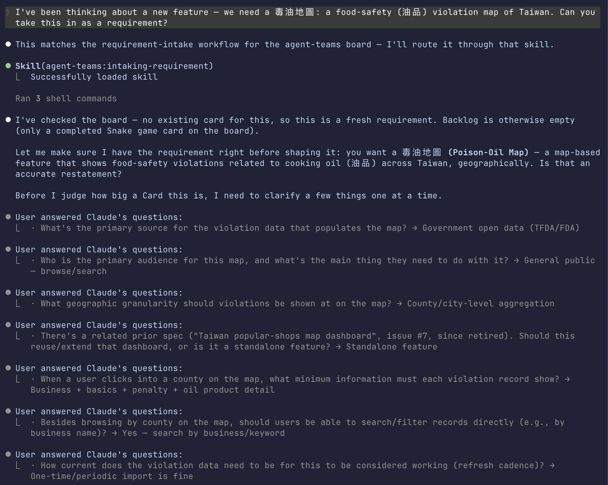

One question per message, until "popular", "safe", "current" are measurable — then one Card: #12, handed to the architect

<!--
This answers the PM's feedback from last week directly: the analyst was under-clarifying, so the spec had nothing to stand on.
The loop is derived from superpowers' brainstorming skill — the same battle-tested source board-superpowers itself routes to — stripped of its design half: the analyst stops at a clear problem, the architect owns design.
Seven questions here: data source, audience, granularity, relation to prior work, record fields, search, freshness. Each answer landed in the Card as an acceptance criterion, a non-goal, or an owned open question — nothing stayed vague.
There is no fixed question count: it stops when acceptance criteria are third-person checkable and no requirement can be read two ways. The human can end it any time with "enough, file it" — recorded.
Backup images if asked: intake-filed.png (the handoff summary), card-12.png (the resulting issue on GitHub).
-->

---
layout: ppt
class: dense
---

# "write the spec for card #12" — architect

  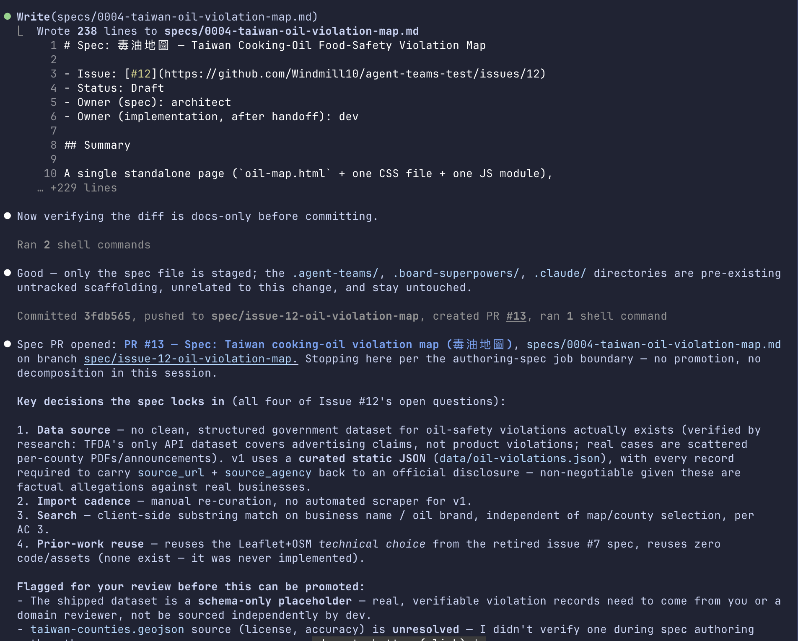

Research-grounded decisions → docs-only spec PR #13 — then stop: no promoting, no decomposing in this session

<!--
The architect read the Card, then delegated dataset research to a background agent rather than assuming. The finding was NEGATIVE — no clean structured government dataset for oil-safety violations exists (TFDA's API covers advertising claims; real cases are scattered per-county PDFs) — and the spec respected it: a human-curated static JSON where every record must cite an official source_url + source_agency. No fabricated API.
All four of the Card's open questions became explicit decisions with rationale, each flagged for human confirmation or override.
Then the session stopped at the job boundary — one job per session; promotion and decomposition belong to later sessions.
The human merge gate caught one defect here: the PR body said "Closes #12", which would have auto-closed the Card on merge. Fixed at the gate, and the authoring-spec skill now forbids closing keywords in spec PRs — the gate did its job and the skill got better the same evening.
Backup images: spec-research.png (the research agent being spawned), spec-merged.png (the merged PR with the corrected "Spec for #12" reference).
-->

---
layout: ppt
class: dense
---

# "split card #12 into implementation cards" — architect

  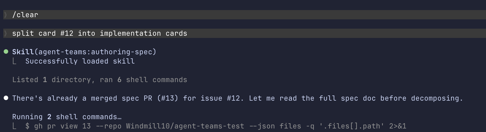

<!--
A fresh session — decompose is the architect's other job, and refuses to run until the spec PR is merged (spec_completion=merged).
Every candidate child passes refusal gates adopted from board-superpowers: INVEST per-letter, no layer-only slices ("frontend card" fails on sight), size ceiling. The first child of a brand-new surface is a walking skeleton — the smallest end-to-end slice through every layer: import a few real records, render the county map, click a county, see the list.
#14 also carries a blocking prerequisite the skill propagated from the spec: the human must supply/review real, citable violation records before promotion — dev must never fabricate data. We honored it: three documented cases (大統長基 2013, 強冠 2014, 正義 2014) reviewed and attached, and a fourth (富味鄉) excluded because its penalty was revoked on appeal — the exclusion recorded on the Card.
Children land at (Backlog, human): decomposition proposes; the human decides each child individually.
-->

---
layout: ppt
class: dense
---

# The Readiness Gate

  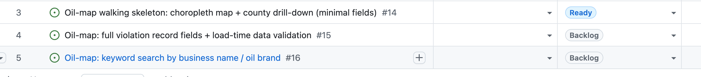

<code>promote 14 --spec PR#13</code> — human-only: every agent seat is refused in policy, and even the human is refused until the spec PR is merged

<!--
The board after the human's promote: #14 Ready, #15/#16 deliberately still at the gate — walking skeleton ships first, the human decides each child individually.
Say verbally: this gate is code, not convention — policy.py refuses promote for every agent seat before any GitHub call, and refuses the human too while the spec PR is open. We exercised the refusals live in earlier testing.
Also worth telling here: the OTHER gate (PR merge) caught a real defect this run — the spec PR body carried "Closes #12", which would have auto-closed the Card on merge. Human caught, skill hardened the same evening.
Backup images: spec-pr.png (architect stopping at the job boundary), spec-merged.png (the merged spec PR with the fixed "Spec for #12" reference).
-->

---
layout: ppt
class: dense
---

# "what's ready to work on?" — lead

  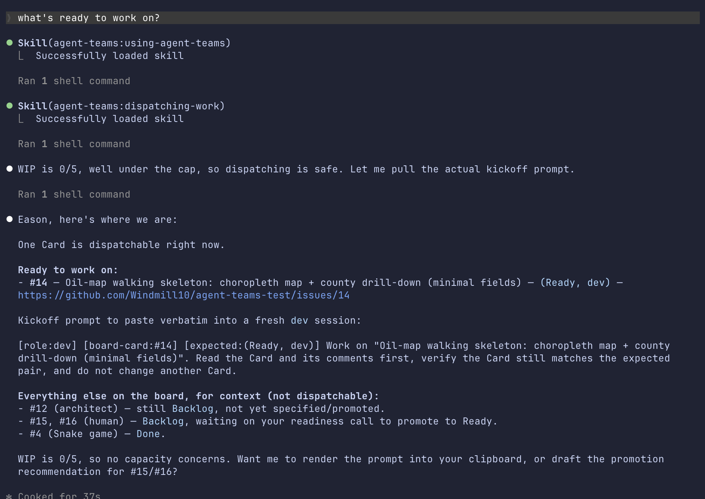

Dispatch renders a prompt and stops — "prompt rendered", never "session started"; a human carries it into a fresh dev session

<!--
The lead checked WIP (0/5) before dispatching, rendered exactly one kickoff for #14, and listed everything else with the reason it is NOT dispatchable.
Point at the [expected:(Ready, dev)] stamp — new this week: the receiving dev session verifies the Card still matches that pair before claiming, so a stale kickoff dies instead of mutating the wrong Card.
-->

---
layout: ppt
class: dense
---

# "[role:dev] [board-card:#14] …" — dev

  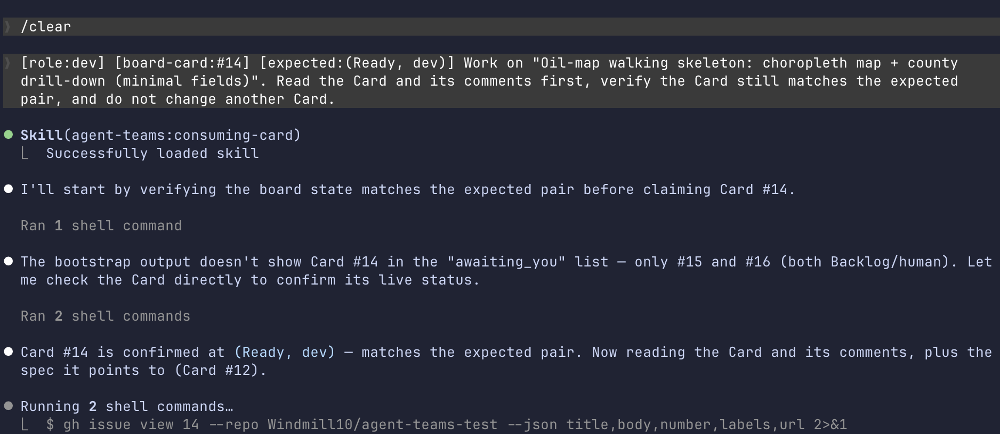

<!--
The pasted kickoff routes to consuming-card. First move: preflight — it checks the Card still matches [expected:(Ready, dev)] on the live board before touching anything. A stale kickoff dies here instead of mutating the wrong Card.
Then the claim: a branch pushed to GitHub as the mutual-exclusion lock (the unique-commit trick from Part 1), a worktree outside the repo root, and the TDD discipline — failing test before code.
It reads the human-reviewed dataset from the Card's comments — the Card forbids inventing records.
Ends with exactly one PR and the Card at (In Review, qa). What happens after — QA's evidence-grounded verdict and the route decision — is the Part 1 QA workflow; in this run the merge stays with the human (the acceptance lane needs branch protection + required checks on the repo, which the test repo doesn't have yet — it fails closed by design).
-->

---
layout: ppt
class: dense
---

# The Board After the Handoff

  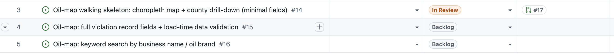

The board mid-flight: #14 <code>(In Review, qa)</code> · #15/#16 at the readiness gate · one claim, one PR, one review in progress

<!--
One real artifact beats an illustrated one. Capture after the promote + dispatch run so the lanes show the real state.
-->

---
layout: ppt
class: dense
---

# "[role:qa] [board-card:#14] …" — qa

  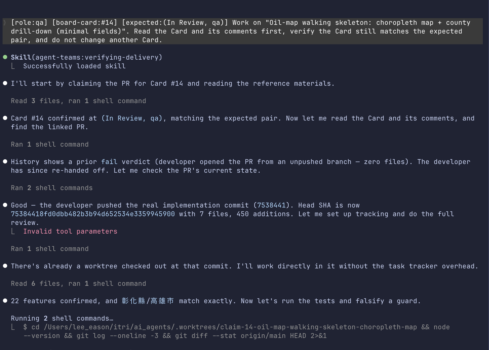

Independent verification against the delivered head — reads every changed file, runs the tests, and tries to falsify its own findings

<!--
A fresh session, bound to one Card. Preflight first: the Card must still be (In Review, qa) on the live board.
What the screenshot shows in order: the verifying-delivery skill loads; the pair check passes; it reads the Card's comment history — including a prior fail verdict — then confirms the current head is the real delivery (7 files, 450 additions); reads all changed files; checks the 22 county features against the spec; then runs the tests and deliberately reverts a guard to prove a test would catch it.
The prior fail verdict is worth telling: the first delivery came in as an empty diff (the implementation commit was never pushed), QA published an evidence-grounded fail, policy routed the Card defect-back to dev on the same PR, the dev fixed forward, and this is the re-review. That is the three-route design from Part 1 running live — the reviewer publishes evidence, policy picks the route, and nothing about the round trip needed a human to untangle it.
The verdict it publishes is bound to the exact head SHA reviewed; a new commit invalidates the evidence and forces a re-review.
-->

---
layout: ppt
class: dense
---

# The Merge Gate

  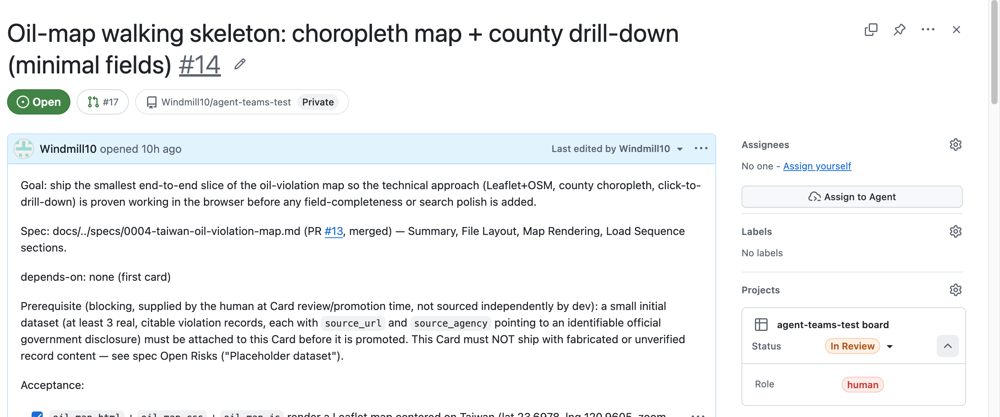

QA passed — but with no required checks configured, policy fails closed: the Card lands at <code>(In Review, human)</code> and the merge waits for a person

<!--
The handoff reason on the Card, verbatim: no required checks are configured on this repository, so automated acceptance cannot establish a green baseline — configure required_checks and branch protection, or accept through the human lane. On a repo with CI and branch protection, this same pass verdict would have armed auto-merge instead.
The human's two commands: gh pr merge, then reconcile-done — which records a merge that happened (it never causes one), flips the Card to Done, and removes the claim branch's lock and the worktree.
This is the second of the two human gates from Part 1: readiness (promote) and merge. Both sat exactly where judgment was needed and nowhere else in this run.
-->

---
layout: ppt
class: dense
---

# The Dashboard — 毒油地圖

  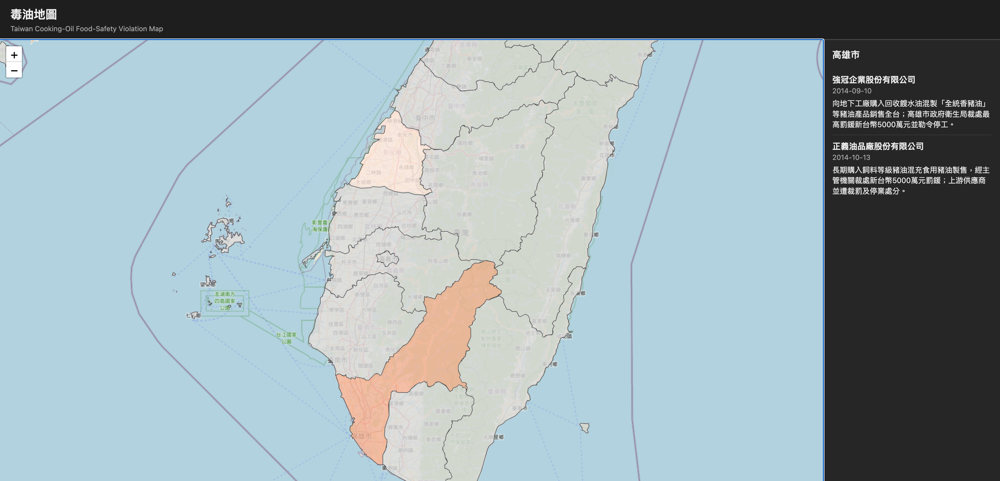

Cooking-oil violations on a Taiwan county map — county drill-down with real, source-cited records · card #14's delivery

<!--
This is the slide the PM reply promised: "用我們的架構製作熱門餐廳或食安的 dashboard 並顯示在台灣的地圖上" — we took the 食安/油品 angle.
The data is real: three documented cases (大統長基 2013, 強冠 2014, 正義 2014), every record carrying a source_url + source_agency back to an official government disclosure. The spec REQUIRES that — an uncited allegation against a named business is refused at load time. A fourth candidate (富味鄉) was excluded because its penalty was revoked on appeal — that editorial decision is recorded on the Card.
The point to say out loud: the artifact matters less than how it got here — clarified, spec'd, decomposed, promoted, dispatched, delivered as one PR, QA-reviewed. #15 (full record fields) and #16 (keyword search) are the next promotes — the roadmap the architect itself produced.
-->

---
layout: ppt
class: dense
---

# The Board — Done

  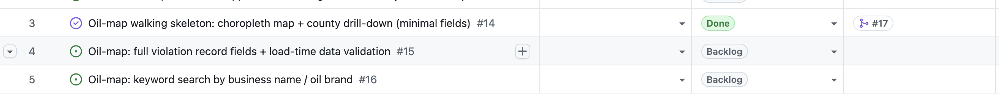

#14 <code>Done</code> with PR #17 merged · #15/#16 waiting at the readiness gate — the loop from requirement to merged delivery, closed

<!--
The closing state. One requirement went from a sentence in plain language to a merged, QA-verified delivery, and every step of the route is on the Card as a permanent record: the clarification, the spec PR, the decomposition, the promote, the kickoff, the claim, both verdicts, the acceptance, and the reconcile.
Worth saying: this run also exercised the defect route live — the first delivery failed verification, went back to dev, and came back to pass. The board never needed a human to untangle any of it; the two human moments were the two gates.
#15 and #16 are sitting at the readiness gate — the demo continues whenever we promote them.
-->

