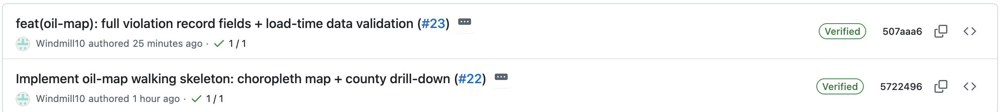
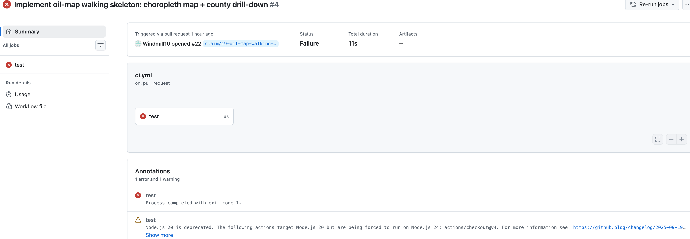
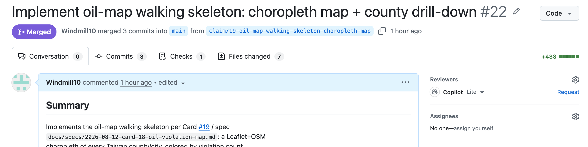
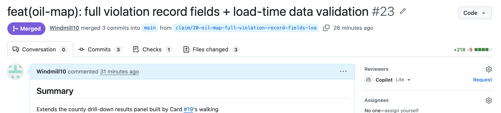
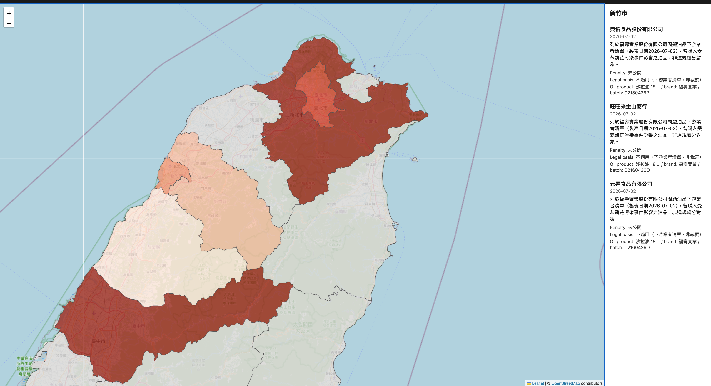
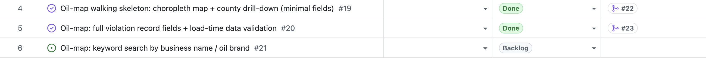

# AI Agent Dev Team

<hr class="rule" />

Weekly update — automated workflow, hardened recovery, and on-demand skills<br/>
<span class="muted">ITRI</span>

<!--
Two sections this week: what changed in agent-teams, then the dashboard demo. The headline is that the workflow no longer stops after rendering a kickoff. One coordinating session can now plan and run bounded Card stages, re-read durable GitHub state, and continue through development, QA, correction, merge, and Done. Part 1 is based on today's cf4f681 and 6f6851a commits.
-->

---
layout: center
---

<div class="chapter">
  <div class="chapter-num">Part 1</div>
  <div class="chapter-title">What We Did This Week</div>
  <div class="chapter-sub">1. Automated the workflow · 2. Hardened recovery · 3. Break down skills</div>
</div>

<!--
Part 1 is organized by three outcomes, not by commit count. First, automated workflow: deterministic planning, bounded workers, direct specifications, readiness finalization, QA, monitored auto-merge, and automatic reconciliation. Second, hardened recovery: durable resume, pending-state monitoring, stale-evidence invalidation, and loop protection. Both shipped in cf4f681. Third, smaller on-demand skills: 6f6851a removed eager workflow preloads and split returned-Card clarification away from new intake.
The important distinction is what is proven. The automation passed a 241-test focused regression and the 385-test hermetic suite before the lazy-loading split. The split then passed 16 focused planner/worker tests, four skill validators, and plugin validation. Live child skill-loading and the full GitHub auto-merge path still need end-to-end proof.
-->

---
layout: ppt
class: dense
---

# 1 — Automated the Workflow

<div class="grid-2" style="max-width:100%;">
  <div class="card">
    <h3>Before — people moved the work</h3>
    <p>The plugin created a prompt.<br/>
    A person copied it into a new session, waited for that step to finish, then did the same thing again.<br/>
    Every step needed manual help.</p>
  </div>
  <div class="card">
    <h3>Now — the plugin moves the work</h3>
    <p>A person says <span class="accent">“start the team.”</span><br/>
    The plugin checks the board, starts the right worker, waits for the result, and moves to the next step.<br/>
    No prompt copying.</p>
  </div>
</div>

<br/>

<p class="takeaway">One session can now continue through <span class="accent">development → QA → fixes → merge → Done</span>.</p>

<!--
Before this change, dispatch only created a kickoff prompt. A person had to carry that prompt into another session for every stage.
Now the current session runs the loop. It checks GitHub, starts one worker for one Card step, waits for that worker to save its result, and checks GitHub again.
The important point is that GitHub records the progress. The plugin does not trust conversation text as proof that a step finished.
-->

---
layout: ppt
class: dense
---

# How the Automatic Loop Works

<div class="eyebrow">1 · Automated workflow</div>

<div class="protocol">
  <div class="protocol-step"><span class="protocol-num">1</span><strong>Check</strong><p>Read the latest board state from GitHub.</p></div><div class="protocol-arrow">→</div>
  <div class="protocol-step"><span class="protocol-num">2</span><strong>Choose</strong><p>Find the next Card and the next step.</p></div><div class="protocol-arrow">→</div>
  <div class="protocol-step"><span class="protocol-num">3</span><strong>Start</strong><p>Start one worker for that Card.</p></div><div class="protocol-arrow">→</div>
  <div class="protocol-step"><span class="protocol-num">4</span><strong>Save</strong><p>The worker saves its result to GitHub.</p></div><div class="protocol-arrow">→</div>
  <div class="protocol-step"><span class="protocol-num">5</span><strong>Repeat</strong><p>Read GitHub again and continue.</p></div>
</div>

- One worker handles one Card and one step
- The board, branch, and Pull Request show what really happened
- The loop stops when it finishes or needs a human decision

<!--
The plugin reads the board and chooses the next safe action. This may be asking the analyst a question, writing a specification, starting development, starting QA, waiting for GitHub, or marking merged work Done.
Each worker has a small job: one Card and one step. It saves the result to GitHub and stops. The main session then reads the new state and decides what comes next.
The loop stops when there is no more automatic work or when a real human decision is needed.
-->

---
layout: ppt
class: dense
---

# First Human Gate Remains

<div class="eyebrow">1 · Automated workflow</div>

<div class="protocol">
  <div class="protocol-step"><span class="protocol-num">1</span><strong>Write</strong><p>The architect writes the specification.</p></div><div class="protocol-arrow">→</div>
  <div class="protocol-step"><span class="protocol-num">2</span><strong>Save</strong><p>The plugin saves it to GitHub and merge the PR.</p></div><div class="protocol-arrow">→</div>
  <div class="protocol-step"><span class="protocol-num">3</span><strong>Decide</strong><p>The human decides: if the spec is right?</p></div><div class="protocol-arrow">→</div>
  <div class="protocol-step"><span class="protocol-num">4</span><strong>Check</strong><p>The plugin checks that the specification did not change.</p></div><div class="protocol-arrow">→</div>
  <div class="protocol-step"><span class="protocol-num">5</span><strong>Start</strong><p>The plugin sends the Card to development.</p></div>
</div>

- The human only changes the Card from `Backlog` to `Ready`, no need to merge PR
- If the specification changed: keep the Card waiting at <code>(Ready, human)</code> → return it to Backlog → the architect saves the new version → the human reviews it again.

<!--
The readiness gate remains human because choosing what the team should build is a judgment call.
The architect writes the specification and the plugin saves its exact version. The human reviews it and changes only the Card Status from Backlog to Ready.
The plugin then checks that the saved specification is still current. If it is, development starts automatically.
If it changed, no developer handoff happens. The Card remains waiting at `(Ready, human)`, and the plugin reports that it must return to Backlog for the architect to publish the new version. The human then reviews that version and marks it Ready again. The plugin currently stops safely; it does not perform this return automatically.
-->

---
layout: ppt
class: dense
---

# 2 — Hardened Recovery

<div class="failclass wide">
  <div><span class="fc-num">1</span><div><strong>Work stopped</strong> · <code>continue the same work</code><p>Open the same Card, branch, and work folder. Do not create a duplicate.</p></div></div>
  <div class="defect"><span class="fc-num">2</span><div><strong>GitHub is not finished</strong> · <code>wait and check again</code><p>Pending checks are not failures. Keep monitoring instead of sending the PR back to development.</p></div></div>
  <div><span class="fc-num">3</span><div><strong>The PR changed after QA</strong> · <code>review it again</code><p>The old approval is no longer valid. Send the latest version back to QA.</p></div></div>
</div>

<br/>

- After the PR merges, automatically mark the Card `Done` and clean up its work folder
- If the same step makes no progress twice, stop and explain what is blocking it

<!--
In simple terms, recovery means the workflow can continue safely after an interruption. It reads the saved state from GitHub and continues the same Card instead of starting new work.
It also knows the difference between waiting and failing. Pending checks are watched. A changed PR loses its old QA approval and must be reviewed again. A confirmed merge is the only route to Done.
Finally, the coordinator avoids endless retries. If the same stage runs twice without changing anything on GitHub, it stops and reports the problem.
-->

---
layout: ppt
class: dense
---

# 3 — Break Down Skills

<div class="grid-2" style="max-width:100%;">
  <div class="card">
    <h3>Before — every skill loaded</h3>
    <p>Each worker received instructions for many different jobs: intake, architecture, development, triage, and QA.<br/>
    Most of those instructions were not needed.</p>
  </div>
  <div class="card">
    <h3>Now — load one skill when needed</h3>
    <p>The plugin first decides what job the worker should do.<br/>
    The worker then loads only the skill for that job.</p>
  </div>
</div>

<br/>

- One worker still handles one Card and one step
- Each worker sees only the instructions it needs for its current job.

<!--
Before this change, the worker loaded six complete workflow skills when it started. A development worker also received intake, architecture, triage, and QA instructions that it did not need.
Now the plugin chooses one job first. It sends one routine name and one skill name to the worker. The worker loads that skill only when the job starts. Extra reference files also load only when needed.
The result is a smaller and clearer context. The worker still handles only one Card and one step.
-->

---
layout: ppt
class: dense sources
---

# Split Intake into Two Skills

<div class="eyebrow">3 · Break Down Skills</div>

<div class="grid-2" style="max-width:100%;">
  <div class="card">
    <h3>New work — <code>intaking-requirement</code></h3>
    <p>Ask questions about a new request.<br/>
    Create <span class="accent">one new Card</span> and send it to the architect.</p>
  </div>
  <div class="card">
    <h3>Existing work — <code>clarifying-card</code></h3>
    <p>Answer the architect's question on an existing Card.<br/>
    Update the <span class="accent">same Card</span> and send it back.</p>
  </div>
</div>

<br/>

- New request → create a new Card
- Returned Card → update the same Card; do not create a duplicate

<!--
The old intake skill did two different jobs: create new work and answer a question on existing work. Mixing them created a risk that the plugin could make a duplicate Card.
Now intaking-requirement handles only new requests. clarifying-card handles only an existing Card returned by the architect.
clarifying-card reads the Card and its history, answers the named question, adds the answer to the same Card, and sends it back to the architect. It does not create a new Card or make architecture decisions.
-->

---
layout: center
---

<div class="chapter">
  <div class="chapter-num">Part 2</div>
  <div class="chapter-title">Demo</div>
  <div class="chapter-sub">A data dashboard through the pipeline</div>
</div>

<!--
Pre-recorded run / screenshots. The workload lives in the agent-teams-test repository; the plugin is agent-teams.
-->

---
layout: ppt
class: dense stagefail
---

# The Run — One Requirement, End to End

| # | Seat | We said / did | Durable result |
|---|---|---|---|
| 1 | analyst | "we need a 毒油地圖 …" | found retired #12 in history → asked rerun-or-fresh → fresh → Issue #18 |
| 2 | lead | "what's next? go run it" | `next-actions` → architect spawned as an <span class="accent">in-session worker</span> |
| 3 | architect | worker | spec <span class="accent">straight to main</span> — no PR · decompose → #19 → #20 → #21 |
| 4 | human | `promote 19` | <span class="accent">the readiness gate</span> → `(Ready, dev)` · #20/#21 held |
| 5 | dev | worker | claim + worktree → PR #22 — flags a CI risk in its own retro |
| 6 | CI | required check `test` | <span class="accent">fail</span> — auto-merge blocked: real bug in our workflow file |
| 7 | lead | root cause | four variants tested → our CI setup commit — <span class="accent">stops for sign-off</span> |
| 8 | human | "yes, go ahead" | the exception lane: one-line CI fix lands on `main` |
| 9 | dev → qa | workers | branch updated → check green → re-verify the <span class="accent">new head</span> → pass |
| 10 | policy | `eligible` | auto-merge → PR #22 merged → #19 `Done`, reconciled automatically |
| 11 | human | `promote 20` | whole loop repeats hands-off → PR #23 → #20 `Done` |

<p class="figure-note">"…" = typed prompt · <code>code</code> = typed CLI · worker = spawned in the same session, nothing pasted. Human moments: rows 4, 8, 11.</p>

<!--
This ran live on 08-12 — same requirement as last week, rerun through the automated flow after retiring the old artifacts. The card numbers are real and the screenshots on the next slides are the actual artifacts.
The headline against last week's table: that run had five human command points (merge spec PR, promote, merge implementation PR, reconcile-done, plus launching every seat's session and pasting kickoffs). This run had two routine commands — promote 19, promote 20 — plus one exception sign-off that only existed because the run surfaced a real infrastructure bug. No session launching, no kickoff pasting, no merge command, no reconcile command.
Row 1 is worth telling: the board was clean, but the analyst dug the retired run out of git history and asked whether this was a rerun or a re-scope, rather than assuming either. We chose fresh — so every clarifying answer below is newly derived, not copied.
Rows 6-8 are the run's best moment, not its embarrassment: the required check caught a genuine bug in the CI workflow we ourselves had added earlier that day, the coordinator root-caused it with an evidence table, and it refused to touch shared CI config without a human — the exception lane doing exactly its designed job on its first live firing.
Row 9: QA re-verified the exact new head SHA — the stale-evidence rule from Part 1, live.
Row 11 is the proof of the routine case: with the infrastructure fixed, one promote carried a card from Ready to merged-and-Done with zero further human input.
-->

---
layout: ppt
class: dense
---

# "we need a 毒油地圖 …" — analyst

<div class="step-badge"><b>Step 1</b> · analyst · skill: intaking-requirement · typed prompt</div>

<div class="shot-split">
  <div>

```text
The board's Backlog is empty, but git/GitHub history shows this
exact feature already went through the full pipeline once:
issue #12 … was decomposed into #14, #15, #16 — all closed/merged —
then the artifacts were deliberately retired.

Is this new request the same scope rerun, or do you want to
change the scope this time?
  1. Same scope, rerun (Recommended)
  2. Same core idea, different scope
▶ 3. Let me describe it fresh          ← our choice
```

  </div>
  <div>
    <ul class="qa-list">
      <li><b>Outcome?</b> → browse + search violations on a map</li>
      <li><b>Data source?</b> → corrected mid-loop: research showed <span class="accent">no live gov API exists</span> → curated, source-cited JSON</li>
      <li><b>Fields per record?</b> → full detail</li>
      <li><b>Search?</b> → by business name / oil brand</li>
      <li><b>Granularity?</b> → county-level, zero-counties shown distinctly</li>
      <li><b>Non-goals?</b> → no real-time/live sync</li>
    </ul>
  </div>
</div>

<p class="takeaway">The board was clean — but the analyst found the retired run in git history and asked <span class="accent">before</span> assuming · fresh answers → one Card: #18</p>

<!--
The board had been wiped for the rerun, but the analyst noticed the closed issues and the retirement commit in history and opened with "is this the same scope again, or new?" — exactly the shape-judgment the skill migration was for.
The data-source answer is the honest beat: the human first said "live government API". A parallel research pass (delegated to a background agent) re-confirmed that no national machine-readable dataset of oil violations exists — TFDA publishes monthly PDFs, not data — so the answer was corrected mid-loop to a curated dataset, now seeded from the 2026 中聯油脂 (benzo[a]pyrene) case instead of the 2013-14 scandals. Fresher data than last week's run, same integrity rule: every record must cite an official source.
Each answer became an acceptance criterion, a non-goal, or an owned open question — the loop stops when nothing reads two ways, not at a fixed count.
-->

---
layout: ppt
class: dense
---

# Spec Goes Straight to Git — No PR, No Gate

<div class="step-badge"><b>Steps 2–3</b> · lead + architect worker · skills: dispatching-work, authoring-spec</div>

<div class="figure">
  
</div>

<p class="takeaway">The spec is a <span class="accent">direct commit on main</span>, its exact SHA recorded on the Card · decompose → #19 walking skeleton → #20 fields → #21 search — children inherit the spec record</p>

<!--
Last week the spec was a PR a human had to read and merge — and that gate caught a "Closes #12" defect. This week there is no spec PR at all: the architect worker publishes the product spec directly on the current branch, and the Card records the exact path and last-changing commit. The human attention that gate consumed is gone; what protected us instead this run is further down — the required check and the exception lane.
The architect resolved all four of intake's open questions with rationale: curated JSON (no fabricated API), county boundaries fresh from g0v/twgeojson rather than reused from the retired implementation, search matching rules, and no code reuse from the retired run.
One honesty detail to say out loud: the architect confirmed the 中聯油脂 case, county, and legal basis from primary .gov.tw sources, but could NOT pin the exact penalty amount to a primary source — so the spec leaves it as a curator to-do instead of asserting it. The shipped dashboard renders it as 未公開.
And the coordinator mechanics: the human typed nothing but "go run it". The lead read the typed next-actions plan and spawned the architect as a bounded background worker inside the same session — the whole session-launching, kickoff-pasting carrier role from last week no longer exists.
-->

---
layout: ppt
class: dense
---

# The Readiness Gate — Still Human, Now the Only Routine Gate

<div class="step-badge"><b>Step 4</b> · human · promote — no skill · typed CLI</div>

```text
❯ promote 19. Hold #20 and #21 at the gate until the skeleton merges.

⏺ #19 is now (Ready, dev); #20 and #21 stay parked at the human gate
  as instructed. Spawning the dev worker to implement and open a PR
  for #19.

⏺ agent-teams:agent-teams-worker(Implement Card #19 walking skeleton)
  ⎿ Backgrounded agent
```

<p class="takeaway"><code>promote 19</code> — no <code>--spec</code> flag needed: the spec record is on the Card · #20/#21 deliberately held — walking skeleton first</p>

<!--
The one routine human command in the whole flow now. Policy still refuses promote for every agent seat, and the coordinator offered to run it and was correctly not taken up on it — the human types the gate.
promote no longer takes a spec reference: with direct-to-git specs the Card already carries the exact spec commit, and promote validates it is present.
After this single command the coordinator took over: spawned the dev worker, then QA, then handled the merge — every following slide until promote 20 happened without a human keystroke except one exception sign-off.
-->

---
layout: ppt
class: dense
---

# The Machine Gate Fires — Required Check Fails

<div class="step-badge"><b>Steps 5–6</b> · dev worker → CI · skill: consuming-card</div>

<div class="figure">
  
</div>

<p class="takeaway">Dev delivered PR #22 — and <span class="accent">flagged the CI risk itself</span> in its retro · the required <code>test</code> check went red → auto-merge stayed blocked, <span class="accent">exactly as designed</span></p>

<!--
The dev worker ran the full consuming-card routine: preflight against the expected (Ready, dev) pair, claim branch as the mutual-exclusion lock, worktree, tests-first implementation, one PR. 8 of 8 tests passing locally.
Then the honest part: in its own PR retro it flagged that the repository's CI invocation failed locally for a reason unrelated to its code. It did not hide the anomaly to look green — it reported it and finished its lane.
CI confirmed the flag: the required check failed on the runner too. With branch protection + required checks, nothing can merge — the acceptance design fails closed. Auto-merge simply never fires.
The bug was ours, not the dev's: the workflow we added while configuring the repo that morning invoked node --test with a path argument, which Node treats as a module to require rather than a directory to scan. It had never been caught because no test suite existed until this very PR — the first real delivery through the gate is what exposed the gate's own defect.
-->

---
layout: ppt
class: dense
---

# The Exception Lane — Root Cause, Then a Human

<div class="step-badge"><b>Steps 7–8</b> · lead → human · sign-off on shared infrastructure</div>

```text
⏺ I verified all four variants directly:
    node --test test/  (current CI)   fails, MODULE_NOT_FOUND
    node --test test                  fails, same error
    node --test ./test/               fails, same error
    node --test  (bare)               passes, 8/8

  This bug predates Card #19 — the workflow was added in c8d0f09,
  before any test suite existed to exercise it. It will block every
  future Card's required check identically, including #20 and #21.

  This is a one-line change to shared CI config, not part of Card
  #19's file layout, so I want your sign-off before I commit it
  directly to main. Want me to make that fix now?

❯ yes, go ahead
```

<p class="takeaway">Bug traced to our CI setup commit → <span class="accent">"I want your sign-off before I commit it directly to main"</span> → one-line fix</p>

<!--
The coordinator did not route the failure back to dev (the code was fine) and did not silently patch main either. It reproduced the failure, tested four invocation variants, traced the bug to the CI setup commit that predated any test suite, predicted it would block #20 and #21 identically — and then stopped: a one-line change to shared CI config alters what every future PR's required check means, so it asked for explicit human sign-off first.
That is the exception lane from Part 1 firing for the first time live, and on precisely the right class of change: not a routine delivery, but a modification to the system's own gate.
The human's entire contribution: reading the evidence and saying "yes, go ahead." The fix landed on main as one line.
An independent reproduction on our side reached the identical conclusion before the sign-off — the coordinator's evidence table was correct, not persuasive-sounding.
-->

---
layout: ppt
class: dense
---

# Re-verify the New Head → Auto-merge → Done

<div class="step-badge"><b>Steps 9–10</b> · dev + qa workers → policy · skill: verifying-delivery</div>

<div class="figure">
  
</div>

<p class="takeaway">QA's verdict is bound to the <span class="accent">exact head SHA</span> — the updated branch forced a fresh review · <code>eligible</code> → auto-merge → #19 <code>Done</code>, <span class="accent">no human merge, no reconcile command</span></p>

<!--
After the CI fix, the coordinator resumed the dev worker to update the branch against main (strict protection requires re-testing against the current base), the required check went green, and — because the head SHA had moved — the earlier QA evidence was stale by rule, so QA ran again against the new head. Exact-SHA binding is not a formality; this run exercised it.
The pass verdict plus green required check made policy's acceptance eligible; auto-merge fired; the merge was detected and the Card reconciled to Done automatically. Last week this took two human commands (gh pr merge, reconcile-done). This week it took zero.
The delivery itself: choropleth map, county drill-down, the curated 中聯油脂 record with every field either source-cited or explicitly 未公開.
-->

---
layout: ppt
class: dense
---

# The Routine Case — One Command to Done

<div class="step-badge"><b>Step 11</b> · human · <code>promote 20</code> — then nothing</div>

<div class="figure">
  
</div>

<p class="takeaway">With the infrastructure fixed: <code>promote 20</code> → claim → PR #23 → check green → QA pass → auto-merge → <code>Done</code> · <span class="accent">zero further human input</span></p>

<!--
Card #19's run proved the exception path; card #20 proved the routine path. One typed command, and the full loop — claim, implementation, PR, required check, QA verdict, acceptance, auto-merge, reconciliation — completed hands-off. This is the shape every routine card takes from now on.
Full violation record fields plus load-time data validation, on top of #19's skeleton. The CI fix from the exception lane applied automatically — the blocker class cannot recur.
This is the direct answer to the 08-07 finding that opened the week: five human command points then, two routine commands plus one justified exception now.
-->

---
layout: ppt
class: dense
---

# The Dashboard — 毒油地圖, 2026 Data

<div class="step-badge">delivery · cards #19 + #20 · PRs #22, #23</div>

<div class="figure">
  
</div>

<p class="takeaway">Seeded with the <span class="accent">ongoing 2026 中聯油脂 case</span> — every field source-cited, or explicitly <code>未公開</code></p>

<!--
Same integrity rule as last week — an uncited allegation against a named business is refused at load time — but the seed case is now current news: the 2026 中聯油脂 benzo[a]pyrene incident, unfolding since June, with penalties from MOHW and multiple county governments. The research pass that grounded this also re-confirmed the negative finding: still no national machine-readable dataset of oil violations; the Ministry of Environment publishes exactly this kind of structured penalty data, the food-safety agencies do not — worth saying if the PM asks why the data is curated.
The penalty amount that could not be pinned to a primary .gov.tw source renders as 未公開 — the spec's honesty rule, visible in the artifact itself.
The multi-county spread comes from the official 福壽實業 problem-oil downstream-businesses list (製表日期 2026-07-02): each of those records is explicitly labeled 非違規處分對象 — a recipient of affected product, not a violator — with penalty null and legal basis 不適用. The panel in the screenshot shows exactly that wording. Curated per the spec's manual re-curation mechanism: a human supplied the official list, records were drafted from it, human-reviewed, and committed.
-->

---
layout: ppt
class: dense
---

# The Board — and the Live Demo

<div class="step-badge">final state · #21 deliberately held</div>

<div class="figure">
  
</div>

<p class="takeaway">#19 + #20 <code>Done</code>, merged by policy · #21 (keyword search) waiting at the readiness gate — <span class="accent">one <code>promote 21</code>, live, runs the whole loop in front of you</span></p>

<!--
The closing state, and the setup for the live portion: #21 was deliberately left at the gate. The live demo is one typed command — promote 21 — and the room watches the coordinator spawn the dev worker, the PR open, the check run, QA publish its verdict, and the merge land, with no further human touch expected.
Every step of both finished cards is on the Cards as a permanent record: the clarification answers, the spec commit reference, the decomposition, the promotes, the claim, the verdicts bound to exact SHAs, the acceptance routes, and the automatic reconciliation. The one exception sign-off is in the session record with its full evidence table.
If the live run hits an exception instead of merging cleanly — that is also the system working; we just demonstrated what that path looks like.
-->
