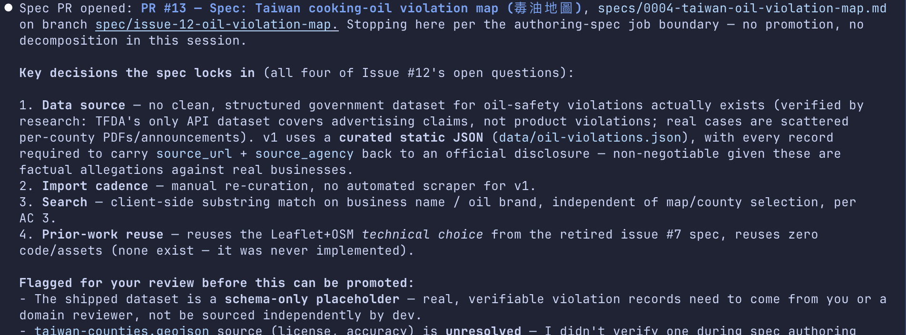
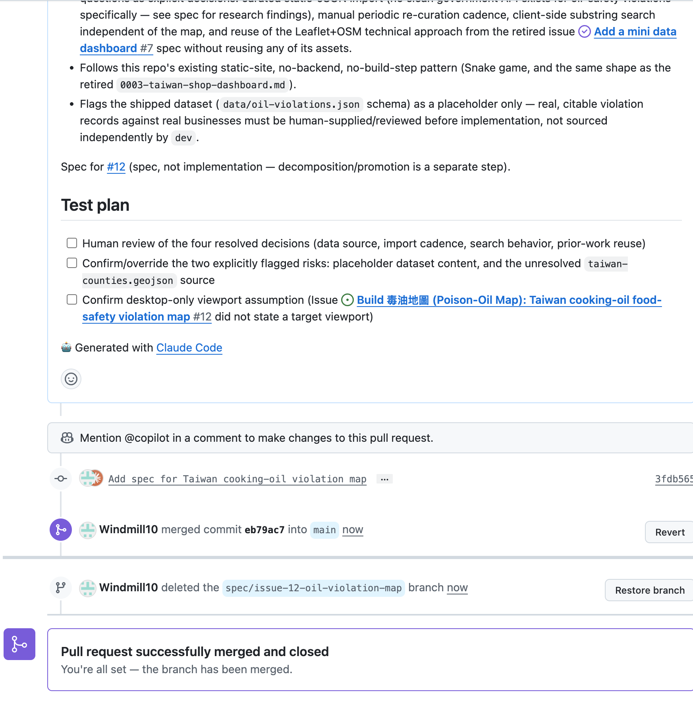

# AI Agent Dev Team

Weekly update — automated workflow, hardened recovery, and on-demand skills 
ITRI

<!--
Two sections this week: what changed in agent-teams, then the dashboard demo. The headline is that the workflow no longer stops after rendering a kickoff. One coordinating session can now plan and run bounded Card stages, re-read durable GitHub state, and continue through development, QA, correction, merge, and Done. Part 1 is based on today's cf4f681 and 6f6851a commits.
-->

---
layout: center
---

  
Part 1

  
What We Did This Week

  
1. Automated the workflow · 2. Hardened recovery · 3. Split skills + loaded on demand

<!--
Part 1 is organized by three outcomes, not by commit count. First, automated workflow: deterministic planning, bounded workers, direct specifications, readiness finalization, QA, monitored auto-merge, and automatic reconciliation. Second, hardened recovery: durable resume, pending-state monitoring, stale-evidence invalidation, and loop protection. Both shipped in cf4f681. Third, smaller on-demand skills: 6f6851a removed eager workflow preloads and split returned-Card clarification away from new intake.
The important distinction is what is proven. The automation passed a 241-test focused regression and the 385-test hermetic suite before the lazy-loading split. The split then passed 16 focused planner/worker tests, four skill validators, and plugin validation. Live child skill-loading and the full GitHub auto-merge path still need end-to-end proof.
-->

---
layout: ppt
class: dense
---

# 1 — Automated the Workflow

  

    <h3>Before — dispatch stopped at a prompt</h3>
    
<code>dispatch</code> rendered a kickoff. 
    A person opened another session, pasted it, waited, then repeated the process for the next stage. 
    The workflow existed, but the human was its carrier.

  

  

    <h3>Now — one coordinating session runs it</h3>
    
<code>next-actions</code> returns deterministic work. 
    The coordinator starts one bounded worker per Card stage, waits for durable GitHub state, then plans again. 
    No prompt copying between sessions.

  

 

“Start the team” can now continue through dev → QA → correction → merge → Done inside the current session.

<!--
Commit cf4f681 changes dispatching-work from a prompt renderer into a same-session orchestration loop. The planner returns typed actions rather than prose: spawn a worker, run a controller operation, reconcile a confirmed merge, monitor GitHub, or wait.
The worker is still bounded. It owns one Card and one stage, persists the outcome to GitHub, and stops. It cannot start grandchildren. Different Cards may run concurrently below the WIP limit; stages for the same Card remain sequential.
The coordinator never treats a child response as completion. It rereads GitHub after every stage because the Project, Issue, branch, and Pull Request are the durable source of truth.
-->

---
layout: ppt
class: dense
---

# What the Coordinator Automates

1 · Automated workflow

| Live Card / delivery state | Automatic action |
|---|---|
| `(Backlog, analyst)` | Run focused clarification on the existing Card |
| `(Backlog, architect)` | Write and publish the direct Git specification |
| `(Ready, human)` | Verify the recorded spec commit, then hand to dev |
| `(Ready / In Progress, dev)` | Claim new work or resume the durable claim |
| `(In Review, qa)` | Independently verify, publish a verdict, and evaluate acceptance |
| Eligible exact head | Monitor auto-merge, then reconcile the Card to `Done` |

Every loop is plan → run one bounded stage → persist → re-read GitHub → plan again.

<!--
The new read-only next-actions planner maps live board state to typed work. Spawn actions include one Card, its expected Status/Role pair, one routine, and one qualified skill. Controller actions cover readiness finalization and acceptance. Reconcile actions require confirmed merge evidence. Monitor actions wait for GitHub checks, mergeability, or auto-merge without misclassifying delay as a defect.
Returned analyst Cards, resumed development, blocked triage, QA, and merge reconciliation are now first-class planner cases. WIP admission and hard dependencies are checked before a worker starts.
The loop stops only when no automatic action remains, a human decision is genuinely required, or the same stage returns twice without changing durable state.
-->

---
layout: ppt
class: dense
---

# Automation Covers the Readiness Gate

1 · Automated workflow

  
1<strong>Write</strong><code>docs/*.md</code>
Architect writes the product specification in the current checkout.

→

  
2<strong>Publish</strong><code>publish-spec</code>
Commit and push only that document on the current branch.

→

  
3<strong>Record</strong><code>path + exact SHA</code>
The Card carries the durable specification pointer.

→

  
4<strong>Decide</strong><code>Backlog → Ready</code>
The human changes one Project Status.

→

  
5<strong>Finalize</strong><code>Ready → dev</code>
The controller re-verifies the exact Git artifact and hands off.

- No specification branch, worktree, or Pull Request
- No copied spec reference and no required promotion command in the normal path
- If the recorded document changed, readiness finalization refuses before development

<!--
The earlier flow put a non-judgmental spec PR and a promotion command around the actual decision. cf4f681 removes both from the normal path. publish-spec refuses a detached HEAD, files outside docs, unrelated checkout changes, and rename tricks; it stages only the requested specification and records the file's exact last-changing commit.
The architect hands the Card to human at Backlog. The human's mandatory action is the decision itself: edit Project Status to Ready. On the next loop, finalize-readiness loads the Card's structured spec record, verifies that exact path at that exact commit is still current, and changes Role to dev.
promote remains an optional CLI convenience, but automation no longer requires the person to know or carry the internal command contract.
-->

---
layout: ppt
class: dense
---

# 2 — Hardened Recovery

If work stops or changes, continue safely from GitHub instead of starting over

  
1
<strong>Work stopped</strong> · <code>continue the same work</code>
Open the same Card, branch, and work folder. Do not create a duplicate.

  
2
<strong>GitHub is not finished</strong> · <code>wait and check again</code>
Pending checks are not failures. Keep monitoring instead of sending the PR back to development.

  
3
<strong>The PR changed after QA</strong> · <code>review it again</code>
The old approval is no longer valid. Send the latest version back to QA.

 

- After the PR merges, automatically mark the Card `Done` and clean up its work folder
- If the same step makes no progress twice, stop and explain what is blocking it

<!--
In simple terms, recovery means the workflow can continue safely after an interruption. It reads the saved state from GitHub and continues the same Card instead of starting new work.
It also knows the difference between waiting and failing. Pending checks are watched. A changed PR loses its old QA approval and must be reviewed again. A confirmed merge is the only route to Done.
Finally, the coordinator avoids endless retries. If the same stage runs twice without changing anything on GitHub, it stops and reports the problem.
-->

---
layout: ppt
class: dense
---

# 3 — Smaller Skills, Loaded Only When Needed

  

    <h3>Before — six skills loaded up front</h3>
    
The generic worker listed six workflow skills in frontmatter. Every child started with intake, architecture, development, triage, and QA instructions in the same context — even when it needed only one.

  

  

    <h3>Now — dispatch selects one routine</h3>
    
Each spawn carries one <code>[routine:name]</code> and one qualified <code>[skill:agent-teams:name]</code>. The worker uses the Skill tool to load exactly that procedure when the stage begins.

  

 

- No workflow skill is preloaded into the bounded worker
- Deeper references load only when that skill's condition applies
- The worker still owns one Card, one stage, and no grandchildren

Smaller context makes the worker's authority and job boundary easier to inspect.

<!--
The root cause was Claude Code skill frontmatter: it eagerly injected all six complete skill bodies rather than making them available lazily. Commit 6f6851a removes the skills preload list, adds the Skill tool, and makes next-actions attach one qualified skill to every spawn.
This is not a monolithic replacement for engineering practice. The focused local skills still adapt and attribute disciplines from board-superpowers, superpowers, and gstack, while agent-teams owns routing, the Ready gate, durable claims, exact-head acceptance, and orchestration. There is still no runtime dependency on those sibling plugins.
The focused contract test checks both halves: the worker frontmatter has no skills list, and every planner spawn has a matching routine and qualified skill marker.
-->

---
layout: ppt
class: dense sources
---

# One Mixed Skill Became Two Focused Skills

3 · Smaller skills, loaded on demand

  

    <h3>New requirement — <code>intaking-requirement</code></h3>
    
Clarifies a new product or engineering need, creates one new Backlog Issue, and hands it to architecture. It does not handle an Issue that already exists.

  

  

    <h3>Returned Card — <code>clarifying-card</code></h3>
    
Requires one existing Card at <code>(Backlog, analyst)</code>, resolves the architect's named question, comments on the same Issue, and hands it back.

  

| Situation | Mutation boundary |
|---|---|
| “We need to build…” | `intake`: create one Card, then stop at architecture |
| Architect returns Card #N with a question | `clarify N`: add one evidence-based note and hand the same Card back |

The split prevents a returned Card from accidentally running intake and creating a duplicate Issue.

<!--
The old intaking-requirement skill contained two different jobs: creating a requirement and answering a question on an existing returned Card. Their authority and mutation boundaries are different, so one mixed procedure created a routing risk.
clarifying-card first verifies the kickoff against live `(Backlog, analyst)` state, reads the existing Card and comment history, identifies the architect's exact unresolved question, and investigates repository or bounded primary-source evidence. It never restarts the full intake interview or makes an architecture decision.
The clarification note records the question, evidence/source, answer/constraint, and acceptance-criteria impact. The clarify command comments and performs analyst → architect on the same Card. If the business fact is unavailable, the worker records an exact durable blocker instead of inventing an answer.
-->

---
layout: ppt
class: dense
---

# Evidence and Honest Boundary

| Validation | Result | What it covers |
|---|---|---|
| Focused automation regression | 241 passed | Planner actions, readiness, resume, acceptance, reconciliation |
| Full hermetic suite | 385 passed | Policy, real-Git claim races, exact-head safety, partial recovery |
| Lazy-loading split | 16 focused passed | One-skill planner/worker contract and clarification routing |
| Skill + plugin checks | green | Four skill validators, manifest validation, diff check |

  

    <h3>What we can claim</h3>
    
The automation and safety contracts are implemented and hermetically tested. The bounded worker now has a focused, inspectable skill boundary.

  

  

    <h3>What still needs proof</h3>
    
A live child trace must show exactly one skill loaded. Auto-merge, delayed reconciliation, and the protected-change lane need an end-to-end run on a configured GitHub repository.

  

<!--
The 385-test suite ran after the automation-flow implementation and before commit cf4f681. It was not rerun after the lazy-loading split. Commit 6f6851a changed the planner/worker contract and clarification routing; those changes received 16 focused tests, four quick skill validations, warning-free plugin validation, and a clean diff check.
Hermetic coverage proves deterministic decisions, claim exclusivity against real Git, exact-head protection, partial-failure recovery, direct spec records, WIP admission, delayed merge monitoring, and merge-evidence-only Done. It does not prove the fake GitHub CLI shapes against a real repository or observe which skill Claude loads inside a real child.
The live proof needs a disposable authenticated repository with auto-merge, branch protection, at least one required check, and matching required_checks configuration. Empty required_checks continues to fail closed into the human exception lane.
-->

---
layout: center
---

  
Part 2

  
Demo

  
A data dashboard through the pipeline

<!--
Pre-recorded run / screenshots. The workload lives in the agent-teams-test repository; the plugin is agent-teams.
-->

---
layout: ppt
class: dense stagefail
---

# The Run — One Requirement, End to End

| # | Seat | We said / did | Durable result |
|---|---|---|---|
| 1 | analyst | "we need a 毒油地圖 …" | 7 clarifying questions → Issue #12 · `(Backlog, architect)` |
| 2 | architect | "write the spec for card #12" | research agent → spec PR #13, docs-only — then stop |
| 3 | human | merge PR #13 | spec durable on `main` |
| 4 | architect | "split #12 into implementation cards" | #14 walking skeleton + #15 + #16 · `(Backlog, human)` |
| 5 | human | `promote 14 --spec PR#13` | the readiness gate → `(Ready, dev)` |
| 6 | lead | "what's ready to work on?" | one `[role:dev] [board-card:#14]` kickoff |
| 7 | dev | claim → implement → one PR | `(In Review, qa)` |
| 8 | qa | "verify card #14" | fail verdict — empty delivery → routed `(In Progress, dev)` |
| 9 | dev | defect kickoff | fix-forward: same Card, same branch, same PR |
| 10 | qa | re-verify kickoff | pass verdict, bound to the new head |
| 11 | human | merge PR #17 + `reconcile-done` | #14 `Done` |

Prompt origin: "…" = typed by the human · kickoff = rendered by <code>dispatch</code>, pasted by the human · <code>code</code> = typed CLI command. Each following page's top-right badge names its step, seat, and skill. Full session transcripts: <code>slides/transcripts/2026-08-06/</code>.

<!--
This all ran live on the board on 08-06/07 — the card numbers are real; the screenshots on the next slides are the actual artifacts.
Rows 8-11 are the QA half: the first delivery came in empty (the implementation commit was never pushed), QA published an evidence-grounded fail, policy routed the defect back to dev on the same PR, the fix came back, and the re-review passed. The two human rows (3, 5, 11) are the only human moments in the run.
Step 1 used the new clarification loop (next slide). Step 2's session delegated dataset research to a background agent, which came back negative — no clean government dataset exists — so the spec chose a human-curated, source-cited JSON over a fabricated API. Steps 2 and 4 are separate architect sessions — one job per session.
Step 3 story to tell verbally: the PR body said "Closes #12", which would have auto-closed the Card on merge. The human gate caught it; the fix is now baked into the authoring-spec skill (spec PRs may never carry closing keywords). The gate did exactly its job — and the skill got better the same evening.
Step 5 refuses every agent seat in policy.py, and refuses the human too until the spec PR is merged. #15/#16 were deliberately left at the gate — walking skeleton first.
Step 7 is the first live run of the Consumer half.
-->

---
layout: ppt
class: dense
---

# "we need a 毒油地圖 …" — analyst

<b>Step 1</b> · analyst · skill: intaking-requirement · prompt: typed

  
  

    <ul class="qa-list">
      <li><b>Data source?</b> → government open data (TFDA/FDA)</li>
      <li><b>Audience / main use?</b> → general public — browse & search</li>
      <li><b>Map granularity?</b> → county/city-level aggregation</li>
      <li><b>Relation to prior #7 spec?</b> → standalone feature</li>
      <li><b>Minimum fields per record?</b> → business + basics + penalty + oil product</li>
      <li><b>Search beyond the map?</b> → yes — business name / keyword</li>
      <li><b>Data freshness?</b> → one-time / periodic import is fine</li>
    </ul>
    
Question loop derived from superpowers <code>brainstorming</code> (MIT) — one question per message; stops when no requirement reads two ways.

  

Seven questions, one at a time — each answer became an acceptance criterion, a non-goal, or an owned open question → one Card: #12

<!--
This answers the PM's feedback from last week directly: the analyst was under-clarifying, so the spec had nothing to stand on.
The loop is derived from superpowers' brainstorming skill — the same battle-tested source board-superpowers itself routes to — stripped of its design half: the analyst stops at a clear problem, the architect owns design.
Seven questions here: data source, audience, granularity, relation to prior work, record fields, search, freshness. Each answer landed in the Card as an acceptance criterion, a non-goal, or an owned open question — nothing stayed vague.
There is no fixed question count: it stops when acceptance criteria are third-person checkable and no requirement can be read two ways. The human can end it any time with "enough, file it" — recorded.
Backup images if asked: intake-filed.png (the handoff summary), card-12.png (the resulting issue on GitHub).
-->

---
layout: ppt
class: dense
---

# "write the spec for card #12" — architect

<b>Step 2</b> · architect · skill: authoring-spec · prompt: typed

  

Research-grounded decisions → docs-only spec PR #13 — then stop: no promoting, no decomposing in this session

<!--
The architect read the Card, then delegated dataset research to a background agent rather than assuming. The finding was NEGATIVE — no clean structured government dataset for oil-safety violations exists (TFDA's API covers advertising claims; real cases are scattered per-county PDFs) — and the spec respected it: a human-curated static JSON where every record must cite an official source_url + source_agency. No fabricated API.
All four of the Card's open questions became explicit decisions with rationale, each flagged for human confirmation or override.
Then the session stopped at the job boundary — one job per session; promotion and decomposition belong to later sessions.
The human merge gate caught one defect here: the PR body said "Closes #12", which would have auto-closed the Card on merge. Fixed at the gate, and the authoring-spec skill now forbids closing keywords in spec PRs — the gate did its job and the skill got better the same evening.
Backup images: spec-research.png (the research agent being spawned), spec-merged.png (the merged PR with the corrected "Spec for #12" reference).
-->

---
layout: ppt
class: dense
---

# Human Merges the Spec — PR #13

<b>Step 3</b> · human · merge gate — no skill · GitHub / CLI

  

The merge gate at work: the PR body said <code>Closes #12</code> — which would have auto-closed the Card on merge. Caught here, fixed, then merged

<!--
The first of the run's three human moments (rows 3, 5, 11). The human read the spec PR and caught a real defect before merging: GitHub's closing-keyword pattern in the body would have closed Card #12 the moment the PR merged. The body was fixed to "Spec for #12", then merged — and the authoring-spec skill now forbids closing keywords in spec PRs, so the same defect cannot recur.
-->

---
layout: ppt
class: dense
---

# "split card #12 into implementation cards" — architect

<b>Step 4</b> · architect · skill: authoring-spec · prompt: typed

  

<!--
A fresh session — decompose is the architect's other job, and refuses to run until the spec PR is merged (spec_completion=merged).
Every candidate child passes refusal gates adopted from board-superpowers: INVEST per-letter, no layer-only slices ("frontend card" fails on sight), size ceiling. The first child of a brand-new surface is a walking skeleton — the smallest end-to-end slice through every layer: import a few real records, render the county map, click a county, see the list.
#14 also carries a blocking prerequisite the skill propagated from the spec: the human must supply/review real, citable violation records before promotion — dev must never fabricate data. We honored it: three documented cases (大統長基 2013, 強冠 2014, 正義 2014) reviewed and attached, and a fourth (富味鄉) excluded because its penalty was revoked on appeal — the exclusion recorded on the Card.
Children land at (Backlog, human): decomposition proposes; the human decides each child individually.
-->

---
layout: ppt
class: dense
---

# The Readiness Gate

<b>Step 5</b> · human · promote — no skill · typed CLI

  

<code>promote 14 --spec PR#13</code> — human-only: every agent seat is refused in policy, and even the human is refused until the spec PR is merged

<!--
The board after the human's promote: #14 Ready, #15/#16 deliberately still at the gate — walking skeleton ships first, the human decides each child individually.
Say verbally: this gate is code, not convention — policy.py refuses promote for every agent seat before any GitHub call, and refuses the human too while the spec PR is open. We exercised the refusals live in earlier testing.
Also worth telling here: the OTHER gate (PR merge) caught a real defect this run — the spec PR body carried "Closes #12", which would have auto-closed the Card on merge. Human caught, skill hardened the same evening.
Backup images: spec-pr.png (architect stopping at the job boundary), spec-merged.png (the merged spec PR with the fixed "Spec for #12" reference).
-->

---
layout: ppt
class: dense
---

# "what's ready to work on?" — lead

<b>Step 6</b> · lead · skill: dispatching-work · prompt: typed

  

Dispatch renders a prompt and stops — "prompt rendered", never "session started"

<!--
The lead checked WIP (0/5) before dispatching, rendered exactly one kickoff for #14, and listed everything else with the reason it is NOT dispatchable.
Point at the [expected:(Ready, dev)] stamp — new this week: the receiving dev session verifies the Card still matches that pair before claiming, so a stale kickoff dies instead of mutating the wrong Card.
-->

---
layout: ppt
class: dense
---

# "[role:dev] [board-card:#14] …" — dev

<b>Step 7</b> · dev · skill: consuming-card · prompt: kickoff, pasted

  

<!--
The pasted kickoff routes to consuming-card. First move: preflight — it checks the Card still matches [expected:(Ready, dev)] on the live board before touching anything. A stale kickoff dies here instead of mutating the wrong Card.
Then the claim: a branch pushed to GitHub as the mutual-exclusion lock (the unique-commit trick from Part 1), a worktree outside the repo root, and the TDD discipline — failing test before code.
It reads the human-reviewed dataset from the Card's comments — the Card forbids inventing records.
Ends with exactly one PR and the Card at (In Review, qa). What happens after — QA's evidence-grounded verdict and the route decision — is the Part 1 QA workflow; in this run the merge stays with the human (the acceptance lane needs branch protection + required checks on the repo, which the test repo doesn't have yet — it fails closed by design).
-->

---
layout: ppt
class: dense
---

# The Board After the Handoff

after <b>Step 7</b> · board state

  

The board mid-flight: #14 <code>(In Review, qa)</code> · #15/#16 at the readiness gate · one claim, one PR, one review in progress

<!--
One real artifact beats an illustrated one. Capture after the promote + dispatch run so the lanes show the real state.
-->

---
layout: ppt
class: dense
---

# "[role:qa] [board-card:#14] …" — qa

<b>Steps 8–10</b> · qa · skill: verifying-delivery · prompt: kickoff, pasted

  

Independent re-verification against the new head — reads every changed file, runs the tests, and tries to falsify its own findings → pass

<!--
A fresh session, bound to one Card. Preflight first: the Card must still be (In Review, qa) on the live board.
What the screenshot shows in order: the verifying-delivery skill loads; the pair check passes; it reads the Card's comment history — including a prior fail verdict — then confirms the current head is the real delivery (7 files, 450 additions); reads all changed files; checks the 22 county features against the spec; then runs the tests and deliberately reverts a guard to prove a test would catch it.
The prior fail verdict is worth telling: the first delivery came in as an empty diff (the implementation commit was never pushed), QA published an evidence-grounded fail, policy routed the Card defect-back to dev on the same PR, the dev fixed forward, and this is the re-review. That is the three-route design from Part 1 running live — the reviewer publishes evidence, policy picks the route, and nothing about the round trip needed a human to untangle it.
The verdict it publishes is bound to the exact head SHA reviewed; a new commit invalidates the evidence and forces a re-review.
-->

---
layout: ppt
class: dense
---

# The Merge Gate

<b>Step 11</b> · human · merge + reconcile-done — no skill · typed CLI

  

<!--
The handoff reason on the Card, verbatim: no required checks are configured on this repository, so automated acceptance cannot establish a green baseline — configure required_checks and branch protection, or accept through the human lane. On a repo with CI and branch protection, this same pass verdict would have armed auto-merge instead.
The human's two commands: gh pr merge, then reconcile-done — which records a merge that happened (it never causes one), flips the Card to Done, and removes the claim branch's lock and the worktree.
This is the second of the two human gates from Part 1: readiness (promote) and merge. Both sat exactly where judgment was needed and nowhere else in this run.
-->

---
layout: ppt
class: dense
---

# The Dashboard — 毒油地圖

delivery · card #14 · PR #17

  

Cooking-oil violations on a Taiwan county map — county drill-down with real, source-cited records · card #14's delivery

<!--
This is the slide the PM reply promised: "用我們的架構製作熱門餐廳或食安的 dashboard 並顯示在台灣的地圖上" — we took the 食安/油品 angle.
The data is real: three documented cases (大統長基 2013, 強冠 2014, 正義 2014), every record carrying a source_url + source_agency back to an official government disclosure. The spec REQUIRES that — an uncited allegation against a named business is refused at load time. A fourth candidate (富味鄉) was excluded because its penalty was revoked on appeal — that editorial decision is recorded on the Card.
The point to say out loud: the artifact matters less than how it got here — clarified, spec'd, decomposed, promoted, dispatched, delivered as one PR, QA-reviewed. #15 (full record fields) and #16 (keyword search) are the next promotes — the roadmap the architect itself produced.
-->

---
layout: ppt
class: dense
---

# The Board — Done

final state · steps 1–11 complete

  

#14 <code>Done</code> with PR #17 merged · #15/#16 waiting at the readiness gate — the loop from requirement to merged delivery, closed

<!--
The closing state. One requirement went from a sentence in plain language to a merged, QA-verified delivery, and every step of the route is on the Card as a permanent record: the clarification, the spec PR, the decomposition, the promote, the kickoff, the claim, both verdicts, the acceptance, and the reconcile.
Worth saying: this run also exercised the defect route live — the first delivery failed verification, went back to dev, and came back to pass. The board never needed a human to untangle any of it; the two human moments were the two gates.
#15 and #16 are sitting at the readiness gate — the demo continues whenever we promote them.
-->

