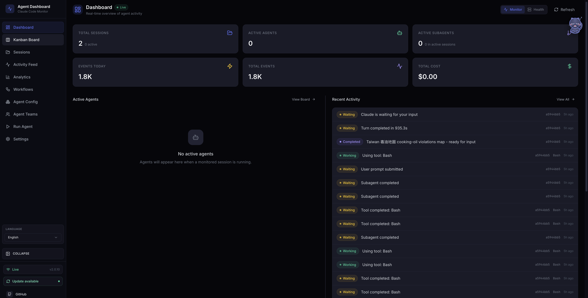
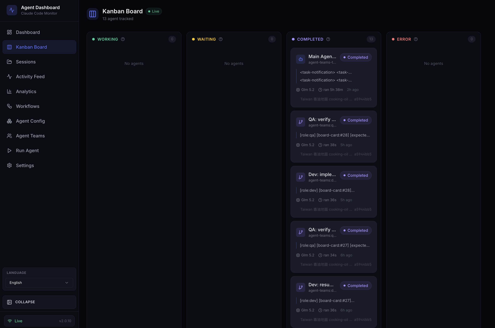
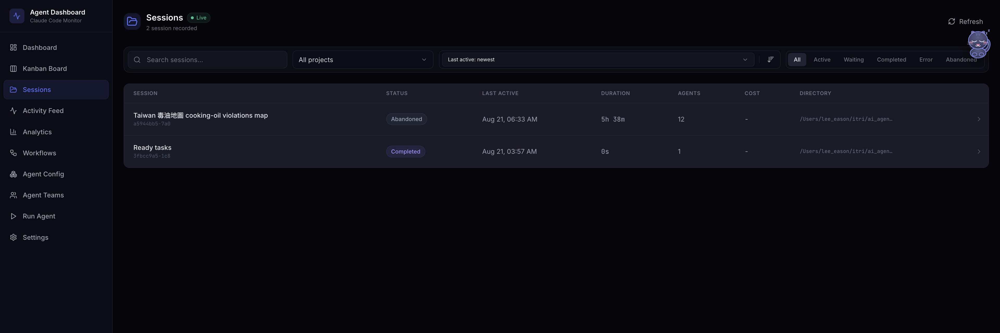
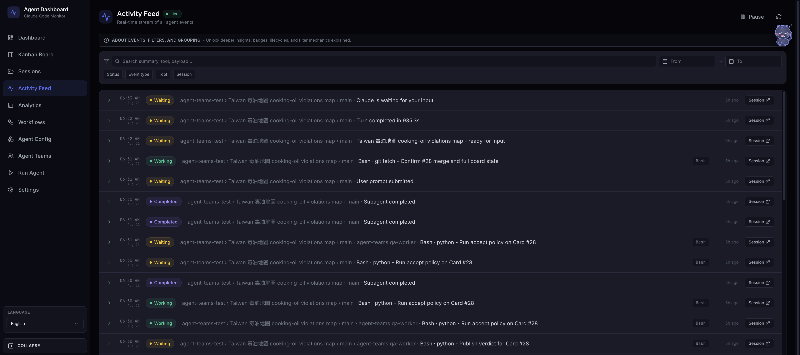
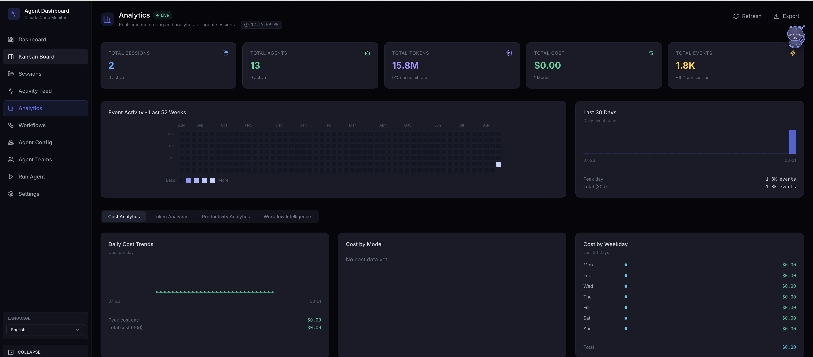
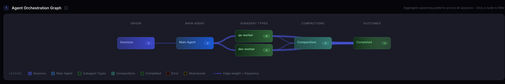
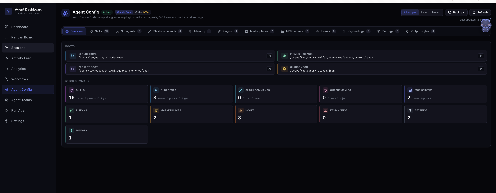
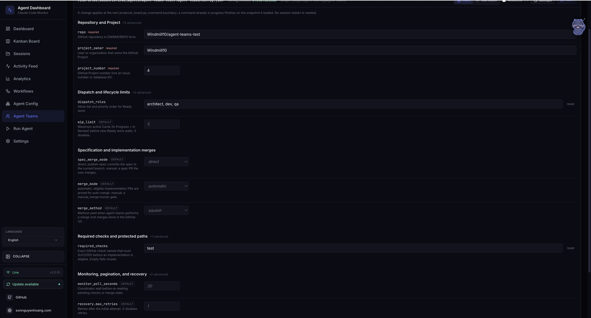

# AI Agent Dev Team

<hr class="rule" />

Weekly update — configurable workflow and dashboard foundation<br/>
<span class="muted">ITRI</span>

<!--
This week focuses on one foundation: workflow policy no longer lives as
hard-coded values. The same validated config will be editable from the
dashboard; the dashboard design itself is intentionally left for its owner.
-->

---
layout: center
---

<div class="chapter">
  <div class="chapter-num">Part 1</div>
  <div class="chapter-title">What We Did This Week</div>
  <div class="chapter-sub">1. Extract configuration · 2. Prepare dashboard integration</div>
</div>

<!--
The story is deliberately short: show the old hard-coded operating model,
show the new configuration surface, then explain how a running session adopts
a dashboard update safely.
-->

---
layout: ppt
class: dense
---

# 1. Extract configuration

<div class="grid-2" style="max-width:100%;">
  <div class="card">
    <h3>Before — change the code</h3>
    <p>Merge behavior, retries, backoff, and polling were fixed inside the implementation.<br/><br/>
    A policy change required a code edit.</p>
  </div>
  <div class="card">
    <h3>After — change the config</h3>
    <p>Operational choices live in a validated <code>config.json</code> with safe defaults.<br/><br/>
    Each project can choose its own policy.</p>
  </div>
</div>

<br/>

<p class="takeaway">The workflow engine stays the same; <span class="accent">team policy becomes configurable</span>.</p>

<!--
The important difference is ownership. Defaults still provide a safe path, but
changing how one project operates no longer requires changing shared plugin
code. The config is validated before any workflow action starts.
-->

---
layout: ppt
class: dense
---

# Config Extracted

| Config | Default | What it controls |
|---|---:|---|
| <code>spec_merge_mode</code> | <code>direct</code> | Commit the spec directly, or wait for user to merge |
| <code>merge_mode</code> | <code>automatic</code> | Auto-merge an eligible delivery, or let the user merge it |
| <code>merge_method</code> | <code>squash</code> | Use squash, merge, or rebase for automated merges |
| <code>recovery.max_retries</code> | <code>1</code> | Retries after the first failed attempt |
| <code>recovery.initial_backoff_seconds</code> | <code>5</code> | Wait before the first retry |
| <code>recovery.backoff_multiplier</code> | <code>2</code> | Increase the wait after each repeated failure |
| <code>recovery.max_backoff_seconds</code> | <code>60</code> | Maximum wait between retries |
| <code>monitor_poll_seconds</code> | <code>30</code> | How often pending checks and merge state are re-read |

<!--
These are the highest-impact settings requested this week. The two merge
switches are independent. Recovery uses bounded exponential backoff and stops
with visible evidence after the configured retry schedule is exhausted. Other
extracted controls include WIP, handoff limits, board pagination, required
checks, protected paths, and workspace location.
-->

---
layout: ppt
class: dense
---

# Change Config Without Restarting

<div class="protocol">
  <div class="protocol-step"><span class="protocol-num">1</span><strong>Edit</strong><p>The dashboard changes the project config.</p></div><div class="protocol-arrow">→</div>
  <div class="protocol-step"><span class="protocol-num">2</span><strong>Save</strong><p>Validate and atomically replace one complete snapshot.</p></div><div class="protocol-arrow">→</div>
  <div class="protocol-step"><span class="protocol-num">3</span><strong>Reload</strong><p>The next action reads the latest revision.</p></div><div class="protocol-arrow">→</div>
  <div class="protocol-step"><span class="protocol-num">4</span><strong>Continue</strong><p>Resume the same Card, branch, and worktree.</p></div>
</div>

<br/>

<p class="takeaway">No session restart: the current action finishes safely, and the <span class="accent">next action uses the new config</span>.</p>

<!--
Each CLI action uses one consistent config snapshot. config_revision identifies
that snapshot; when it changes, the coordinator discards unstarted old actions
and replans from GitHub. Durable in-flight work remains authoritative, so a
workspace change does not lose an existing claim checkout.
-->

---
layout: ppt
class: dense
---

# 2. Management Dashboard

<div class="grid-2" style="max-width:100%;">
  <div class="card">
    <h3>What it is</h3>
    <p>A fork of an open-source Claude Code monitor, pointed at the team's config directory.<br/><br/>
    Hooks in every session report each tool call, worker spawn and turn to a local server; the web UI shows sessions, workers, tokens and timelines live.</p>
  </div>
  <div class="card">
    <h3>Why a fork, not a new tool</h3>
    <p>It already has the two things a human gate needs: a server-side command runner and a validated config-write route.<br/><br/>
    We vendor the core and own it; upstream is not tracked.</p>
  </div>
</div>

<p class="takeaway">The board is the truth for <span class="accent">work</span>; the dashboard is the window on <span class="accent">who is doing it right now</span>.</p>

<div class="citations">
<ul>
<li><b>Source</b> — Claude-Code-Agent-Monitor (MIT), github.com/hoangsonww/Claude-Code-Agent-Monitor — forked and modified for this project</li>
</ul>
</div>

<!--
Base: hoangsonww/Claude-Code-Agent-Monitor (MIT). Chosen after a source-level feasibility pass against the runner-up (a read-only TUI with no server layer). Data flow: Claude Code hooks → scripts/hook-handler.js → POST :4820 → SQLite → WebSocket → React. It runs against the isolated team config via CLAUDE_HOME, so it sees exactly the demo sessions and nothing else.
Two upstream gaps were fixed in our fork before it was useful: plugin-contributed skills and agents were only counted, never listed (README overclaims); and every worker showed up as one generic agent type.
-->

---
layout: ppt
class: dense
---

# Dashboard Tour — Dashboard

<div class="figure">
  
</div>

<p class="takeaway">Sessions, active agents, events, cost at a glance; recent activity across every session.</p>

<!--
The overview page. The 1.8K events are the full 毒油地圖 rerun. Cost reads $0.00 because the run went through Ollama, not the Anthropic API.
-->

---
layout: ppt
class: dense
---

# Dashboard Tour — Kanban Board

<div class="figure">
  
</div>

<p class="takeaway">Each worker is a card: Working / Waiting / Completed / Error, with its seat type, model and run time. The Kanban here is <span class="accent">agents</span>, not cards — the GitHub Project stays the board for work.</p>

<!--
Thirteen agents tracked for that run — the main session plus twelve workers; each card shows the agent type (agent-teams:dev-worker / qa-worker), the model (glm 5.2) and how long it ran.
-->

---
layout: ppt
class: dense
---

# Dashboard Tour — Sessions

<div class="figure">
  
</div>

<p class="takeaway">One row per Claude Code session: status, duration, how many agents it spawned.</p>

<!--
Two sessions recorded in the team config directory; the big one is the 5h38m unattended run.
-->

---
layout: ppt
class: dense
---

# Dashboard Tour — Activity Feed

<div class="figure">
  
</div>

<p class="takeaway">Every tool call, attributed to main or to the worker that made it (<code>main › agent-teams:qa-worker</code>).</p>

<!--
The breadcrumb is the attribution fix — before the seat split every worker line read the same. "Run accept policy on Card #28" is the QA worker calling the plugin CLI.
-->

---
layout: ppt
class: dense
---

# Dashboard Tour — Analytics

<div class="figure">
  
</div>

<p class="takeaway">Tokens, cost and event volume over time — 15.8M tokens for the full rerun.</p>

<!--
0% cache hit rate and $0 cost are artefacts of the Ollama backend; the token number is real.
-->

---
layout: ppt
class: dense
---

# Dashboard Tour — Workflows

<div class="figure">
  
</div>

<p class="takeaway">Orchestration graph: session → main → subagent types → outcome. On the 08-12 run every worker was one generic type; now <span class="accent">dev-worker and qa-worker are distinct agent types</span>, so any monitor can tell the seats apart.</p>

<!--
The Agent Orchestration Graph panel of the Workflows tab (the tab also has a tool-flow Sankey; full capture: images/2026-08-21/tab-workflows.png). The dashboard reads the subagent type from hook events, not from our prompts. On the 08-12 run every role was spawned through a single agent-teams-worker, so this graph showed ×7 of one thing — that finding drove the split into five seat workers (analyst, architect, dev, qa, lead) with identical tools and contract; only the name and the seat paragraph differ. Before/after capture, if asked: images/2026-08-21/dashboard-graph-before-after-crop.jpg.
-->

---
layout: ppt
class: dense
---

# Dashboard Tour — Agent Config

<div class="figure">
  
</div>

<p class="takeaway">What the team config actually loads: skills, subagents, plugins, hooks — plugin scope listed, not just counted.</p>

<!--
The tab we fixed upstream — it now lists the ten plugin skills and five plugin agents under "plugin" scope.
-->

---
layout: ppt
class: dense
---

# Config Tab — Edit the Plugin's Settings Safely

<div class="step-badge">dashboard · Agent Teams page · the plugin validates, the dashboard never rewrites its rules</div>

<div class="figure">
  
</div>

<p class="takeaway">Fourteen settings up front — including every one from the config table — twelve under Advanced. Saves go through the plugin's own validator — <span class="accent">same config_revision</span> in the dashboard and the CLI.</p>

<!--
A small Python bridge imports the plugin's Config class for inspect/validate/write, so the dashboard holds none of the rules. Invalid input returns the plugin's own problem list verbatim; a valid save backs up the old file then atomically replaces it, and the next CLI command picks up the new revision — which is the mechanism from the previous slide.
Next on this page: a Board tab reading the GitHub Project, and a Promote button so the readiness gate can be clicked here instead of typed in a terminal. Tonight's run still used the terminal for promote.
-->

---
layout: center
---

<div class="chapter">
  <div class="chapter-num">Part 2</div>
  <div class="chapter-title">Demo</div>
  <div class="chapter-sub">Full rerun from intake, watched from the dashboard</div>
</div>

<!--
Run live on 08-21, overnight, unattended. Setup: all prior oil-map artifacts were retired from the repo and the board (recoverable from history); the only things kept were the curated dataset (51 source-cited records across 7 counties) and the county boundary file. Model for every seat: glm-5.2 served through Ollama — no Anthropic usage. The operator typed the requirement, answered two questions, and ran promote three times; everything else on the following slides was the team.
-->

---
layout: ppt
class: dense stagefail
---

# The Run — Three Cards, End to End

| # | Seat | We said / did | Result |
|---|---|---|---|
| 1 | analyst | "we need a 毒油地圖 …" | recovered the retired spec from history → <span class="accent">2 questions</span> → Issue #25 |
| 2 | architect | "what's next? go run it" | found a <span class="accent">data defect</span> (桃園市 vs 桃園縣) · spec to `main` · #26 #27 #28 |
| 3 | human | `promote 26` | `(Ready, dev)` → dev-worker → PR #29, CI green |
| 4 | qa | worker ×2 | first worker died on image input → <span class="accent">retried once by policy</span> |
| 5 | qa | verdict | real defect: `type="module"` breaks the offline error page → <span class="accent">asks the human</span> |
| 6 | human | "fix it properly" | spec amended → dev resumes → QA re-verifies → auto-merge |
| 7 | qa | merged head ≠ verified head | re-verified the merged commit — then <span class="accent">stuck</span> (plugin bug) |
| 8 | human | `promote 27` | refused: spec drifted → re-recorded → `(Ready, dev)` → PR #30 → Done |
| 9 | human | `promote 28` | same guard → PR #31 → Done · 43 tests · map complete |

<p class="figure-note">"…" = typed prompt · <code>code</code> = typed CLI · worker = spawned in the same session. Human moments: rows 1, 3, 6, 8, 9. Rows 4–7 are one card.</p>

<!--
Three cards through the pipeline in one session, ~2.5 hours wall clock including two GitHub rate-limit stalls. Human input: the requirement, two intake answers, three promotes, one exception decision.
The headline is rows 4–7: the walking skeleton was the card that exercised every safety mechanism — the recovery policy (retry once), the QA exception gate (a real defect, the human decides), fix-forward through the architect, the stale-evidence rule (re-verify after the head changed), and finally a genuine plugin bug that left the card merged-but-not-Done. Rows 8–9 are the routine case: one promote each, no further human input.
Rows 8–9 also show a guard we had not seen fire before: because the spec was amended mid-run, promote refused the later cards until the architect re-recorded the current spec on them.
-->

---
layout: ppt
class: dense
---

# "we need a 毒油地圖 …" — analyst

<div class="step-badge"><b>Step 1</b> · analyst · skill: intaking-requirement · typed prompt</div>

```text
> we need a 毒油地圖 — a Taiwan map of cooking-oil food-safety
  violations, so people can see which counties had problem oil
  products and look up the businesses involved. The curated
  dataset is already in the repo under data/oil-violations.json

⏺ I've read the recovered prior spec (Card #18, retired in
  60c79f5) and inspected the dataset.
  Restatement: … 51 records across 7 counties … the map itself
  was previously built (PRs #22–#24) and then retired.
  The prior spec locked four design-level decisions — those
  belong to the architect's re-spec, not this intake.
  Before I write the Card, one clarifying question …
```

<p class="takeaway">The board was empty, but the analyst found the retired run in git history and <span class="accent">separated what is requirement from what is design</span> before asking anything.</p>

<!--
The repo had been wiped of the map code; only the dataset and the boundary file were left. The analyst recovered the retired spec from history, read the 51-record dataset (noting penalty_amount is empty on all records, legal_basis filled on 50/51), and explicitly declined to re-decide the four design-level questions the old spec had settled — it left those to the architect. That is the analyst/architect boundary holding without anyone enforcing it.
-->

---
layout: ppt
class: dense
---

# Analyst — Two Questions, Then Stop

<div class="step-badge"><b>Step 1</b> · analyst · the clarification loop, one question per message</div>

| The analyst asked | The human answered |
|---|---|
| Same v1 scope as the retired #18 (choropleth, drill-down, keyword search) — or has the richer dataset changed what people should see or do? | Same three features. Per-record detail shows the full record: business name, date, description, penalty, legal basis, oil product. |
| The prior spec assumed desktop-only and flagged it as unconfirmed. A public tool will be opened on phones — desktop-only or responsive? | Desktop-only for v1; mobile out of scope. |

<p class="takeaway">Two questions, because only two things were still ambiguous. The loop <span class="accent">ends when every acceptance criterion is checkable by a third party</span> — not at a question count. Result: one Card, #25.</p>

<!--
Last week's run needed seven questions on a blank slate; this one needed two because the analyst carried the prior spec's answers forward as context and only asked what had actually changed or never been decided. The viewport question is new — the old spec had flagged it as unconfirmed and nobody had answered.
The Card records both answers as acceptance criteria and non-goals, notes the expected three-way split as a hint, and leaves the four design questions open with the architect as owner.
-->

---
layout: ppt
class: dense
---

# Architect — Finds a Data Defect First

<div class="step-badge"><b>Step 2</b> · architect · skill: authoring-spec · in-session, no PR</div>

```text
⏺ County-name defect (NEW, must fix): the dataset has 7 records
  with county "桃園市", but the GeoJSON (2010 vintage) has 桃園縣.
  The prior validateViolations would have silently dropped all
  7 Taoyuan records as unmatched.

  Spec mandates an explicit alias map at the join layer (DD4);
  the panel shows the current name 桃園市. Rejected: mutating
  the CC0 boundary file; downgrading the dataset to 桃園縣.

> publish-spec 25  ⎿ 24c6436 on main (direct mode)
> decompose 25     ⎿ #26 #27 #28 at (Backlog, human)
⏺ The architect seat does not promote Cards. The next move is yours.
```

<p class="takeaway">Last week's code would have <span class="accent">silently hidden all seven Taoyuan records</span>. Research before design caught it; the fix became Card #27.</p>

<!--
The architect checked the data against the boundary file concretely instead of trusting the old code, found the county-name mismatch the previous SOURCE.md had only flagged as a future risk, and wrote the resolution into the spec with the rejected alternatives. It then stopped exactly at the seat boundary: spec on main, three children parked at the human gate, an explicit statement that promoting is not its job.
Routing note: "what's next? go run it" went straight to the architect skill rather than through the lead's dispatch routine — the model matched the intent to the seat that had the work. Same protocol, one fewer hop.
-->

---
layout: ppt
class: dense
---

# The Three Cards

<div class="step-badge"><b>Step 2</b> · board after decompose · all three at the human readiness gate</div>

<div class="figure">
  
</div>

<p class="takeaway">#26 walking skeleton · #27 full record fields + validation + <span class="accent">county-name normalization</span> · #28 keyword search. #25 stays as the spec-holder.</p>

<!--
Same decomposition shape as 08-12, with one difference that came out of the research: the second card now carries the Taoyuan normalization as an explicit acceptance criterion, with the first card allowed to leave those seven records unrendered for one step. The dependency order is written into the cards: #27 and #28 depend on #26.
-->

---
layout: ppt
class: dense
---

# Readiness Gate → Dev Worker

<div class="step-badge"><b>Step 3</b> · human <code>promote 26</code> · lead: dispatching-work · spawn agent-teams:dev-worker</div>

```text
> promote 26        ← human, from a terminal
  ⎿ ok · (Ready, dev) · handoff human -> dev

> what's ready to work on? go run it
⏺ Skill(agent-teams:dispatching-work)
⏺ next-actions returns one spawn action: #26 -> agent-teams:dev-worker
  (consuming-card). The #27/#28 readiness gates are human gates
  I won't touch.
⏺ agent-teams:dev-worker(Dev: implement Card #26 walking skeleton)
  ⎿ Backgrounded agent
```

<p class="takeaway">The lead reads the deterministic next action and spawns the seat it names. <span class="accent">It names the other two gates and leaves them alone.</span></p>

<!--
Promote is still typed in a terminal — the dashboard's Promote button is the next fork feature. From here to the PR nobody types anything: the coordinator reads next-actions, spawns the dev worker with the rendered kickoff, and waits for the worker's report.
-->

---
layout: ppt
class: dense
---

# Dev — Tests First

<div class="step-badge"><b>Step 3</b> · dev worker · skill: consuming-card · worker transcript</div>

```text
> bootstrap --role dev      ⎿ #26 at (Ready, dev) — matches expected
> gh issue view 26 · Read docs/specs/…card-25…md
⏺ Card #26 is the walking skeleton only — no validation,
  normalization, search, or full fields.
> git show 60c79f5^:oil-map.js          ← reads the retired version
> claim 26 --acting-role dev
  ⎿ ok · (In Progress, dev) · worktree .worktrees/claim-26-…
> Write(test/oil-map.test.js)           ← tests first
> node --test
  ⎿ red — oil-map.js doesn't exist yet
⏺ Red confirmed — fails because oil-map.js doesn't exist. Now Green.
> Write(oil-map.js) · node --test       ⎿ 10/10 pass
> node tmp/verify_card26_wiring.js
  ⎿ 6 of 7 record-counties render
    桃園市 (7) has no polygon — that is #27's job
```

<!--
The routine part held on a different model: preflight against the expected pair, claim as the mutual-exclusion lock, worktree, red-then-green. Two details worth pointing at: it read the retired implementation from history as reference rather than reinventing, and its own wiring check against the real data reported the Taoyuan gap and correctly attributed it to the next card instead of fixing out of scope. PR #29 opened seven minutes after the spawn; the required check passed.
-->

---
layout: ppt
class: dense
---

# Recovery Policy, Live

<div class="step-badge"><b>Step 4</b> · qa worker ×2 · recovery.max_retries = 1 · the lead's narration</div>

```text
⏺ The QA worker terminated on an API error: the model does not
  support image input, and it died trying to read a screenshot.
  No durable state changed — #26 is still (In Review, qa),
  no verdict published.

⏺ Per the recovery policy (max_retries 1), I get one retry.
  Re-spawning with the verbatim core prompt plus an explicit
  constraint to avoid the failure mode: no screenshot/image
  input (verify via node --test, source reading, and headless
  DOM reasoning).

⏺ This is the single retry the recovery policy allows.
  If it fails again I'll stop and report rather than loop.
```

<p class="takeaway">The first failure was the model's, not the plugin's. The coordinator <span class="accent">classified it, retried exactly once, and said what it would do if that failed too</span>.</p>

<!--
This is Part 1's "hardened recovery" running for real. The first QA worker tried to verify the page visually through a headless browser and died when it handed the screenshot to a model that cannot take images. The coordinator confirmed nothing durable had changed, used its single configured retry, and constrained the retry so it could not fail the same way. Both workers are visible in the dashboard as separate qa-worker runs.
-->

---
layout: ppt
class: dense
---

# QA Finds a Real Defect — and Asks

<div class="step-badge"><b>Step 5</b> · qa verdict → exception gate · the human decides</div>

```text
⏺ Why it's a spec conflict, not a dev defect
  The dev followed DD7 literally (<script type="module">). But
  oil-map.js has no ES module syntax. type="module" is cargo-
  culted from the retired implementation and is the sole cause
  of the AC4 failure: over file:// Chrome and Safari block
  module scripts, so the graceful "data failed to load" page
  never appears — a blank page instead.

☐ QA exception — how do you want to resolve it?
❯ 1. Fix it: drop type="module" (Recommended)
     Amend DD7; dev changes one line on PR #29; QA re-verifies.
     Does NOT merge now — routes architect -> dev -> qa.
  2. Accept as-is: approve-exception
     Merge now; scope the offline error page to Firefox only.
```

<p class="takeaway">QA traced it to <span class="accent">a line copied from last week's code</span>, blamed the spec, not the dev — and asked instead of merging around it.</p>

<!--
The acceptance criterion: if the data files fail to load, the page must show a visible error, not a blank map. The retired implementation loaded the script as a module; over file:// that is CORS-blocked in Chrome and Safari, so the error handler never runs. QA proved it by reasoning from the source, traced it to the spec's design decision rather than the dev's work, and offered two routes with the cost of each. The human (the operator, via the recommended option) chose the proper fix.
-->

---
layout: ppt
class: dense
---

# Fix-Forward — Architect, Dev, QA Again

<div class="step-badge"><b>Step 6</b> · spec amended on main → dev resumes PR #29 → QA re-verifies → auto-merge</div>

```text
⏺ Amend spec DD7 on main so QA has a correct target, then route
  #26 back to dev to push the one-line fix onto PR #29.
> publish-spec 25
  ⎿ 2f1cfdb · DD7 now: classic <script defer>, NOT type="module"
⏺ next-actions returns the dev spawn for #26 — a consuming-card
  resume (not a fresh claim): "Resume the existing claim, worktree,
  branch, and Pull Request; do not claim again."
> dev-worker (resume)   ⎿ e08f488 · +regression test · 11/11 pass
> qa-worker (re-verify) ⎿ pass, bound to head e08f488
  re-added type="module" via sed -> the named regression test FAILED
  restored -> 11/11
> accept 26   ⎿ eligible · auto-merge armed · merged 35f73dd
```

<p class="takeaway">The same card, the same PR, the same worktree — <span class="accent">resumed, not restarted</span>. QA re-ran against the new head before anything merged.</p>

<!--
Three seats in sequence with no human in between once the decision was made: the architect amended the design decision in the spec on main, the dev worker resumed its own claim and changed one attribute plus a regression test that pins it, and QA verified at the new commit — including mutating the HTML back to the bad form to prove the test catches it.
A side note the lead reported on its own: the QA worker had left the main checkout on the PR branch, so the first spec re-publish landed on the wrong branch; the lead caught it, switched back, and re-published correctly. Honest reporting of its own near-miss, unprompted.
-->

---
layout: ppt
class: dense
---

# The Routine Case — One Promote to Done, Twice

<div class="step-badge"><b>Steps 8–9</b> · human <code>promote 27</code>, <code>promote 28</code> · no further human input</div>

```text
> promote 27
  ⎿ ok=false — specification changed after it was recorded on
    the Card; the architect must run publish-spec again
> publish-spec 27 (architect) · handoff architect -> human
> promote 27        ⎿ (Ready, dev)
  dev-worker  ⎿ PR #30 · 27/27 tests · 7 桃園市 records now render
  qa-worker   ⎿ pass · eligible · merged 6bb5fd9 · #27 (Done, lead)

> promote 28        ⎿ same guard, same re-record, then (Ready, dev)
  dev-worker  ⎿ PR #31 · keyword search · 43/43 tests
  qa-worker   ⎿ pass · eligible · merged fee2708 · #28 (Done, lead)
```

<p class="takeaway">Because the spec changed mid-run, <span class="accent">promote refused until the current spec was re-recorded on each card</span>. After that, one command each, hands off to Done.</p>

<!--
Both later cards are the steady state the whole system is for: promote, then nothing. The spec-drift guard is worth a sentence — the DD7 amendment during #26 meant #27 and #28 still pointed at the original spec commit, and the readiness gate refused to let them through against a stale design. The architect re-recorded the current spec on each, the human promoted, and both went through dev and QA with no exceptions, no retries, no questions.
-->

---
layout: ppt
class: dense
---

# The Dashboard — Eleven Workers, One Session

<div class="step-badge">dashboard · session view · agents by seat, each with its kickoff, duration and outcome</div>

<div class="figure">
  
</div>

<p class="takeaway">Every spawn on the previous slides is a row here: <span class="accent">5 dev-worker and 6 qa-worker runs</span> under one lead session — retry and resumes included.</p>

<!--
This is what the team lead asked for: a place to watch the team work without reading terminals. The session view shows the main agent and each worker with its rendered kickoff (role, card, expected pair, routine), how long it ran, and whether it completed. The two QA runs on #26 are both visible — the one that died and the retry — as are the two dev resumes. Token flow and event mix are on the same page.
Known display issue we will fix in the fork: a backgrounded worker is marked Completed at spawn time; the real end is the SubagentStop event.
-->

---
layout: ppt
class: dense
---

# The Product — 毒油地圖, 51 Records, 7 Counties

<div class="step-badge">delivery · cards #26 + #27 + #28 · PRs #29, #30, #31</div>

<div class="figure">
  
</div>

<p class="takeaway">Penalty reads <code>未公開</code> where no official figure exists.</p>

<!--
The county panel shows the full record: business, date, description, penalty, legal basis, oil product. The Taoyuan records are the proof of the architect's finding and the second card's fix: the dataset says 桃園市, the boundary file says 桃園縣, and the join layer maps one to the other while the panel shows the current name. Each record in this county is explicitly labeled as a downstream recipient from the official 福壽實業 list, not a penalized violator — the same integrity rule as before.
-->

---
layout: ppt
class: dense
---

# Search — Any Business, Any Brand, Any County

<div class="step-badge">delivery · keyword search (#28) · PR #31</div>

<div class="figure">
  
</div>

<p class="takeaway">Type a business name or oil brand and the panel lists matches across all counties; <span class="accent">clearing the box restores the county view</span>. Last week's card #21, rebuilt from the new spec.</p>

<!--
Search by business name or oil brand, case-insensitive substring, independent of the county selection; an active search overrides the county panel and a cleared search restores it. The 中聯油脂 record shown is the 2026 seed case; penalty and legal basis read 未公開 because no primary official figure exists.
-->

---
layout: ppt
class: dense
---

# The Board at the End

<div class="step-badge">final state · #27 and #28 Done · #26 merged, not reconciled</div>

<div class="figure">
  
</div>

<p class="takeaway">#27 and #28 Done by the rules. #26 is merged and live </p>

<!--
The board's second row is the honest one: #26's code is on main and verified twice, but the card could not be reconciled because of the accept ordering bug. We left it rather than hand-edit the board — the fix belongs in the plugin, and the board should say what actually happened. Parent #25 stays open as the spec-holder; closing it is a bookkeeping decision, not a delivery one.
-->
