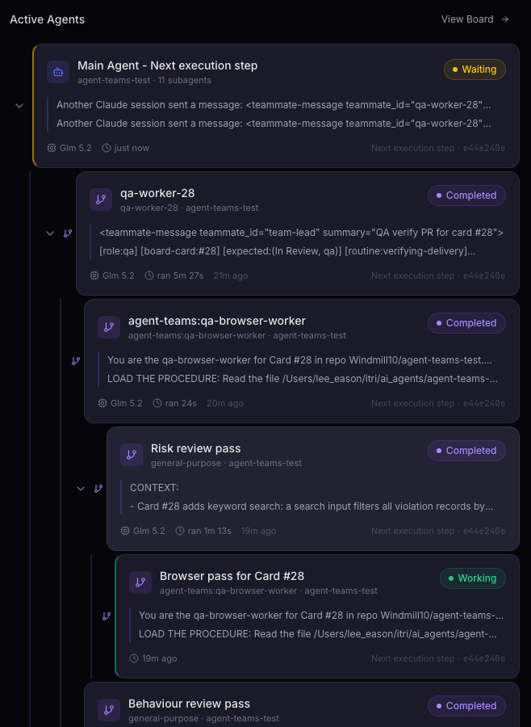
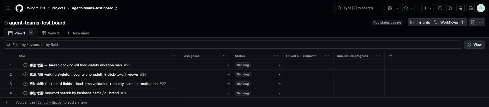
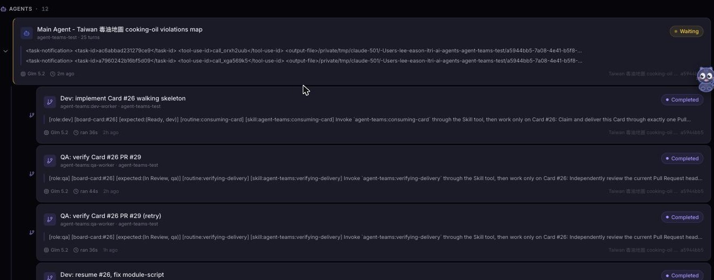
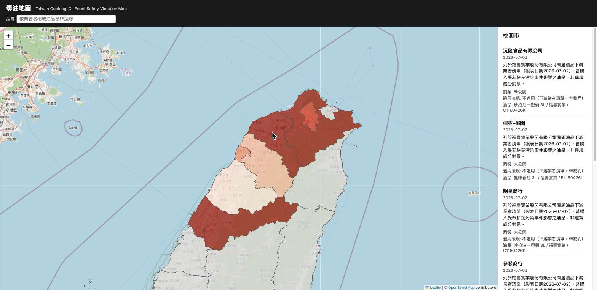
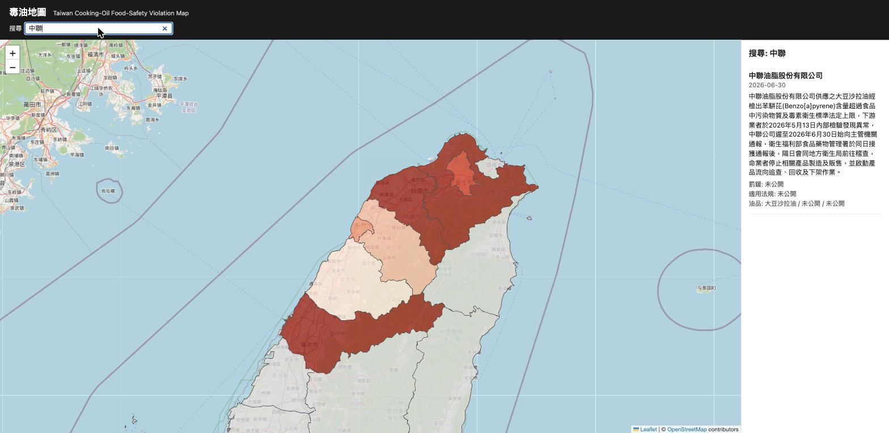
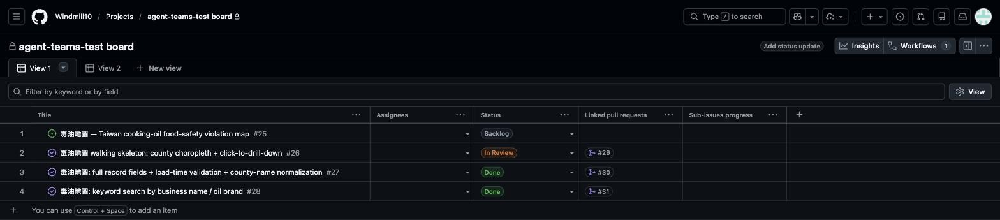

# AI Agent Dev Team

<hr class="rule" />

Weekly update — per-role policy, an independent QA seat, and a runbook<br/>
<span class="muted">ITRI</span>

<!--
This week is the 08-21 review list, worked in order. The through-line is that
each change moves a rule out of prose and into something that refuses bad input:
config that validates which agent may set which field, and a QA verdict that is
rejected when its evidence is not checkable.
Part 2 is last week's live run, kept as the reference demo. The rebuilt QA has
now also run live (2026-08-28, re-verifying Card #28) — those results are in
the Part 1 QA pages.
-->

---
layout: center
---

<div class="chapter">
  <div class="chapter-num">Part 1</div>
  <div class="chapter-title">What We Did This Week</div>
  <div class="chapter-sub">1. Config per role · 2. QA rebuilt · 3. A setup guide</div>
</div>

<!--
All of this comes from the 08-21 review list. Seven of the nine items are done.
The dataset swap is waiting on the data; the naming question stays parked.
Update since this deck was first drafted: the rebuilt QA HAS now run live —
twice on 2026-08-28, re-verifying merged Cards #26 and #28. The first run
exposed a real gap (the fan-out stayed prose-optional and did not happen), the
fix landed, and the second run fanned out fully. The QA pages carry the
evidence; the fan-out gap and its fix live in the speaker notes of "The
Split, Live".
-->

---
layout: ppt
class: dense
---

# Retry Settings Per Role

<div class="eyebrow">1 · Config per role</div>

<div class="grid-2" style="max-width:100%;">
<div class="card">
<h3>Before</h3>
<p>One retry setting for the whole team.<br/><br/>
Give QA more retries, and dev got them too.</p>

```json
"recovery": { "max_retries": 1 }
```

</div>
<div class="card">
<h3>After</h3>
<p>Each role can set its own.<br/><br/>
Anything a role does not set, it copies from the default.</p>

```json
"recovery": { "max_retries": 1 },
"roles": { "qa": { "recovery": { "max_retries": 3 } } }
```

</div>
</div>

<p class="takeaway">QA now retries <span class="accent">3 times</span>. Everyone else still retries once.</p>

<style>
/* A code sample belonging to one side of a before/after pair sits INSIDE its
   card, so each side reads as one block rather than two stacked boxes. Grid
   stretch equalises the cards; min-height equalises the samples, because the
   "after" case needs one line more and two boxes of different height read as
   an accident. */
.card pre {
  margin: 1rem 0 0 !important;
  padding: 0.65rem 0.8rem !important;
  min-height: 3.7rem;
  box-sizing: border-box;
  background: rgba(28, 27, 24, 0.04) !important;
  border: 1px solid var(--line);
  border-radius: 3px;
}
.card pre code { font-size: 0.74rem !important; line-height: 1.65 !important; }
</style>

<!--
Six roles can be tuned: analyst, architect, dev, qa, lead, and merge_master.
merge_master is not a board role — it is the merge step inside accept and
approve-exception. The team lead asked for it to be its own thing, so it is.
Two details if someone asks. First, we only store what a role actually changed,
not a full copy — otherwise editing the team default later would stop reaching
that role, and nobody would notice. Second, every planned action now carries its
own retry setting; the coordinator used to hold one number for everything, which
cannot express "architect two, QA three" no matter what the file says.
-->

---
layout: ppt
class: dense
---

# Clearer Names for the Merge Settings

<div class="eyebrow">1 · Config per role</div>

<div class="grid-2" style="max-width:100%;">
  <div class="card">
    <h3>Before</h3>
    <p>You could not tell which Pull Request each setting controlled.<br/><br/>
    The spec one and the code one looked the same.</p>
  </div>
  <div class="card">
    <h3>After</h3>
    <p>The name says it.<br/><br/>
    <code>spec_pr_…</code> is the spec. <code>code_pr_…</code> is the code.</p>
  </div>
</div>

| Was | Now | Who uses it |
|---|---|---|
| <code>spec_merge_mode</code> | <code>spec_pr_merge_mode</code> | architect |
| <code>merge_mode</code> | <code>code_pr_merge_mode</code> | the merge step |
| <code>merge_method</code> | <code>code_pr_merge_method</code> | the merge step |

<p class="takeaway">Old names still work — they get <span class="accent">renamed when you save</span>.</p>

<!--
If a file has both names, the new one wins. That is what a half-updated
dashboard writes. Error messages always use the new name, so they tell you what
to change to instead of repeating the dead one.
The other half of the request is done too: every row in the config reference now
says which agent reads that setting, and lists all the valid values.
And putting a setting under the wrong role is now an error that names the right
role. It used to be silently ignored, which was the whole problem — you could
not tell which agent read which setting.
-->

---
layout: ppt
class: dense
---

# Dashboard Settings Update

<div class="eyebrow">1 · Config per role</div>

<div class="grid-2" style="max-width:100%;">
  <div class="card">
    <h3>Before</h3>
    <p>You pick <code>squash</code>, save, reopen the page — and it says default again.<br/><br/>
    The form saved <code>merge_mode</code>. On the way to disk the plugin renamed it to <code>code_pr_merge_mode</code>. The form then looked for <code>merge_mode</code>, could not find it, and showed the field as unset.</p>
  </div>
  <div class="card">
    <h3>After</h3>
    <p>The form uses the new names, so what you save is what it reads back.<br/><br/>
    It also gained a row per role. Each row shows <strong>the value it inherits</strong>, and an <code>inherit</code> option to clear an override you set by mistake.</p>
  </div>
</div>

<!--
The plugin accepts the old names on purpose, so nobody's config file breaks when
they upgrade. It also rewrites them on save, so a repository migrates just by
letting it save once. Those two behaviours are right on their own — the bug was
that the dashboard was not updated to match.
On the per-role rows: showing a fixed default would have displayed the plugin's
built-in number and contradicted what the file actually says. And a dropdown
always holds a value, so without an explicit "inherit" option, one accidental
click would write a setting you could never remove.
Verification: the dashboard's config tests run against the real plugin rather
than a stub, so a mismatch between the two shows up as a failing test. 9 of 9
passing.
Also worth mentioning here, from the review list: we confirmed the 08-21
subagent-tracking fix still works now that QA starts helpers of its own, and
added a test for it. Small leftover — several helpers running at once can still
finish in the wrong order on screen. Cosmetic; a worker can no longer be marked
finished by its own helper, which was the damaging version.
One thing to watch: the form's field list is written by hand from our docs, not
read from the plugin, so the two can drift. The new test catches a rename but
cannot catch a new setting — if we add a config key, we have to edit that file
too.
-->

---
layout: ppt
class: dense
---

# QA Was Repeating Dev's Work

<div class="eyebrow">2 · QA rebuilt</div>

<div class="grid-2" style="max-width:100%;">
  <div class="card">
    <h3>Before</h3>
    <p>Ran Dev's tests again. Read Dev's code. Sometimes took a screenshot.<br/><br/>
    All of it came from work Dev had already done.</p>
  </div>
  <div class="card">
    <h3>After</h3>
    <p>One reviewer never sees the code.<br/><br/>
    It gets the Card, the spec, and the running app. Nothing else.</p>
  </div>
</div>

<p class="takeaway">The problem was not that QA looked too shallowly. It was that QA had <span class="accent">no evidence of its own</span>.</p>

<!--
This is the slide that explains why we built what we built.
The obvious fix for "QA is too thin" is to make the code review deeper — split
the eight review checks across eight agents. That gives you a better read of the
same code. The evidence still all comes from Dev's work.
What the team lead was actually pointing at was independence. So the main change
is a reviewer that never sees the code at all.
Worth mentioning if it comes up: the one bug our unit tests missed was a blank
page from an ES-module mismatch, and it was caught by a screenshot someone took
by chance. That is the check we made standard.
-->

---
layout: ppt
class: dense
---

# How QA Splits Now

<div class="eyebrow">2 · QA rebuilt</div>

<div class="grid-2" style="max-width:100%;">
  <div class="card">
    <h3>Browser reviewer</h3>
    <p>Clicks through the app, types bad input into every field, checks the console.<br/><br/>
    Tests what the spec promised — not what the code does.</p>
  </div>
  <div class="card">
    <h3>Code reviewer</h3>
    <p>Three passes: <code>structure</code>, <code>behaviour</code>, <code>risk</code>.<br/><br/>
    Three, not eight — eight would copy the same code eight times.</p>
  </div>
</div>

<p class="takeaway">Still <span class="accent">one verdict</span>. The helpers only report; the reviewer decides.</p>

<!--
Why blind: if you have read the code, you test what the code does. If you have
only read the spec, you test what was promised — and that is the only way to
find something nobody built. It is how a real QA team works: they design tests
without the dev team seeing them first.
Why three passes and not eight: design and architecture ask almost the same
question, and so do compatibility and cross-file. All eight checks still appear
in the verdict. The grouping decides who looks, not what counts as looked at.
Load testing is deferred on purpose, with a clear trigger: do it when a spec
first states a speed or concurrency target. A load test with no target is
theatre.
On agent-to-agent messaging, which was also on the list: we checked, and
subagents can talk to each other. But dev and QA never run at the same time, so
there is nobody to talk to. The place it actually helps is here — the reviewer
briefing its own helpers. Rule of thumb we set: send a file path, not the file.
This is no longer just a design: the next slide is this split running live on
2026-08-28, re-verifying the merged keyword-search Card.
-->

---
layout: ppt
class: dense
---

# The Split, Live

<div class="eyebrow">2 · QA rebuilt</div>

<div class="grid-2" style="max-width:100%; align-items:start;">
  <div>
    
  </div>
  <div>
    <div class="card">
      <h3>One seat, four evidence producers</h3>
      <p>The qa-worker spawned the <code>structure</code> / <code>behaviour</code> / <code>risk</code> passes over the diff, plus the spec-blind browser worker — nested live under one seat on the dashboard.</p>
    </div>
    <div class="card" style="margin-top:10px;">
      <h3>Verdict: PASS — with one real finding</h3>
      <p>43/43 tests · 11 browser flows + 8 garbage inputs · security 10/10.<br/><br/>
      The risk pass deleted the search wiring — <strong>43/43 still green</strong>: that layer has no test that fails when it breaks. Not a defect under the spec; noted for a follow-up Card.</p>
    </div>
  </div>
</div>

<p class="figure-note">Live run 2026-08-28 · QA re-verification of merged Card #28 (keyword search) · one verdict, published by the qa seat alone.</p>

<!--
This is the dashboard during the run: the reviewer at the top, and under it the
browser worker and the three review passes, each a real subagent with its own
token budget. Structure pass is just below the fold.
The finding is the part worth 30 seconds: the risk pass did not trust the 43
green tests — it deleted the entire search-wiring layer and the suite stayed
green, which proves the wiring is untested. The spec accepts that (browser
observation covers it), so it is an observation on a pass, not a defect. That
is exactly the split working: independent evidence, one verdict.
Small honest caveat if asked: the dashboard still duplicates some helper rows
and one shows a stale Working state — the known cosmetic attribution issue,
already on the fix list.
The fan-out story, if it comes up: in the FIRST live run this split did not
happen — the worker reviewed everything inline, because the worker contract
said "do not spawn another agent" while a later section allowed helpers, and
the skill called a single inline pass "complete and valid". A model resolves
that conflict conservatively; a probe confirmed spawning itself works fine.
The fix was prose, not code: spawning is now the default, inline is the
documented fallback for a failed attempt only, and the verdict must record
which happened. This run is the same model on the same card shape after that
fix. The evidence gate, which IS code, held in both runs.
-->

---
layout: ppt
class: dense
---

# Browser Checks Are Now Required

<div class="eyebrow">2 · QA rebuilt</div>

<div class="grid-2" style="max-width:100%;">
  <div class="card">
    <h3>Before</h3>
    <p>The instructions said "check it in a browser".<br/><br/>
    An agent could skip that and still pass the card.</p>
  </div>
  <div class="card">
    <h3>After</h3>
    <p>If the change touches the UI and there is no browser evidence, <strong>the pass is rejected</strong>.<br/><br/>
    Backend and docs cards are not affected.</p>
  </div>
</div>

```json
"input_validation": [ { "field": "#search-input",
    "input": "injection <script>alert(1)</script>",
    "expected": "no script execution; literal text / no-match",
    "actual": "panel: 搜尋: <script>alert(1)</script> — No matching
               records | console errors: [] | script-tags-in-panel: 0" } ]
```

<p class="takeaway">Asking nicely does not work on an agent. <span class="accent">Refusing bad evidence does.</span></p>

<!--
These agents do not refuse to work. They report success convincingly. That is
why this is a check in code and not a sentence in the instructions.
A pass must now include three things: a flow with at least two steps, one field
fed bad input, and the console state.
The console rule is the interesting one. An empty error list is fine — it means
you looked and it was quiet. A missing error list is rejected, because it means
you did not look. That live blank page was a console error sitting behind a
fully green test suite.
The block on screen is real evidence from the 08-28 run: one of eight garbage
inputs the spec-blind browser worker fed the search field (empty, whitespace,
3000 chars, XSS, SQL injection, path traversal, ...). All eight passed; cases
get recorded whether they pass or not.
We also watched the refusal do its job for real: in the first 08-28 run the
reviewer argued the browser pass was "fundamentally a headless-reasoning task"
and prepared to publish without it. The gate refused the pass, so it served the
app, drove it with Playwright, and produced the evidence. The rule worked
precisely because it is code, not a request.
-->

---
layout: ppt
class: dense
---

# What Each Reviewer Did

<div class="eyebrow">2 · QA rebuilt</div>

<div class="grid-2" style="max-width:100%;">
  <div class="card">
    <h3>Structure pass</h3>
    <p>Read the spec, the diff, and every file; traced the search flow end to end. <code>searchViolations</code> matches DD2 exactly — case-insensitive substring, county never read. <strong>No findings.</strong></p>
  </div>
  <div class="card">
    <h3>Behaviour pass</h3>
    <p>Ran the real data: 「福壽」 finds all 50 brand records, 「中聯」 finds the one null-brand record by name; clearing the search restores the last county view identically. <strong>No defects.</strong></p>
  </div>
  <div class="card">
    <h3>Risk pass</h3>
    <p>The typed query reaches the DOM in exactly one place, through <code>textContent</code>; every <code>innerHTML</code> is an empty-string clear. Then it deleted the search wiring — 43/43 tests stayed green. <strong>Finding recorded.</strong></p>
  </div>
  <div class="card">
    <h3>Browser pass — spec-blind</h3>
    <p>Never saw the code. Drove the app from the spec alone: 11 flows, 8 garbage inputs — <code>&lt;script&gt;alert(1)&lt;/script&gt;</code> rendered as text, 0 script tags, clean console after every step. <strong>All pass.</strong></p>
  </div>
</div>

<p class="takeaway">Four producers of evidence. The qa seat reconciled them into <span class="accent">one verdict</span>.</p>

<!--
All four snippets are condensed verbatim from the helpers' own reports in the
08-28 run; the full texts are in the session transcripts and the verdict's
checks array on Issue #28.
Structure and behaviour both came back clean, which is what you want on a
merged card — their value is that they are independent confirmations, not that
they find something every time.
The risk pass is the one worth narrating: it did not trust 43 green tests. It
checked the XSS surface line by line (the one textContent sink, the three
empty-string innerHTML clears, no eval, no URL interpolation), then ran a
mutation — deleted the entire search-wiring layer and the suite stayed green.
That is how "the wiring has no failing test" became a recorded finding instead
of an opinion.
The browser worker's blindness is enforced by its prompt: it gets the Card, the
spec, and the head SHA — never the diff. It found the same behavior the
behaviour pass traced in code, from the outside, which is exactly the
independent-evidence property the team lead asked for.
-->

---
layout: ppt
class: dense
---

# 3. A Runbook for Beginners

<!-- opacity:1 is load-bearing. @slidev/theme-default styles the first paragraph
     after an h1 as a subtitle — `h1 + p { opacity-50 }` — which washes this
     line out to about #8a857a. Every other slide in this part escapes it by
     having an .eyebrow div between the title and the text; this one has no
     eyebrow, so it has to opt out directly. Setting `color` alone does
     nothing: the colour was never wrong, the element was half transparent. -->
<p style="opacity: 1; color: var(--fg); font-size: 1.05rem; max-width: 84%; margin-bottom: 1.5rem;">
For someone who has never used this plugin — or Claude Code at all.
Nine steps, from creating the accounts to one card merged.</p>

<div class="status-note">
  <strong>Each step ends with a check</strong>
  <span>A command to run, and the output it should print — so you know a step worked, instead of finding out three steps later.</span>
</div>

<p class="takeaway">Please try it cold. Tell us <span class="accent">the last check that passed</span> — that is the bug report.</p>

<!--
Why this was needed: setup was spread over four reference documents, none of
them a sequence, and nobody had ever rebuilt the pipeline from scratch — so
nobody knew what was missing. That is what the dry run is for.
Almost every confusing failure we have hit was an earlier step that was never
really green, which is why every step ends with a check.
The nine parts: what you are building · accounts and tools · a short Claude
Code primer · installing the plugin · repo, board, CI, branch protection ·
init and doctor · shipping one card · the dashboard · troubleshooting.
Every command in it was tested against the real CLI, not written from memory,
and two tests now guard the document itself.
The troubleshooting chapter is only problems we actually hit: the missing GitHub
project permission, capital letters in the board field names, an empty required
check list sending every card to a human, a model that cannot read images, and
the setting that silently hid 8 of our 10 skills from the model.
-->

---
layout: center
---

<div class="chapter">
  <div class="chapter-num">Part 2</div>
  <div class="chapter-title">Demo</div>
  <div class="chapter-sub">Full rerun from intake, watched from the dashboard</div>
</div>

<!--
Run live on 08-21, overnight, unattended. Setup: all prior oil-map artifacts were retired from the repo and the board (recoverable from history); the only things kept were the curated dataset (51 source-cited records across 7 counties) and the county boundary file. Model for every seat: glm-5.2 served through Ollama — no Anthropic usage. The operator typed the requirement, answered two questions, and ran promote three times; everything else on the following slides was the team.
-->

---
layout: ppt
class: dense stagefail
---

# The Run — Three Cards, End to End

| # | Seat | We said / did | Result |
|---|---|---|---|
| 1 | analyst | "we need a 毒油地圖 …" | recovered the retired spec from history → <span class="accent">2 questions</span> → Issue #25 |
| 2 | architect | "what's next? go run it" | found a <span class="accent">data defect</span> (桃園市 vs 桃園縣) · spec to `main` · #26 #27 #28 |
| 3 | human | `promote 26` | `(Ready, dev)` → dev-worker → PR #29, CI green |
| 4 | qa | worker ×2 | first worker died on image input → <span class="accent">retried once by policy</span> |
| 5 | qa | verdict | real defect: `type="module"` breaks the offline error page → <span class="accent">asks the human</span> |
| 6 | human | "fix it properly" | spec amended → dev resumes → QA re-verifies → auto-merge |
| 7 | qa | merged head ≠ verified head | re-verified the merged commit — then <span class="accent">stuck</span> (plugin bug) |
| 8 | human | `promote 27` | refused: spec drifted → re-recorded → `(Ready, dev)` → PR #30 → Done |
| 9 | human | `promote 28` | same guard → PR #31 → Done · 43 tests · map complete |

<p class="figure-note">"…" = typed prompt · <code>code</code> = typed CLI · worker = spawned in the same session. Human moments: rows 1, 3, 6, 8, 9. Rows 4–7 are one card.</p>

<!--
Three cards through the pipeline in one session, ~2.5 hours wall clock including two GitHub rate-limit stalls. Human input: the requirement, two intake answers, three promotes, one exception decision.
The headline is rows 4–7: the walking skeleton was the card that exercised every safety mechanism — the recovery policy (retry once), the QA exception gate (a real defect, the human decides), fix-forward through the architect, the stale-evidence rule (re-verify after the head changed), and finally a genuine plugin bug that left the card merged-but-not-Done. Rows 8–9 are the routine case: one promote each, no further human input.
Rows 8–9 also show a guard we had not seen fire before: because the spec was amended mid-run, promote refused the later cards until the architect re-recorded the current spec on them.
-->

---
layout: ppt
class: dense
---

# "we need a 毒油地圖 …" — analyst

<div class="step-badge"><b>Step 1</b> · analyst · skill: intaking-requirement · typed prompt</div>

```text
> we need a 毒油地圖 — a Taiwan map of cooking-oil food-safety
  violations, so people can see which counties had problem oil
  products and look up the businesses involved. The curated
  dataset is already in the repo under data/oil-violations.json

⏺ I've read the recovered prior spec (Card #18, retired in
  60c79f5) and inspected the dataset.
  Restatement: … 51 records across 7 counties … the map itself
  was previously built (PRs #22–#24) and then retired.
  The prior spec locked four design-level decisions — those
  belong to the architect's re-spec, not this intake.
  Before I write the Card, one clarifying question …
```

<p class="takeaway">The board was empty, but the analyst found the retired run in git history and <span class="accent">separated what is requirement from what is design</span> before asking anything.</p>

<!--
The repo had been wiped of the map code; only the dataset and the boundary file were left. The analyst recovered the retired spec from history, read the 51-record dataset (noting penalty_amount is empty on all records, legal_basis filled on 50/51), and explicitly declined to re-decide the four design-level questions the old spec had settled — it left those to the architect. That is the analyst/architect boundary holding without anyone enforcing it.
-->

---
layout: ppt
class: dense
---

# Analyst — Two Questions, Then Stop

<div class="step-badge"><b>Step 1</b> · analyst · the clarification loop, one question per message</div>

| The analyst asked | The human answered |
|---|---|
| Same v1 scope as the retired #18 (choropleth, drill-down, keyword search) — or has the richer dataset changed what people should see or do? | Same three features. Per-record detail shows the full record: business name, date, description, penalty, legal basis, oil product. |
| The prior spec assumed desktop-only and flagged it as unconfirmed. A public tool will be opened on phones — desktop-only or responsive? | Desktop-only for v1; mobile out of scope. |

<p class="takeaway">Two questions, because only two things were still ambiguous. The loop <span class="accent">ends when every acceptance criterion is checkable by a third party</span> — not at a question count. Result: one Card, #25.</p>

<!--
Last week's run needed seven questions on a blank slate; this one needed two because the analyst carried the prior spec's answers forward as context and only asked what had actually changed or never been decided. The viewport question is new — the old spec had flagged it as unconfirmed and nobody had answered.
The Card records both answers as acceptance criteria and non-goals, notes the expected three-way split as a hint, and leaves the four design questions open with the architect as owner.
-->

---
layout: ppt
class: dense
---

# Architect — Finds a Data Defect First

<div class="step-badge"><b>Step 2</b> · architect · skill: authoring-spec · in-session, no PR</div>

```text
⏺ County-name defect (NEW, must fix): the dataset has 7 records
  with county "桃園市", but the GeoJSON (2010 vintage) has 桃園縣.
  The prior validateViolations would have silently dropped all
  7 Taoyuan records as unmatched.

  Spec mandates an explicit alias map at the join layer (DD4);
  the panel shows the current name 桃園市. Rejected: mutating
  the CC0 boundary file; downgrading the dataset to 桃園縣.

> publish-spec 25  ⎿ 24c6436 on main (direct mode)
> decompose 25     ⎿ #26 #27 #28 at (Backlog, human)
⏺ The architect seat does not promote Cards. The next move is yours.
```

<p class="takeaway">Last week's code would have <span class="accent">silently hidden all seven Taoyuan records</span>. Research before design caught it; the fix became Card #27.</p>

<!--
The architect checked the data against the boundary file concretely instead of trusting the old code, found the county-name mismatch the previous SOURCE.md had only flagged as a future risk, and wrote the resolution into the spec with the rejected alternatives. It then stopped exactly at the seat boundary: spec on main, three children parked at the human gate, an explicit statement that promoting is not its job.
Routing note: "what's next? go run it" went straight to the architect skill rather than through the lead's dispatch routine — the model matched the intent to the seat that had the work. Same protocol, one fewer hop.
-->

---
layout: ppt
class: dense
---

# The Three Cards

<div class="step-badge"><b>Step 2</b> · board after decompose · all three at the human readiness gate</div>

<div class="figure">
  
</div>

<p class="takeaway">#26 walking skeleton · #27 full record fields + validation + <span class="accent">county-name normalization</span> · #28 keyword search. #25 stays as the spec-holder.</p>

<!--
Same decomposition shape as 08-12, with one difference that came out of the research: the second card now carries the Taoyuan normalization as an explicit acceptance criterion, with the first card allowed to leave those seven records unrendered for one step. The dependency order is written into the cards: #27 and #28 depend on #26.
-->

---
layout: ppt
class: dense
---

# Readiness Gate → Dev Worker

<div class="step-badge"><b>Step 3</b> · human <code>promote 26</code> · lead: dispatching-work · spawn agent-teams:dev-worker</div>

```text
> promote 26        ← human, from a terminal
  ⎿ ok · (Ready, dev) · handoff human -> dev

> what's ready to work on? go run it
⏺ Skill(agent-teams:dispatching-work)
⏺ next-actions returns one spawn action: #26 -> agent-teams:dev-worker
  (consuming-card). The #27/#28 readiness gates are human gates
  I won't touch.
⏺ agent-teams:dev-worker(Dev: implement Card #26 walking skeleton)
  ⎿ Backgrounded agent
```

<p class="takeaway">The lead reads the deterministic next action and spawns the seat it names. <span class="accent">It names the other two gates and leaves them alone.</span></p>

<!--
Promote was typed in a terminal in this run; since then the dashboard's Agent Teams page gained a gate button that opens the same readiness gate (uncommitted on the fork, not yet pressed against a live board). From here to the PR nobody types anything: the coordinator reads next-actions, spawns the dev worker with the rendered kickoff, and waits for the worker's report.
-->

---
layout: ppt
class: dense
---

# Dev — Tests First

<div class="step-badge"><b>Step 3</b> · dev worker · skill: consuming-card · worker transcript</div>

```text
> bootstrap --role dev      ⎿ #26 at (Ready, dev) — matches expected
> gh issue view 26 · Read docs/specs/…card-25…md
⏺ Card #26 is the walking skeleton only — no validation,
  normalization, search, or full fields.
> git show 60c79f5^:oil-map.js          ← reads the retired version
> claim 26 --acting-role dev
  ⎿ ok · (In Progress, dev) · worktree .worktrees/claim-26-…
> Write(test/oil-map.test.js)           ← tests first
> node --test
  ⎿ red — oil-map.js doesn't exist yet
⏺ Red confirmed — fails because oil-map.js doesn't exist. Now Green.
> Write(oil-map.js) · node --test       ⎿ 10/10 pass
> node tmp/verify_card26_wiring.js
  ⎿ 6 of 7 record-counties render
    桃園市 (7) has no polygon — that is #27's job
```

<!--
The routine part held on a different model: preflight against the expected pair, claim as the mutual-exclusion lock, worktree, red-then-green. Two details worth pointing at: it read the retired implementation from history as reference rather than reinventing, and its own wiring check against the real data reported the Taoyuan gap and correctly attributed it to the next card instead of fixing out of scope. PR #29 opened seven minutes after the spawn; the required check passed.
-->

---
layout: ppt
class: dense
---

# Recovery Policy, Live

<div class="step-badge"><b>Step 4</b> · qa worker ×2 · recovery.max_retries = 1 · the lead's narration</div>

```text
⏺ The QA worker terminated on an API error: the model does not
  support image input, and it died trying to read a screenshot.
  No durable state changed — #26 is still (In Review, qa),
  no verdict published.

⏺ Per the recovery policy (max_retries 1), I get one retry.
  Re-spawning with the verbatim core prompt plus an explicit
  constraint to avoid the failure mode: no screenshot/image
  input (verify via node --test, source reading, and headless
  DOM reasoning).

⏺ This is the single retry the recovery policy allows.
  If it fails again I'll stop and report rather than loop.
```

<p class="takeaway">The first failure was the model's, not the plugin's. The coordinator <span class="accent">classified it, retried exactly once, and said what it would do if that failed too</span>.</p>

<!--
This is Part 1's "hardened recovery" running for real. The first QA worker tried to verify the page visually through a headless browser and died when it handed the screenshot to a model that cannot take images. The coordinator confirmed nothing durable had changed, used its single configured retry, and constrained the retry so it could not fail the same way. Both workers are visible in the dashboard as separate qa-worker runs.
-->

---
layout: ppt
class: dense
---

# QA Finds a Real Defect — and Asks

<div class="step-badge"><b>Step 5</b> · qa verdict → exception gate · the human decides</div>

```text
⏺ Why it's a spec conflict, not a dev defect
  The dev followed DD7 literally (<script type="module">). But
  oil-map.js has no ES module syntax. type="module" is cargo-
  culted from the retired implementation and is the sole cause
  of the AC4 failure: over file:// Chrome and Safari block
  module scripts, so the graceful "data failed to load" page
  never appears — a blank page instead.

☐ QA exception — how do you want to resolve it?
❯ 1. Fix it: drop type="module" (Recommended)
     Amend DD7; dev changes one line on PR #29; QA re-verifies.
     Does NOT merge now — routes architect -> dev -> qa.
  2. Accept as-is: approve-exception
     Merge now; scope the offline error page to Firefox only.
```

<p class="takeaway">QA traced it to <span class="accent">a line copied from last week's code</span>, blamed the spec, not the dev — and asked instead of merging around it.</p>

<!--
The acceptance criterion: if the data files fail to load, the page must show a visible error, not a blank map. The retired implementation loaded the script as a module; over file:// that is CORS-blocked in Chrome and Safari, so the error handler never runs. QA proved it by reasoning from the source, traced it to the spec's design decision rather than the dev's work, and offered two routes with the cost of each. The human (the operator, via the recommended option) chose the proper fix.
-->

---
layout: ppt
class: dense
---

# Fix-Forward — Architect, Dev, QA Again

<div class="step-badge"><b>Step 6</b> · spec amended on main → dev resumes PR #29 → QA re-verifies → auto-merge</div>

```text
⏺ Amend spec DD7 on main so QA has a correct target, then route
  #26 back to dev to push the one-line fix onto PR #29.
> publish-spec 25
  ⎿ 2f1cfdb · DD7 now: classic <script defer>, NOT type="module"
⏺ next-actions returns the dev spawn for #26 — a consuming-card
  resume (not a fresh claim): "Resume the existing claim, worktree,
  branch, and Pull Request; do not claim again."
> dev-worker (resume)   ⎿ e08f488 · +regression test · 11/11 pass
> qa-worker (re-verify) ⎿ pass, bound to head e08f488
  re-added type="module" via sed -> the named regression test FAILED
  restored -> 11/11
> accept 26   ⎿ eligible · auto-merge armed · merged 35f73dd
```

<p class="takeaway">The same card, the same PR, the same worktree — <span class="accent">resumed, not restarted</span>. QA re-ran against the new head before anything merged.</p>

<!--
Three seats in sequence with no human in between once the decision was made: the architect amended the design decision in the spec on main, the dev worker resumed its own claim and changed one attribute plus a regression test that pins it, and QA verified at the new commit — including mutating the HTML back to the bad form to prove the test catches it.
A side note the lead reported on its own: the QA worker had left the main checkout on the PR branch, so the first spec re-publish landed on the wrong branch; the lead caught it, switched back, and re-published correctly. Honest reporting of its own near-miss, unprompted.
-->

---
layout: ppt
class: dense
---

# The Routine Case — One Promote to Done, Twice

<div class="step-badge"><b>Steps 8–9</b> · human <code>promote 27</code>, <code>promote 28</code> · no further human input</div>

```text
> promote 27
  ⎿ ok=false — specification changed after it was recorded on
    the Card; the architect must run publish-spec again
> publish-spec 27 (architect) · handoff architect -> human
> promote 27        ⎿ (Ready, dev)
  dev-worker  ⎿ PR #30 · 27/27 tests · 7 桃園市 records now render
  qa-worker   ⎿ pass · eligible · merged 6bb5fd9 · #27 (Done, lead)

> promote 28        ⎿ same guard, same re-record, then (Ready, dev)
  dev-worker  ⎿ PR #31 · keyword search · 43/43 tests
  qa-worker   ⎿ pass · eligible · merged fee2708 · #28 (Done, lead)
```

<p class="takeaway">Because the spec changed mid-run, <span class="accent">promote refused until the current spec was re-recorded on each card</span>. After that, one command each, hands off to Done.</p>

<!--
Both later cards are the steady state the whole system is for: promote, then nothing. The spec-drift guard is worth a sentence — the DD7 amendment during #26 meant #27 and #28 still pointed at the original spec commit, and the readiness gate refused to let them through against a stale design. The architect re-recorded the current spec on each, the human promoted, and both went through dev and QA with no exceptions, no retries, no questions.
-->

---
layout: ppt
class: dense
---

# The Dashboard — Eleven Workers, One Session

<div class="step-badge">dashboard · session view · agents by seat, each with its kickoff, duration and outcome</div>

<div class="figure">
  
</div>

<p class="takeaway">Every spawn on the previous slides is a row here: <span class="accent">5 dev-worker and 6 qa-worker runs</span> under one lead session — retry and resumes included.</p>

<!--
This is what the team lead asked for: a place to watch the team work without reading terminals. The session view shows the main agent and each worker with its rendered kickoff (role, card, expected pair, routine), how long it ran, and whether it completed. The two QA runs on #26 are both visible — the one that died and the retry — as are the two dev resumes. Token flow and event mix are on the same page.
Known display issue we will fix in the fork: a backgrounded worker is marked Completed at spawn time; the real end is the SubagentStop event.
-->

---
layout: ppt
class: dense
---

# The Product — 毒油地圖, 51 Records, 7 Counties

<div class="step-badge">delivery · cards #26 + #27 + #28 · PRs #29, #30, #31</div>

<div class="figure">
  
</div>

<p class="takeaway">Penalty reads <code>未公開</code> where no official figure exists.</p>

<!--
The county panel shows the full record: business, date, description, penalty, legal basis, oil product. The Taoyuan records are the proof of the architect's finding and the second card's fix: the dataset says 桃園市, the boundary file says 桃園縣, and the join layer maps one to the other while the panel shows the current name. Each record in this county is explicitly labeled as a downstream recipient from the official 福壽實業 list, not a penalized violator — the same integrity rule as before.
-->

---
layout: ppt
class: dense
---

# Search — Any Business, Any Brand, Any County

<div class="step-badge">delivery · keyword search (#28) · PR #31</div>

<div class="figure">
  
</div>

<p class="takeaway">Type a business name or oil brand and the panel lists matches across all counties; <span class="accent">clearing the box restores the county view</span>. Last week's card #21, rebuilt from the new spec.</p>

<!--
Search by business name or oil brand, case-insensitive substring, independent of the county selection; an active search overrides the county panel and a cleared search restores it. The 中聯油脂 record shown is the 2026 seed case; penalty and legal basis read 未公開 because no primary official figure exists.
-->

---
layout: ppt
class: dense
---

# The Board at the End

<div class="step-badge">final state · #27 and #28 Done · #26 merged, not reconciled</div>

<div class="figure">
  
</div>

<p class="takeaway">#27 and #28 Done by the rules. #26 is merged and live </p>

<!--
The board's second row is the honest one: #26's code is on main and verified twice, but the card could not be reconciled because of the accept ordering bug. We left it rather than hand-edit the board — the fix belongs in the plugin, and the board should say what actually happened. Parent #25 stays open as the spec-holder; closing it is a bookkeeping decision, not a delivery one.
-->
