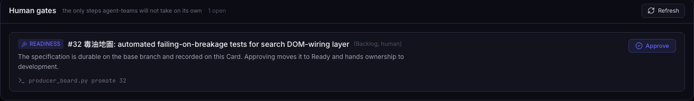
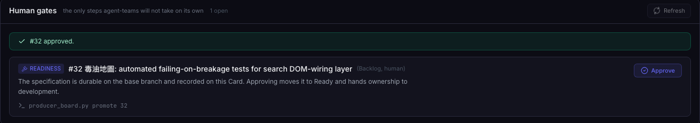

# AI Agent Dev Team

<hr class="rule" />

Weekly update — a change nobody reviewed, and review rules nothing was checking<br/>
<span class="muted">ITRI</span>

<!--
Last week the team lead asked for one thing to be traced. We renamed a config
setting — so did that change actually flow through spec, dev and QA, or did we
just do it ourselves?

The answer is the spine of this deck. There was no chain. And once you look at
why, the rest of the week keeps finding the same shape: something written down
that nothing downstream is forced to notice.

Two working sessions. Yesterday: five items off the 08-28 list, events 1 to 5.
Today: event 6, which was not on the list at all — it came from the intern
asking whether QA actually uses the code-smell vocabulary we added yesterday.
The answer was no, and why not is the same shape again.

Part 2 is the 08-21 live run, kept as the reference demo. Say plainly at the
start that nothing in Part 1 has run live — it is tests, refusals and
documents. The next dataset run is the first real test of all of it.
-->

---
layout: center
---

<div class="chapter">
  <div class="chapter-num">Part 1</div>
  <div class="chapter-title">What We Did This Week</div>
  <div class="chapter-sub">1. Config is governed · 2. Old names refuse · 3. QA reaches the spec<br/>4. Reuse, not rebuild · 5. Which browser · 6. Rules that refuse · 7. Reviewing ourselves</div>
</div>

<!--
Six events over two sessions, numbered in the order they happened.

YESTERDAY, events 1 to 5 — five of the ten items from the 08-28 review. They
are not five independent pieces of work: events 1, 2 and 3 all came out of one
trace, of a config rename that had never gone through the pipeline. Event 4 is "don't reinvent the wheel, go read the best-known
review skill". Event 5 is "write down which browser suite you drive".

TODAY, event 6 — not on the review list. The intern asked whether QA actually
uses the code-smell vocabulary event 4 introduced. Tracing that found the
vocabulary was never given to the agents that read the code, and that every
rule in it was unenforceable. Both are now fixed.

Not here: item 4 of the review (observability), 7-8 (the new dataset), 9-10
(the runbook audience pass).
-->

---
layout: ppt
class: dense
---

# A Config Change Now Leaves a Trail

<div class="eyebrow">1 · Configuration is governed</div>

<p style="opacity:1; margin: 0 0 0.85rem; font-size:0.95rem;">A configuration change now travels like any other change: <strong>through a human gate, through a check that it reached every consumer, and without anyone keeping a second copy of the settings.</strong> None of the three existed before.</p>

<div class="grid-3" style="max-width:100%;">
  <div class="card">
    <h3>It is reviewable</h3>
    <p>The two files that <em>are</em> the vocabulary became a protected path, so changing them routes to the human gate we already had.</p>
  </div>
  <div class="card">
    <h3>It is checked</h3>
    <p>A retired setting name may not appear <strong>anywhere an agent reads</strong>. One rename, five consumers, all verified by the suite.</p>
  </div>
  <div class="card">
    <h3>Nobody copies it</h3>
    <p>The dashboard kept its own hand-typed list of our setting names. It now <strong>asks the plugin</strong>. A new setting reaches the form with no edit.</p>
  </div>
</div>

<p class="takeaway">First run found three real ones — including <span class="accent">a retired name written that same morning, by the session that wrote the rule</span>.</p>

<!--
The background, only if asked. The lead asked us to follow one change through
the pipeline: last month's rename of three merge settings. It had not gone
through. No Card, no specification, no Pull Request, no QA -- raised verbally,
carried into a session, committed directly as 20 files bundled with two
unrelated items. Five places needed the new name, three were missed, each found
later by a different accident, never by a check.

Why a check as well as the protected path, if anyone asks the sharp question:
docs/specs was ALREADY protected while all of that happened. The rename changed
the subject matter that document governs without touching the file, so the
protection never engaged. Protection is on the path; the authority it guards is
the content.

The asymmetry in card two, worth thirty seconds. In skills and agent files a
retired name is banned outright, because an agent reading a skill cannot tell
"this was renamed" from "set this" -- that is exactly how the architect's own
skill kept the old key for nine days with the test suite ASSERTING it should.
In docs, prose may name an old key freely; a settings-table row may not define
one, unless it also names the replacement, which is a migration table.

Card three is the only mechanism that crosses a repository boundary. The
dashboard's copy sat under a header saying "Keep this file in sync with that
doc" -- a comment where a check should be. It drifted twice: wrote the old key
for a week after the rename, so a user's merge choice appeared to reset on every
reload; then went on telling users old names were still accepted after they had
been retired, at exactly the moment a user most needs correct guidance. The
plugin now exports its vocabulary -- names, types, defaults, enumerations,
retirements, every value read off the dataclass rather than restated -- and the
dashboard renders it.

The takeaway is the evidence it works. First run, six failures, three of them
things nobody knew: the approved specification still documented the old key;
`recovery` had NO row in any settings table, so a real top-level setting was
unlookupable; and our own code-smell reference named a retired key, written that
same morning, in an agent-facing file. The rule caught its own author within
hours.

Still open, and say it if asked "is that all of it?": we do not run our own work
through our own pipeline. That is event 7.
-->

---
layout: ppt
class: dense
---

# Backward Compatibility Was Hiding It

<div class="eyebrow">2 · Old names now refuse</div>

<div class="grid-2" style="max-width:100%;">
  <div class="card">
    <h3>Before</h3>
    <p>Old names were accepted and quietly rewritten on save, so nothing would break.<br/><br/>
    It worked — and it turned a loud one-line failure into a silent one that took a week to surface, and a second that took nine days.</p>
  </div>
  <div class="card">
    <h3>After</h3>
    <p>An old name is <strong>refused</strong>, and the error names the key to write instead.</p>

```text
'merge_mode' was renamed to
'code_pr_merge_mode' … rename the
key. Its values are unchanged, so
only the name has to move.
```

  </div>
</div>

<p class="takeaway"><span class="accent">15 tests failed on the first run</span> and named every call site. That is not the cost of the change — it is the change working.</p>

<style>
.card pre {
  margin: 0.9rem 0 0 !important;
  padding: 0.6rem 0.8rem !important;
  box-sizing: border-box;
  background: rgba(28, 27, 24, 0.04) !important;
  border: 1px solid var(--line);
  border-radius: 3px;
}
.card pre code { font-size: 0.72rem !important; line-height: 1.6 !important; }
</style>

<!--
This is the lead's own argument from last week, and the trace turned it from a
position into evidence: the right behaviour after a change is that the tests
surface it and the pipeline corrects itself, and keeping both names is exactly
what stops that happening.

The counter-intuitive part, worth twenty seconds: simply DELETING the old names
would have been worse than keeping them. Unknown keys are ignored by the parser,
so a file saying merge_mode: manual would have silently meant
code_pr_merge_mode: automatic -- the default, and the one that merges without
asking. A file that reads as though it were honoured and is not. So retirement
is an error, not a deletion.

Two of the fifteen failures were not mechanical. Three tests fed an old name and
asserted the new name appeared in the message; under retirement those pass for
the WRONG reason, because the retirement error also contains the new name. The
other was the architect skill's assertion from event 1.

spec_completion is deliberately left accepted-and-ignored: it is a removed
feature, not a rename, so a refusal could only say "delete this".
-->

---
layout: ppt
class: dense
---

# When the Spec Is What Is Wrong

<div class="eyebrow">3 · QA reaches the specification</div>

<div class="grid-2" style="max-width:100%;">
  <div class="card">
    <h3>Before</h3>
    <p>Every QA finding routed to <code>dev</code>.<br/><br/>
    When the defect was in the <strong>specification</strong>, that sent the Card to the one seat that may not change a specification. What actually happened: a person edited the document by hand and approved their own edit.</p>
  </div>
  <div class="card">
    <h3>After</h3>
    <p>QA records the document, the clause, the conflict it observed, and what it suggests instead. Policy routes the Card to a person.<br/><br/>
    That gate deliberately offers <strong>no merge button</strong>: the code was written to match a spec QA says is wrong, so "approve it anyway" is not one of the honest answers.</p>
  </div>
</div>

<p class="takeaway">All four fields required. A request the architect <span class="accent">cannot diff is a complaint</span>, and it is refused.</p>

<!--
The lead asked this live: if QA finds a problem, can it throw the issue back to
the spec or the architect and re-run the pipeline? The answer was no.

And it had already bitten us. The real case: a Card where one criterion required
a visible error when the data files failed to load, while another specified
loading the script as an ES module over file:// -- which Chrome and Safari block
before any handler can run. Both could not hold. QA found it and correctly
blamed the design rather than the developer. Then there was no mechanism: a
person edited the spec by hand and approved their own edit, and nothing on the
Card recorded that a request had ever been made, by whom, or on what evidence.

His instruction was precise and is the constraint this is built around: keep the
human approval, make the request and the approval trackable.

Two things found while building it. QA was ALREADY permitted to hand a Card to
the architect -- the authority matrix has that edge, and a refusal message
elsewhere literally says "route specification defects through the architect".
The authority and the vocabulary existed; nothing used them. And we did not add
a fourth routing outcome: docs/specs is already a protected path, so changing a
spec was always a human decision. What was missing was a way for QA to say so.

Human-only, and not for symmetry: an agent seat that could reopen a
specification on its own reading could rewrite the baseline it is judged
against. lead is refused along with the rest.

Unlike the existing exception gate, this one does not expire when the developer
pushes again -- a specification is wrong whichever commit is on the branch.
-->

---
layout: ppt
class: dense
---

# Reuse, Not Rebuild

<div class="eyebrow">4 · Surveying an existing review skill</div>

<p style="opacity:1; margin: 0 0 0.85rem; font-size:0.95rem;">Read Alibaba's open-sourced <strong>OpenCodeReview</strong> at source — the skill, its delegate mode, its ruleset and three system prompts — rather than a summary of it.</p>

<div class="grid-2" style="max-width:100%;">
  <div class="card">
    <h3>What we took</h3>
    <p>· <strong><code>resource-safety</code></strong> as a ninth required review dimension — what does this acquire, and where is it released?<br/>
    · <strong>Severity</strong> as an axis separate from confidence<br/>
    · Drop a finding only when the diff <strong>proves</strong> it wrong<br/>
    · And a named vocabulary for smells: Fowler and Beck's catalogue, as a closed set</p>
  </div>
  <div class="card">
    <h3>What we did not</h3>
    <p>· <strong>Not a dependency</strong> — it needs npm and an API key<br/>
    · Their 50+ per-language rulesets: two years of accumulated knowledge, not reproducible<br/>
    · They <strong>never run the app</strong>, have no spec-blind reviewer, and nothing in them decides a merge</p>
  </div>
</div>

<p class="takeaway">Both of last week's code-smell examples now have a home — and <span class="accent">the merge-mode rename's own smell is <em>Shotgun Surgery</em></span>.</p>

<!--
The instruction was: do not reinvent the wheel, go and look at the best-known
one, and since the four-aspect design is good, see how they cover things and
fold it in. So the deliverable is a gap analysis, not an integration.

The honest one-line summary: OpenCodeReview is a better code reader; ours is a
better gate. Different products, and the overlap is narrower than the phrase
"code review" suggests.

resource-safety is the concrete payoff, and it lands on something the lead said
himself. His two examples were a machine that never releases its connections
until the buffer bursts under load, and private state that keeps breaking out
until it is a security hole. Neither of our eight review checks asked either
question. The first is now resource-safety; the second is Inappropriate Intimacy
under architecture. We found that gap by reading someone else's ruleset rather
than by introspection, which is the argument for doing the survey at all.

It went into the risk bundle: a leak and an injection are the same question
asked twice -- what happens when this is used harder than the happy path -- and
it sits next to test strength, where the awkward truth lives, because exhaustion
defects are the ones a unit suite is least likely to have asserted.

The callback at the bottom is the point of the vocabulary. One conceptual
change, five consumers, three missed -- that is Shotgun Surgery. Having a name
is what lets the next reviewer say it in a way that can be argued with.

Why not adopt it directly: we have a standing rule that agent-teams calls no
other plugin, this is Python standard library with no install step, and it would
sit in the wrong seat -- it reviews a diff, and the seat that most needed help
is the browser reviewer, which is forbidden the diff. Licensing, if it comes up:
Apache-2.0 where our three previous sources are MIT, which additionally requires
stating that changes were made; the attribution file says so.
-->

---
layout: ppt
class: dense
---

# Which Browser Suite, Exactly

<div class="eyebrow">5 · Writing down what we drive</div>

<p style="opacity:1; margin: 0 0 0.85rem; font-size:0.95rem;"><strong>Playwright, headless Chromium, run from the shell.</strong> Nothing named it before, because the reviewer has <em>no browser tool in its definition at all</em> — it runs a script.</p>

<div class="grid-2" style="max-width:100%;">
  <div class="card">
    <h3>Why this one</h3>
    <p>Console and page errors arrive as <strong>events</strong>, not a log scrape — and our own rule makes a console reading a required, validated field.<br/><br/>
    Puppeteer buys nothing extra. Selenium is the right answer for a browser matrix we do not have. Cypress wants to own a directory, and this seat writes nothing.</p>
  </div>
  <div class="card">
    <h3>Why not Claude's own browser</h3>
    <p>It drives the operator's <strong>real logged-in session</strong>.<br/><br/>
    This pass submits injection strings to every input field. Doing that inside a session carrying real credentials is not a test.</p>
  </div>
</div>

<p class="takeaway">Recorded honestly: <span class="accent">one engine, one viewport, headless — and nothing accumulates</span> between Cards.</p>

<!--
Short item, asked for by name: there are many browser-automation suites with
different characteristics, so write down which one we use.

The answer took some finding, and that is itself the finding. The browser
reviewer's tool list has no browser tool at all -- it reaches a browser by
running a script, so nothing in the agent definition names the suite. Our
evidence from the live run records "playwright (chromium headless) 1.62.1", and
that is now the documented answer with the reasoning behind it.

One rule came out of writing it up: record the ENGINE and the version in the
evidence, not just "playwright". Headless Chromium, headed Chromium and WebKit
differ in exactly the places this evidence gets used to argue from -- console
formatting, layout metrics, permission defaults, and CORS over file://, which is
the failure that started this whole line of work.

The last line is the part not to skip. Chromium-only means no Safari-class
finding is reachable -- and the original blank-page defect was a Chrome AND
Safari behaviour. The worktree is deleted when the pass ends, so nothing
accumulates: every Card re-derives its flows from the spec and no regression
suite ever builds up. That last one is an open decision, not an oversight.
-->

---
layout: ppt
class: dense
---

# A Finding Is Now an Object

<div class="eyebrow">6 · Rules that refuse</div>

<p style="opacity:1; margin: 0 0 0.85rem; font-size:0.95rem;">The smell vocabulary went to the seat that <em>reconciles</em> findings, not to the three passes that <em>read the code</em> — and every rule in it was a sentence no validator could check. <strong>Both are fixed.</strong></p>

<div class="grid-2" style="max-width:100%;">
  <div class="card">
    <h3>Before</h3>
    <p>A sentence, with the severity as a prefix nobody parsed.</p>

```text
"[high] the parser drops
 the trailing row"
```

  </div>
  <div class="card">
    <h3>After</h3>
    <p>Four required fields, two closed vocabularies.</p>

```json
{"severity": "medium",
 "dimension": "architecture",
 "confidence": 8,
 "evidence": "board.py:88 reads
   Config._raw directly …",
 "smell": "Inappropriate Intimacy"}
```

  </div>
</div>

<p class="takeaway">A <code>pass</code> carrying a <code>critical</code> or <code>high</code> finding is now <span class="accent">refused</span> — and a smell outside the catalogue is refused by name.</p>

<style>
.card pre {
  margin: 0.8rem 0 0 !important;
  padding: 0.55rem 0.75rem !important;
  box-sizing: border-box;
  background: rgba(28, 27, 24, 0.04) !important;
  border: 1px solid var(--line);
  border-radius: 3px;
}
.card pre code { font-size: 0.66rem !important; line-height: 1.55 !important; }
</style>

<!--
This event came from the intern asking whether QA actually uses the code-smell
vocabulary we added the day before. Tracing it found two gaps, and neither was
the one the question implied.

First, the catalogue was briefed to the QA seat that deduplicates and challenges
findings other agents already produced -- so it arrived after the looking was
over. The three review passes, the seats that actually read the code, never got
it. Fixed by putting the relevant sections in their brief. THIS HALF CANNOT BE
VALIDATED: no check establishes that a reviewer looked for Feature Envy.
Pretending otherwise would be the worse error.

Second, the half that can be. Four rules moved from advice to refusal. Prose
refuses outright, naming the four keys -- we considered accepting both shapes
and rejected it for the same reason as event 2, since a prose entry would sail
past every check. Severity, dimension and smell are closed sets, so a smell
outside the catalogue is refused BY NAME: "do not invent entries", enforced.
Confidence below 5 refuses and the message says MOVE IT TO LIMITATIONS, never
delete it. And the only rule that changes an outcome rather than a format: a
pass carrying a critical or high finding is refused, because writing "pass"
above a serious finding was the cheapest way to ship it. The refusal names
"fail" rather than asking the reviewer to soften the finding.

Two things deliberately NOT enforced, both pinned by tests so they stay
decisions: a smell need not match the finding's dimension, and severity
inflation is undetectable -- which is why evidence is required.

The catalogue was also filled in against Fowler chapter 3, and the more useful
half is what it EXCLUDES. Comments is excluded because Fowler's smell is
comments used as deodorant, while ours explain why a rule exists and several are
the only record of a decision. Data Class is excluded because field-only records
are the intended architecture here. An entry that can never legitimately fire
trains reviewers to force matches.

Four tests compare the reference document against the enforced list in BOTH
directions, with a guard so an empty parse cannot pass for the wrong reason.
Least obviously necessary, most valuable: that drift is exactly what event 1
spent its time tracing.
-->

---
layout: ppt
class: dense
---

# Old Plugin Reviews New Plugin

<div class="eyebrow">7 · Reviewing ourselves is sound</div>

<p style="opacity:1; margin: 0 0 0.85rem; font-size:0.95rem;">One objection has kept this project from running its own work through its own pipeline. <strong>It turns out not to apply here — and the property it rests on is now checked instead of assumed.</strong></p>

<div class="grid-2" style="max-width:100%;">
  <div class="card">
    <h3>The objection</h3>
    <p>The QA that reviews a change to the policy code <em>runs on</em> the policy code.<br/><br/>
    A change that breaks the checker would be waved through by the checker it broke — and the tests could be green, because the assertions were edited with it.</p>
  </div>
  <div class="card">
    <h3>Why it does not apply</h3>
    <p>Every seat runs the <strong>installed</strong> plugin — the last merged version — while the code under review sits in the Pull Request.<br/><br/>
    <strong>Old plugin reviews new plugin.</strong> It is the compiler bootstrap, and it was already true here.</p>
  </div>
</div>

<p class="takeaway">25 command invocations across every seat. <span class="accent">All 25 run the installed plugin; none runs the checkout.</span> Now a test, not a habit.</p>

<div class="status-note">
  <strong>Nothing in Part 1 has run live</strong>
  <span>625 tests, a passing manifest check and documents. The next dataset run is the first real test — as it is for last week's QA split.</span>
</div>

<!--
Say the objection out loud first, because it is the honest reason this never
happened and because it sounds fatal. Then take it apart.

Every skill invokes the installed plugin, while the diff under review lives in
the Pull Request and a detached worktree. So the thing doing the reviewing is
never the thing being reviewed. That is how you bootstrap a compiler: you
compile the new compiler with the old one, and a defect in the new source cannot
excuse itself. It was already true here, by accident of how a plugin is loaded.
What was NOT true is that anything checked it -- one skill rewritten to call a
repository-relative path would quietly turn self-review into self-excusing.

Two things NOT on the slide.

First, a rule that cannot be checked from inside the repository: the installed
plugin is updated AFTER a merge, never before. Install an unmerged build and you
hand the fixed point back.

Second, and more important: THIS DOES NOT MEAN WE NOW SELF-HOST. There is no
board for this repository and no config of its own. What is finished is that
self-hosting is SOUND. Adoption needs a Project, an init, a doctor and a first
Card -- and someone to accept the friction: today's work would have been six to
eight Cards, and changing one line of a reference document would need a Card, a
spec, a PR and a verdict. That cost is the real reason this never happened, and
it is a judgment call for the lead rather than a technical obstacle.

The blast radius is bounded either way: the policy, model, workflow and git
modules, and now the config module and its reference, are protected paths, so a
change to any of them routes to a person whatever the review concluded.

On the status note: say it rather than letting it come out in questions.
-->

---
layout: center
---

<div class="chapter">
  <div class="chapter-num">Part 2</div>
  <div class="chapter-title">Demo</div>
  <div class="chapter-sub">Full rerun from intake, watched from the dashboard</div>
</div>

<!--
Run live on 08-21, overnight, unattended. Setup: all prior oil-map artifacts were retired from the repo and the board (recoverable from history); the only things kept were the curated dataset (51 source-cited records across 7 counties) and the county boundary file. Model for every seat: glm-5.2 served through Ollama — no Anthropic usage. The operator typed the requirement, answered two questions, and ran promote three times; everything else on the following slides was the team.
-->

---
layout: ppt
class: dense stagefail
---

# The Run — Three Cards, End to End

| # | Seat | We said / did | Result |
|---|---|---|---|
| 1 | analyst | "we need a 毒油地圖 …" | recovered the retired spec from history → <span class="accent">2 questions</span> → Issue #25 |
| 2 | architect | "what's next? go run it" | found a <span class="accent">data defect</span> (桃園市 vs 桃園縣) · spec to `main` · #26 #27 #28 |
| 3 | human | `promote 26` | `(Ready, dev)` → dev-worker → PR #29, CI green |
| 4 | qa | worker ×2 | first worker died on image input → <span class="accent">retried once by policy</span> |
| 5 | qa | verdict | real defect: `type="module"` breaks the offline error page → <span class="accent">asks the human</span> |
| 6 | human | "fix it properly" | spec amended → dev resumes → QA re-verifies → auto-merge |
| 7 | qa | merged head ≠ verified head | re-verified the merged commit — then <span class="accent">stuck</span> (plugin bug) |
| 8 | human | `promote 27` | refused: spec drifted → re-recorded → `(Ready, dev)` → PR #30 → Done |
| 9 | human | `promote 28` | same guard → PR #31 → Done · 43 tests · map complete |

<p class="figure-note">"…" = typed prompt · <code>code</code> = typed CLI · worker = spawned in the same session. Human moments: rows 1, 3, 6, 8, 9. Rows 4–7 are one card.</p>

<!--
Three cards through the pipeline in one session, ~2.5 hours wall clock including two GitHub rate-limit stalls. Human input: the requirement, two intake answers, three promotes, one exception decision.
The headline is rows 4–7: the walking skeleton was the card that exercised every safety mechanism — the recovery policy (retry once), the QA exception gate (a real defect, the human decides), fix-forward through the architect, the stale-evidence rule (re-verify after the head changed), and finally a genuine plugin bug that left the card merged-but-not-Done. Rows 8–9 are the routine case: one promote each, no further human input.
Rows 8–9 also show a guard we had not seen fire before: because the spec was amended mid-run, promote refused the later cards until the architect re-recorded the current spec on them.
-->

---
layout: ppt
class: dense
---

# "we need a 毒油地圖 …" — analyst

<div class="step-badge"><b>Step 1</b> · analyst · skill: intaking-requirement · typed prompt</div>

```text
> we need a 毒油地圖 — a Taiwan map of cooking-oil food-safety
  violations, so people can see which counties had problem oil
  products and look up the businesses involved. The curated
  dataset is already in the repo under data/oil-violations.json

⏺ I've read the recovered prior spec (Card #18, retired in
  60c79f5) and inspected the dataset.
  Restatement: … 51 records across 7 counties … the map itself
  was previously built (PRs #22–#24) and then retired.
  The prior spec locked four design-level decisions — those
  belong to the architect's re-spec, not this intake.
  Before I write the Card, one clarifying question …
```

<p class="takeaway">The board was empty, but the analyst found the retired run in git history and <span class="accent">separated what is requirement from what is design</span> before asking anything.</p>

<!--
The repo had been wiped of the map code; only the dataset and the boundary file were left. The analyst recovered the retired spec from history, read the 51-record dataset (noting penalty_amount is empty on all records, legal_basis filled on 50/51), and explicitly declined to re-decide the four design-level questions the old spec had settled — it left those to the architect. That is the analyst/architect boundary holding without anyone enforcing it.
-->

---
layout: ppt
class: dense
---

# Analyst — Two Questions, Then Stop

<div class="step-badge"><b>Step 1</b> · analyst · the clarification loop, one question per message</div>

| The analyst asked | The human answered |
|---|---|
| Same v1 scope as the retired #18 (choropleth, drill-down, keyword search) — or has the richer dataset changed what people should see or do? | Same three features. Per-record detail shows the full record: business name, date, description, penalty, legal basis, oil product. |
| The prior spec assumed desktop-only and flagged it as unconfirmed. A public tool will be opened on phones — desktop-only or responsive? | Desktop-only for v1; mobile out of scope. |

<p class="takeaway">Two questions, because only two things were still ambiguous. The loop <span class="accent">ends when every acceptance criterion is checkable by a third party</span> — not at a question count. Result: one Card, #25.</p>

<!--
Last week's run needed seven questions on a blank slate; this one needed two because the analyst carried the prior spec's answers forward as context and only asked what had actually changed or never been decided. The viewport question is new — the old spec had flagged it as unconfirmed and nobody had answered.
The Card records both answers as acceptance criteria and non-goals, notes the expected three-way split as a hint, and leaves the four design questions open with the architect as owner.
-->

---
layout: ppt
class: dense
---

# Architect — Finds a Data Defect First

<div class="step-badge"><b>Step 2</b> · architect · skill: authoring-spec · in-session, no PR</div>

```text
⏺ County-name defect (NEW, must fix): the dataset has 7 records
  with county "桃園市", but the GeoJSON (2010 vintage) has 桃園縣.
  The prior validateViolations would have silently dropped all
  7 Taoyuan records as unmatched.

  Spec mandates an explicit alias map at the join layer (DD4);
  the panel shows the current name 桃園市. Rejected: mutating
  the CC0 boundary file; downgrading the dataset to 桃園縣.

> publish-spec 25  ⎿ 24c6436 on main (direct mode)
> decompose 25     ⎿ #26 #27 #28 at (Backlog, human)
⏺ The architect seat does not promote Cards. The next move is yours.
```

<p class="takeaway">Last week's code would have <span class="accent">silently hidden all seven Taoyuan records</span>. Research before design caught it; the fix became Card #27.</p>

<!--
The architect checked the data against the boundary file concretely instead of trusting the old code, found the county-name mismatch the previous SOURCE.md had only flagged as a future risk, and wrote the resolution into the spec with the rejected alternatives. It then stopped exactly at the seat boundary: spec on main, three children parked at the human gate, an explicit statement that promoting is not its job.
Routing note: "what's next? go run it" went straight to the architect skill rather than through the lead's dispatch routine — the model matched the intent to the seat that had the work. Same protocol, one fewer hop.
-->

---
layout: ppt
class: dense
---

# The Three Cards

<div class="step-badge"><b>Step 2</b> · board after decompose · all three at the human readiness gate</div>

<div class="figure">
  
</div>

<p class="takeaway">#26 walking skeleton · #27 full record fields + validation + <span class="accent">county-name normalization</span> · #28 keyword search. #25 stays as the spec-holder.</p>

<!--
Same decomposition shape as 08-12, with one difference that came out of the research: the second card now carries the Taoyuan normalization as an explicit acceptance criterion, with the first card allowed to leave those seven records unrendered for one step. The dependency order is written into the cards: #27 and #28 depend on #26.
-->

---
layout: ppt
class: dense
---

# Readiness Gate → Dev Worker

<div class="step-badge"><b>Step 3</b> · human <code>promote 26</code> · lead: dispatching-work · spawn agent-teams:dev-worker</div>

```text
> promote 26        ← human, from a terminal
  ⎿ ok · (Ready, dev) · handoff human -> dev

> what's ready to work on? go run it
⏺ Skill(agent-teams:dispatching-work)
⏺ next-actions returns one spawn action: #26 -> agent-teams:dev-worker
  (consuming-card). The #27/#28 readiness gates are human gates
  I won't touch.
⏺ agent-teams:dev-worker(Dev: implement Card #26 walking skeleton)
  ⎿ Backgrounded agent
```

<p class="takeaway">The lead reads the deterministic next action and spawns the seat it names. <span class="accent">It names the other two gates and leaves them alone.</span></p>

<!--
Promote was typed in a terminal in this run; the next page shows the same gate one week later, as a button. From here to the PR nobody types anything: the coordinator reads next-actions, spawns the dev worker with the rendered kickoff, and waits for the worker's report.
-->

---
layout: ppt
class: dense
---

# The Same Gate, One Week Later

<div class="step-badge"><b>Step 3 revisited</b> · human · 2026-08-28 · Card #32 (a new follow-up card)</div>

<div style="max-width:96%; margin:0 auto;">
  
  
</div>

<p class="takeaway">One click replaced <code>producer_board.py promote 32</code>. The plugin still decides — <span class="accent">the dashboard only presses</span>.</p>

<!--
This is not from the run above — it is the same gate, pressed for real on
2026-08-28 against a new Card (#32, the QA-recommended wiring-tests follow-up,
taken through analyst and architect first so the gate was genuine).
Top: the gate as the dashboard lists it — the Card, why it is waiting, and the
exact CLI command the button wraps, kept visible so a person can always check
what the button does. Bottom: after the press — approved, and the board flipped
to (Ready, dev).
Authority did not move: the dashboard calls the plugin's own promote through
the same policy checks; a refusal (say, a stale spec) comes back as the
refusal text. The board state after: #32 sits at (Ready, dev), which is also
tomorrow's natural live-demo starting point.
If someone notices the lower screenshot's row still saying (Backlog, human):
that is the panel's own re-read racing GitHub's Projects API — the board flip
is eventually consistent; the CLI confirmed (Ready, dev) seconds later.
-->

---
layout: ppt
class: dense
---

# Dev — Tests First

<div class="step-badge"><b>Step 3</b> · dev worker · skill: consuming-card · worker transcript</div>

```text
> bootstrap --role dev      ⎿ #26 at (Ready, dev) — matches expected
> gh issue view 26 · Read docs/specs/…card-25…md
⏺ Card #26 is the walking skeleton only — no validation,
  normalization, search, or full fields.
> git show 60c79f5^:oil-map.js          ← reads the retired version
> claim 26 --acting-role dev
  ⎿ ok · (In Progress, dev) · worktree .worktrees/claim-26-…
> Write(test/oil-map.test.js)           ← tests first
> node --test
  ⎿ red — oil-map.js doesn't exist yet
⏺ Red confirmed — fails because oil-map.js doesn't exist. Now Green.
> Write(oil-map.js) · node --test       ⎿ 10/10 pass
> node tmp/verify_card26_wiring.js
  ⎿ 6 of 7 record-counties render
    桃園市 (7) has no polygon — that is #27's job
```

<!--
The routine part held on a different model: preflight against the expected pair, claim as the mutual-exclusion lock, worktree, red-then-green. Two details worth pointing at: it read the retired implementation from history as reference rather than reinventing, and its own wiring check against the real data reported the Taoyuan gap and correctly attributed it to the next card instead of fixing out of scope. PR #29 opened seven minutes after the spawn; the required check passed.
-->

---
layout: ppt
class: dense
---

# Recovery Policy, Live

<div class="step-badge"><b>Step 4</b> · qa worker ×2 · recovery.max_retries = 1 · the lead's narration</div>

```text
⏺ The QA worker terminated on an API error: the model does not
  support image input, and it died trying to read a screenshot.
  No durable state changed — #26 is still (In Review, qa),
  no verdict published.

⏺ Per the recovery policy (max_retries 1), I get one retry.
  Re-spawning with the verbatim core prompt plus an explicit
  constraint to avoid the failure mode: no screenshot/image
  input (verify via node --test, source reading, and headless
  DOM reasoning).

⏺ This is the single retry the recovery policy allows.
  If it fails again I'll stop and report rather than loop.
```

<p class="takeaway">The first failure was the model's, not the plugin's. The coordinator <span class="accent">classified it, retried exactly once, and said what it would do if that failed too</span>.</p>

<!--
This is Part 1's "hardened recovery" running for real. The first QA worker tried to verify the page visually through a headless browser and died when it handed the screenshot to a model that cannot take images. The coordinator confirmed nothing durable had changed, used its single configured retry, and constrained the retry so it could not fail the same way. Both workers are visible in the dashboard as separate qa-worker runs.
-->

---
layout: ppt
class: dense
---

# QA Finds a Real Defect — and Asks

<div class="step-badge"><b>Step 5</b> · qa verdict → exception gate · the human decides</div>

```text
⏺ Why it's a spec conflict, not a dev defect
  The dev followed DD7 literally (<script type="module">). But
  oil-map.js has no ES module syntax. type="module" is cargo-
  culted from the retired implementation and is the sole cause
  of the AC4 failure: over file:// Chrome and Safari block
  module scripts, so the graceful "data failed to load" page
  never appears — a blank page instead.

☐ QA exception — how do you want to resolve it?
❯ 1. Fix it: drop type="module" (Recommended)
     Amend DD7; dev changes one line on PR #29; QA re-verifies.
     Does NOT merge now — routes architect -> dev -> qa.
  2. Accept as-is: approve-exception
     Merge now; scope the offline error page to Firefox only.
```

<p class="takeaway">QA traced it to <span class="accent">a line copied from last week's code</span>, blamed the spec, not the dev — and asked instead of merging around it.</p>

<!--
The acceptance criterion: if the data files fail to load, the page must show a visible error, not a blank map. The retired implementation loaded the script as a module; over file:// that is CORS-blocked in Chrome and Safari, so the error handler never runs. QA proved it by reasoning from the source, traced it to the spec's design decision rather than the dev's work, and offered two routes with the cost of each. The human (the operator, via the recommended option) chose the proper fix.
-->

---
layout: ppt
class: dense
---

# Fix-Forward — Architect, Dev, QA Again

<div class="step-badge"><b>Step 6</b> · spec amended on main → dev resumes PR #29 → QA re-verifies → auto-merge</div>

```text
⏺ Amend spec DD7 on main so QA has a correct target, then route
  #26 back to dev to push the one-line fix onto PR #29.
> publish-spec 25
  ⎿ 2f1cfdb · DD7 now: classic <script defer>, NOT type="module"
⏺ next-actions returns the dev spawn for #26 — a consuming-card
  resume (not a fresh claim): "Resume the existing claim, worktree,
  branch, and Pull Request; do not claim again."
> dev-worker (resume)   ⎿ e08f488 · +regression test · 11/11 pass
> qa-worker (re-verify) ⎿ pass, bound to head e08f488
  re-added type="module" via sed -> the named regression test FAILED
  restored -> 11/11
> accept 26   ⎿ eligible · auto-merge armed · merged 35f73dd
```

<p class="takeaway">The same card, the same PR, the same worktree — <span class="accent">resumed, not restarted</span>. QA re-ran against the new head before anything merged.</p>

<!--
Three seats in sequence with no human in between once the decision was made: the architect amended the design decision in the spec on main, the dev worker resumed its own claim and changed one attribute plus a regression test that pins it, and QA verified at the new commit — including mutating the HTML back to the bad form to prove the test catches it.
A side note the lead reported on its own: the QA worker had left the main checkout on the PR branch, so the first spec re-publish landed on the wrong branch; the lead caught it, switched back, and re-published correctly. Honest reporting of its own near-miss, unprompted.
-->

---
layout: ppt
class: dense
---

# The Routine Case — One Promote to Done, Twice

<div class="step-badge"><b>Steps 8–9</b> · human <code>promote 27</code>, <code>promote 28</code> · no further human input</div>

```text
> promote 27
  ⎿ ok=false — specification changed after it was recorded on
    the Card; the architect must run publish-spec again
> publish-spec 27 (architect) · handoff architect -> human
> promote 27        ⎿ (Ready, dev)
  dev-worker  ⎿ PR #30 · 27/27 tests · 7 桃園市 records now render
  qa-worker   ⎿ pass · eligible · merged 6bb5fd9 · #27 (Done, lead)

> promote 28        ⎿ same guard, same re-record, then (Ready, dev)
  dev-worker  ⎿ PR #31 · keyword search · 43/43 tests
  qa-worker   ⎿ pass · eligible · merged fee2708 · #28 (Done, lead)
```

<p class="takeaway">Because the spec changed mid-run, <span class="accent">promote refused until the current spec was re-recorded on each card</span>. After that, one command each, hands off to Done.</p>

<!--
Both later cards are the steady state the whole system is for: promote, then nothing. The spec-drift guard is worth a sentence — the DD7 amendment during #26 meant #27 and #28 still pointed at the original spec commit, and the readiness gate refused to let them through against a stale design. The architect re-recorded the current spec on each, the human promoted, and both went through dev and QA with no exceptions, no retries, no questions.
-->

---
layout: ppt
class: dense
---

# The Dashboard — Eleven Workers, One Session

<div class="step-badge">dashboard · session view · agents by seat, each with its kickoff, duration and outcome</div>

<div class="figure">
  
</div>

<p class="takeaway">Every spawn on the previous slides is a row here: <span class="accent">5 dev-worker and 6 qa-worker runs</span> under one lead session — retry and resumes included.</p>

<!--
This is what the team lead asked for: a place to watch the team work without reading terminals. The session view shows the main agent and each worker with its rendered kickoff (role, card, expected pair, routine), how long it ran, and whether it completed. The two QA runs on #26 are both visible — the one that died and the retry — as are the two dev resumes. Token flow and event mix are on the same page.
Known display issue we will fix in the fork: a backgrounded worker is marked Completed at spawn time; the real end is the SubagentStop event.
-->

---
layout: ppt
class: dense
---

# The Product — 毒油地圖, 51 Records, 7 Counties

<div class="step-badge">delivery · cards #26 + #27 + #28 · PRs #29, #30, #31</div>

<div class="figure">
  
</div>

<p class="takeaway">Penalty reads <code>未公開</code> where no official figure exists.</p>

<!--
The county panel shows the full record: business, date, description, penalty, legal basis, oil product. The Taoyuan records are the proof of the architect's finding and the second card's fix: the dataset says 桃園市, the boundary file says 桃園縣, and the join layer maps one to the other while the panel shows the current name. Each record in this county is explicitly labeled as a downstream recipient from the official 福壽實業 list, not a penalized violator — the same integrity rule as before.
-->

---
layout: ppt
class: dense
---

# Search — Any Business, Any Brand, Any County

<div class="step-badge">delivery · keyword search (#28) · PR #31</div>

<div class="figure">
  
</div>

<p class="takeaway">Type a business name or oil brand and the panel lists matches across all counties; <span class="accent">clearing the box restores the county view</span>. Last week's card #21, rebuilt from the new spec.</p>

<!--
Search by business name or oil brand, case-insensitive substring, independent of the county selection; an active search overrides the county panel and a cleared search restores it. The 中聯油脂 record shown is the 2026 seed case; penalty and legal basis read 未公開 because no primary official figure exists.
-->

---
layout: ppt
class: dense
---

# The Board at the End

<div class="step-badge">final state · #27 and #28 Done · #26 merged, not reconciled</div>

<div class="figure">
  
</div>

<p class="takeaway">#27 and #28 Done by the rules. #26 is merged and live </p>

<!--
The board's second row is the honest one: #26's code is on main and verified twice, but the card could not be reconciled because of the accept ordering bug. We left it rather than hand-edit the board — the fix belongs in the plugin, and the board should say what actually happened. Parent #25 stays open as the spec-holder; closing it is a bookkeeping decision, not a delivery one.
-->
