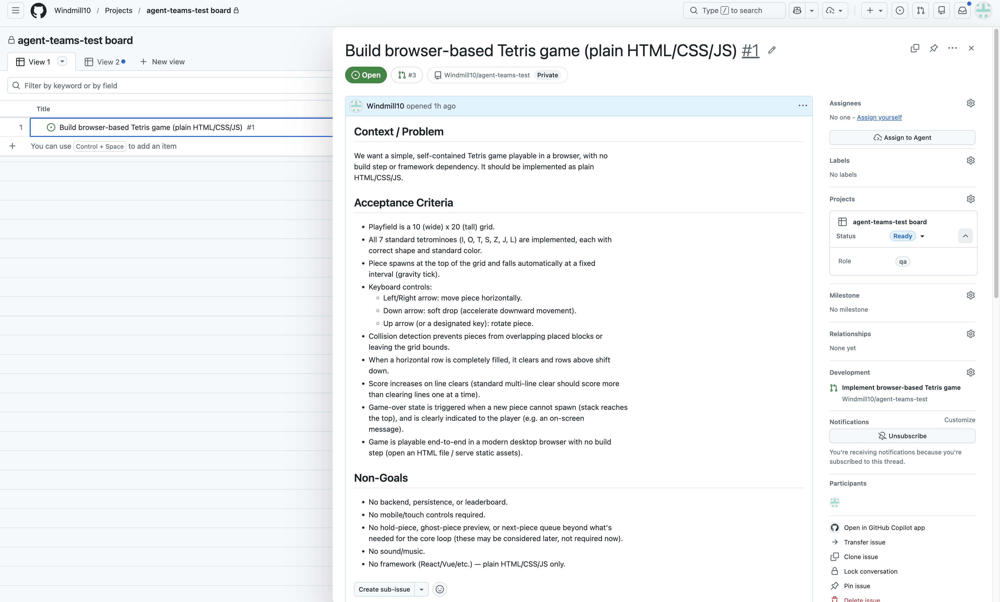

# AI Agent Dev Team

<hr class="rule" />

Understanding board-superpowers, and what we build from it  
<span class="muted">ITRI</span>

<!--
Presenter notes go here.
-->

---
layout: center
---

<div class="chapter">
  <div class="chapter-num">Part 1</div>
  <div class="chapter-title">board-superpowers</div>
  <div class="chapter-sub">How the reference project works</div>
</div>

<!--
Reference: github.com/PanQiWei/board-superpowers.
Our assignment's reference architecture; we studied it before designing our own.
-->

---
layout: ppt
class: dense
---

# What It Is

- A <span class="accent">scheduling layer</span> for Claude Code, packaged as a plugin
- No server, no database, no UI — only skills, hooks, and bash scripts
- The <span class="accent">GitHub Project board is the single source of truth</span> and dispatcher
- Work is delegated: `superpowers` (TDD, planning) · `gstack` (review, QA, security)
- Design thesis: AI throughput scales 100x — <span class="accent">human attention does not</span>

<!--
Not an app. Plugin = folders of instruction files + scripts, inert until a session starts.
State lives on the board and in git — kill every session, nothing is lost.
Sprint / story points deliberately removed: they assume implementation is the bottleneck.
-->

---
layout: ppt
class: dense
---

# Two Session Roles

<div class="grid-2" style="max-width:100%;">
  <div class="card">
    <h3>Producer — Manager</h3>
    <p>Long-lived, interactive.<br/>
    Intake, decompose, dispatch, triage, review.<br/>
    <span class="accent">Never writes code.</span></p>
  </div>
  <div class="card">
    <h3>Consumer — Implementer</h3>
    <p>Disposable, unattended.<br/>
    Claim one card, TDD, open one PR, terminate.<br/>
    <span class="accent">Never merges its own PR.</span></p>
  </div>
</div>

<br/>

- Core invariant: <span class="accent">one card = one session = one PR</span>
- SA / Architect / Dev / QA are lifecycle phases, not standing agents

<!--
A role = which instructions the session loaded. Nothing more.
The real seam: interactive-with-human (Manager) vs unattended (Consumer).
-->

---
layout: ppt
class: dense
---

# Card Lifecycle

```text
Backlog → Ready → In Progress → In Review → Done
                     ↕              │
                  Blocked    (rework loops back)
```

- Card = GitHub Issue: Goal · Acceptance criteria · Out of scope · Dependencies · spec link
- <span class="accent">Gate 1</span> — human approves Backlog → Ready (INVEST, vertical slice, sized)
- <span class="accent">Gate 2</span> — human reviews and merges the PR; agents only propose
- Between the gates: fully autonomous

<!--
Cards are thin pointers to specs — no spec, no card (anti-slop rule).
Gates are cheap: read a one-screen card, read a PR. Minutes of attention govern hours of machine work.
-->

---
layout: ppt
class: dense
---

# Key Mechanisms

<div class="grid-2" style="max-width:100%;">
  <div class="card">
    <h3>Claim = branch push</h3>
    <p>Push empty <code>claim/42-slug</code> — first push wins.<br/>
    <span class="accent">Git is the lock</span>; no server.</p>
  </div>
  <div class="card">
    <h3>Worktree isolation</h3>
    <p>One git worktree per Consumer.<br/>
    N parallel sessions, zero shared state.</p>
  </div>
  <div class="card">
    <h3>PR contract</h3>
    <p>Auto Verification · Human TODO · Retro Notes.<br/>
    <span class="accent">Validated by a script</span>, not the model.</p>
  </div>
  <div class="card">
    <h3>Audit trail</h3>
    <p>Every mutation: auto / propose / never, then logged.<br/>
    Overrides leave traces.</p>
  </div>
</div>

<!--
Pattern everywhere: judgment in prompts, enforcement in code (exit codes).
TDD: for unattended LLMs the green suite is the only ground-truth feedback signal.
-->

---
layout: ppt
class: dense
---

# What We Take From It

| Their design | Our team |
|---|---|
| Manager intake conversation | <span class="accent">SA</span> — requirement → spec |
| Decomposition into cards | <span class="accent">Architect</span> — spec → INVEST cards |
| Consumer TDD loop | <span class="accent">Dev</span> — card → tested PR |
| Verification chain + review queue | <span class="accent">QA</span> — evidence → verdict |
| CI / merge machinery | <span class="accent">OPS</span> — phase 2 |

- Keep: board as truth · one card = one PR · git as lock · two human gates
- Drop: multi-backend, dual-platform

<!--
Our deviation: make the five roles explicit named skills for demo legibility.
Scope honesty: happy path in days; reliability tuning is where real time goes.
-->

---
layout: center
---

<div class="chapter">
  <div class="chapter-num">Part 2</div>
  <div class="chapter-title">Project Architecture</div>
  <div class="chapter-sub">Independent sessions, one durable coordination plane</div>
</div>

<!--
The next three slides move from system context and scope hierarchy, to internal layers, to the Card data model.
The architecture is the complete Phase 1 contract; implementation status is shown later.
-->

---
layout: ppt
class: dense
---

# Overall Architecture

<div class="architecture-map">
  <div class="human-band">
    <div><strong>Human stakeholder</strong></div>
  </div>
  <div class="scope-architecture">
    <div class="scope-node board-scope">
      <div class="node-label">BOARD LEVEL · GITHUB PROJECT</div>
      <strong>Producer</strong>
      <span>lives with the board — shapes, routes, and dispatches</span>
      <div class="scope-seats">analyst · architect · em · qa</div>
    </div>
    <div class="scope-flow">
      <span>dispatch →</span>
      <b>BOARD<br/>↕<br/>CARD</b>
      <span>← result</span>
    </div>
    <div class="scope-node card-scope">
      <div class="node-label">CARD LEVEL · ONE WORK ITEM</div>
      <strong>Consumer</strong>
      <span>lives with one Card — claims and resolves one stage</span>
      <div class="scope-seats">architect · rd · qa</div>
    </div>
  </div>
  <div class="artifact-row">
    <div><strong>Project</strong><span>Status + Role</span></div>
    <div><strong>Issues</strong><span>scope + comments</span></div>
    <div><strong>Git</strong><span>claims + worktrees</span></div>
    <div><strong>Pull Requests</strong><span>delivery + verdict</span></div>
  </div>
</div>

<p class="takeaway">Scope hierarchy is Board → Card; durable artifacts carry dispatch down and results back up.</p>

<!--
"Lives with" means durable scope anchor, not where a process is stored.
Normal flow: Producer observes the board, writes a durable dispatch artifact for one Card, a fresh Consumer claims that Card, and the Consumer's Pull Request, verdict, transition, or handoff returns durable state to the board.
The hierarchy is operational scope, not a required nested runtime stack: the Producer process does not have to remain alive while the Consumer runs.
Architect and QA appear at both levels because each can start separate Producer and Consumer sessions; one session never holds both shapes.
Kill every process: the durable GitHub artifacts still carry the work.
-->

---
layout: ppt
class: dense
---

# Status And Role

<div class="axis-grid">
  <div class="axis-block">
    <div class="axis-label">LIFECYCLE AXIS</div><h3>Status</h3>
    <div class="token-line"><span>Backlog</span><b>→</b><span>Ready</span><b>→</b><span>In Progress</span><b>→</b><span>In Review</span><b>→</b><span>Done</span></div>
  </div>
  <div class="axis-block">
    <div class="axis-label">OWNERSHIP AXIS</div><h3>Role</h3>
    <div class="role-tokens"><span>analyst</span><span>architect</span><span>rd</span><span>qa</span><span>em</span><span>human</span></div>
  </div>
</div>

<div class="pair-row">
  <div class="pair-example"><code>(Backlog, architect)</code><span>shaped demand awaits technical work</span></div>
  <div class="pair-example"><code>(Ready, rd)</code><span>implementation can be claimed</span></div>
  <div class="pair-example"><code>(In Review, qa)</code><span>independent verification is next</span></div>
  <div class="pair-example"><code>(In Review, human)</code><span>only human review and merge remain</span></div>
</div>

<p class="takeaway">The routing state is the pair <code>(Status, Role)</code>.</p>

<!--
When both coordinates move, transition_card and handoff_card are separate semantic operations.
That separation makes a partial external mutation visible and recoverable.
-->

---
layout: center
---

<div class="chapter">
  <div class="chapter-num">Part 3</div>
  <div class="chapter-title">Work Flow & Mechanics</div>
  <div class="chapter-sub">How one request becomes one reviewable delivery</div>
</div>

<!--
Five slides: the lifecycle end to end, the handoff that joins two sessions, then one Consumer session, one Producer session, and what happens when a step fails.
-->

---
layout: ppt
class: dense
---

# From Request to Delivery

<div class="journey">
  <div class="journey-step"><strong>Human</strong><span>request</span><small>no Card yet</small></div><div class="journey-arrow">→</div>
  <div class="journey-step"><strong>Analyst</strong><span>shape demand</span></div><div class="journey-arrow">→</div>
  <div class="journey-step"><strong>Architect</strong><span>spec + decompose</span></div><div class="journey-arrow">→</div>
  <div class="journey-step gate"><strong>Human</strong><span>approve ready</span></div><div class="journey-arrow">→</div>
  <div class="journey-step"><strong>EM</strong><span>dispatch</span></div><div class="journey-arrow">→</div>
  <div class="journey-step"><strong>RD</strong><span>claim + TDD + PR</span></div><div class="journey-arrow">→</div>
  <div class="journey-step"><strong>QA</strong><span>evidence + verdict</span></div><div class="journey-arrow">→</div>
  <div class="journey-step gate"><strong>Human</strong><span>verify + merge</span><small>Done</small></div>
</div>

<div class="rework-loop"><strong>QA fail path</strong><code>(In Review, qa) → (In Progress, rd)</code><span>Fix the same Card, branch, then Pull Request.</span></div>

<!--
No process spans two boxes. Every arrow is a GitHub write that the next session reads back on a cold start.
The optional specification Pull Request is its own architect Consumer session plus a human merge, before decomposition resumes.
Two steps deliberately do not move the Card. The human request has no Card yet — the analyst creates it. EM dispatch is read-only: it renders the kickoff artifact and a carrier starts the session, so the pair stays (Ready, rd) until the rd Consumer claims it.
-->

---
layout: ppt
class: dense
---

# Consumer Mechanics

<div class="protocol">
  <div class="protocol-step"><span class="protocol-num">1</span><strong>Bind</strong><code>[role:rd] [board-card:#42]</code><p>Exactly one Card.</p></div><div class="protocol-arrow">→</div>
  <div class="protocol-step"><span class="protocol-num">2</span><strong>Preflight</strong><code>expected == live?</code><p>Validate configuration, credentials, authority, Status, Role, and required artifacts before touching anything.</p></div><div class="protocol-arrow">→</div>
  <div class="protocol-step"><span class="protocol-num">3</span><strong>Rehydrate</strong><code>Issue + PR</code><p>Rebuild the assignment from existing state.</p></div><div class="protocol-arrow">→</div>
  <div class="protocol-step"><span class="protocol-num">4</span><strong>Resolve one stage</strong><code>produce | deliver | verify</code><p>Implemention and testing.</p></div><div class="protocol-arrow">→</div>
  <div class="protocol-step"><span class="protocol-num">5</span><strong>Persist + stop</strong><code>transition + artifact</code><p>Verify the durable result, then terminate without merging.</p></div>
</div>

<!--
Producer sessions may inspect a bounded queue; Consumer sessions may mutate only one bound Card and its artifacts.
Step 4 runs our own skills. agent-teams does not invoke superpowers or gstack — it may reference them as recommended practice, but every skill and script in this plugin is its own.
The conversational summary helps the human, but GitHub remains authoritative.
Step 5 is deliberately last: a Consumer that cannot persist its result has not delivered, however good the code is.
-->

---
layout: ppt
class: dense
---

# Producer Mechanics

<div class="plugin-flow">
  <div class="plugin-node"><span class="node-label">1 · INPUT</span><strong>Requests</strong><code>[role:analyst] …</code></div><div class="plugin-arrow">→</div>
  <div class="plugin-node"><span class="node-label">2 · BOOTSTRAP</span><strong>Read-only orientation</strong><code>bootstrap</code></div><div class="plugin-arrow">→</div>
  <div class="plugin-node"><span class="node-label">3 · ORCHESTRATION</span><strong>Workflow skill</strong><code>intake · promote</code></div><div class="plugin-arrow">→</div>
  <div class="plugin-node"><span class="node-label">4 · ENFORCEMENT</span><strong>Policy, then adapter</strong><code>policy → board</code></div><div class="plugin-arrow">→</div>
  <div class="plugin-node"><span class="node-label">5 · DURABLE EFFECT</span><strong><code>gh</code> → GitHub</strong><code>Issue + comment</code></div>
</div>

<!--
The model chooses and follows a skill, but it never sets arbitrary Project fields: there is no set_card_field operation.
Step 4 is two things in order — policy decides legality with no network access, then board.py performs the mutation.
Dispatch is read-only: it renders a prompt. A human or another carrier must start the session.
-->

---
layout: ppt
class: dense
---

# When a Step Fails

<div class="recovery-split">
  <div>
<pre><code>{
  "ok": false,
  "partial": true,
  "completed": ["issue_created",
                "project_item_added"],
  "failed": "status_set",
  "error": "gh project item-edit failed: …",
  "recovery": [
    "Issue #61 is on the board, no Status.",
    "Set Backlog, then Role `architect`."
  ]
}</code></pre>
  </div>
  <div class="field-notes">
    <div><strong>Identify the problem</strong><span>Issue creation, the Project write, and the comment are three separate calls.</span></div>
    <div><strong>Never rollback</strong><span>Create a new Issue instead of rolling back.</span></div>
  </div>
</div>

<!--
The test suite asserts that no result ever contains the words "rolled back", "rollback", "reverted", or "undone".
A handoff sets Role before it posts the comment, so the failure mode is "owned, but no context" — recovery writes the comment rather than reassigning.
Same discipline as the merge floor: the system is trusted because it reports what actually happened.
-->

---
layout: center
---

<div class="chapter">
  <div class="chapter-num">Part 4</div>
  <div class="chapter-title">What We Have Built</div>
  <div class="chapter-sub">The Producer MVP, and what comes after it</div>
</div>

<!--
This section distinguishes delivered work from the complete architecture, then names the next milestones in dependency order.
-->

---
layout: ppt
class: dense
---

# The Producer Surface Is Complete

<div class="eyebrow">SEVEN SKILLS · SIX MODULES</div>

<div class="skill-list" style="grid-template-columns: repeat(4, minmax(0, 1fr));">
  <div><code>using-agent-teams</code><span>bootstrap, then route</span></div>
  <div><code>intaking-requirement</code><span>analyst — shape one requirement</span></div>
  <div><code>authoring-spec</code><span>architect — specify and decompose</span></div>
  <div><code>briefing-board</code><span>em — lanes, WIP, merge queue</span></div>
  <div><code>triaging-board</code><span>em — blocked work → responsible seat</span></div>
  <div><code>dispatching-work</code><span>em — Ready queue → kickoff prompts</span></div>
  <div><code>inspecting-queue</code><span>qa — order the queue, no verdicts</span></div>
  <div style="border-color: var(--accent); background: rgba(43,76,126,0.05);"><code>model · policy · config<br/>github · board · workflows</code><span>modules beneath</span></div>
</div>

<!--
The branch deliberately excludes the earlier full framework: no service, database, virtualenv, hooks, setup engine, or dual backend.
Growth is 4 skills to 7 and 1 file to 6 modules; producer_board.py stayed the stable public entry point.
The eighth cell is the deterministic layer: model and policy are pure, github and board talk to gh, workflows composes transactions.
Command names are in the README; what matters here is the shape, not the list.
-->

---
layout: ppt
class: dense
---

# Next Move

<div class="roadmap">
  <div>
    <div class="stage">NEXT</div>
    <div class="roadmap-copy"><strong>The <code>rd</code> Consumer seat</strong><span>Remote claim as the lock, isolated worktree, test-first work, one governed Pull Request.</span></div>
  </div>
  <div>
    <div class="stage">THEN</div>
    <div class="roadmap-copy"><strong>The <code>qa</code> verdict</strong><span>Independent verification with evidence, and the rejection loop back to the same Card.</span></div>
  </div>
  <div>
    <div class="stage">LATER</div>
    <div class="roadmap-copy"><strong>Audit, then OPS</strong><span>A reconstructable seat-by-seat trace for one Card; CI and merge machinery in phase 2.</span></div>
  </div>
</div>

<!--
The order is not preference, it is dependency: building a second seat on unverified response shapes doubles what must be re-checked when the first real gh call disagrees with a fixture.
Say the quiet part out loud: passing tests is a statement about internal consistency, not about GitHub.
-->

---
layout: center
---

<div class="chapter">
  <div class="chapter-num">Part 5</div>
  <div class="chapter-title">Demo</div>
  <div class="chapter-sub">Our agent team at work</div>
</div>

<!--
The demo workload lives in the sibling agent-teams-test repository; the plugin remains in agent-teams.
-->

---
layout: ppt
class: dense
---

# Our Seats

| Seat | Skill | Does |
|---|---|---|
| <span class="accent">analyst</span> | `intaking-requirement` | requirement → Backlog card → architect |
| <span class="accent">architect</span> | `authoring-spec` | spec PR · send to gate · decompose |
| <span class="accent">em</span> | `briefing-board` · `triaging-board` · `dispatching-work` | brief · triage · dispatch kickoffs |
| <span class="accent">qa</span> | `inspecting-queue` | order the verification queue |
| rd | <span class="muted">not yet</span> | claim → TDD → code PR → qa |
| human | — | the two gates: <span class="accent">promote</span> + <span class="accent">merge</span> |

- Routing: plain language or a `[role:…]` token — skill descriptions match the request
- Authority: `policy.py` <span class="accent">refuses illegal actions before any GitHub call</span>

<!--
A seat = which skill the session loads, nothing more. Sessions are peers, not a call stack.
Two layers: routing is soft (prompt matching), authority is hard (Python raises before mutating).
Producer surface now complete across all four Producer seats; the rd Consumer slice is next.
qa's verdict is Consumer-shaped and not built yet; inspecting-queue only orders the queue.
-->

---
layout: ppt
class: dense
---

# One Requirement, End to End — Live Run

| # | Seat | We said / did | Durable result |
|---|---|---|---|
| 1 | analyst | "we need a mini data dashboard …" | Issue #7 · `(Backlog, architect)` |
| 2 | architect | "write the spec for card #7" | spec PR #8, docs-only — then <span class="accent">stop</span> |
| 3 | human | merge PR #8 | spec durable on `main` |
| 4 | architect | "split #7 into implementation cards" | cards #9 + #10 · `(Backlog, human)` |
| 5 | human | `promote 9 --spec PR#8` (and 10) | <span class="accent">the readiness gate</span> → `(Ready, rd)` |
| 6 | em | "what's ready to work on?" | two `[role:rd] [board-card:#…]` kickoffs |
| 7 | rd | — | <span class="muted">future work</span> |

- No token needed: the plugin routed every plain-language request to the right seat
- Two human moments only: merge and promote — everything between ran itself

<!--
Update issue/PR numbers after the live run if they differ.
Steps 2 and 4 are separate architect sessions: one job per session (Consumer vs Producer shape).
Step 5 refuses every agent seat in policy.py, and refuses the human too until the spec PR is merged.
Step 6 renders prompts; rendering is not starting a session — a carrier starts the rd Consumer.
-->

---
layout: ppt
class: dense
---

# What Testing Taught Us

<div class="grid-2" style="max-width:100%;">
  <div class="card">
    <h3>Seats with a skill</h3>
    <p>Announced every mutation first, reported CLI JSON faithfully, refused out-of-authority
    actions..<br/>
    <span class="accent">Follows our rules.</span></p>
  </div>
  <div class="card">
    <h3>The seat without one (rd)</h3>
    <p>Kept the git habits — branch, one PR — but skipped the claim, skipped In&nbsp;Review,
    wrote no tests.<br/>
    <span class="accent">Tools alone don't make discipline.</span></p>
  </div>
</div>

<br/>

- Same model, same CLI available — the only variable was whether a skill defined the procedure


<!--
Evidence: Tetris (#1) and Snake (#4) both implemented by an unscripted rd seat.
Both runs produced honest handoffs and clean PRs, and both left the board wrong until a human repaired it.
This is the argument for building rd/qa as skills rather than trusting the protocol surface.
-->

---
layout: ppt
class: dense
---

# The Board in Action

<div class="figure">
  
</div>

<p class="takeaway">Card #1 after the live run — spec-derived acceptance criteria, <code>Status</code> and <code>Role</code>, linked Pull Request.</p>

<!--
One real artifact beats an illustrated one: an invented mini-board alongside a real screenshot said two different things about the same run.
The demo workload now belongs in the sibling agent-teams-test repository, while the plugin remains in agent-teams.
The current implementation plan still marks disposable-Project end-to-end proof as pending.
-->
